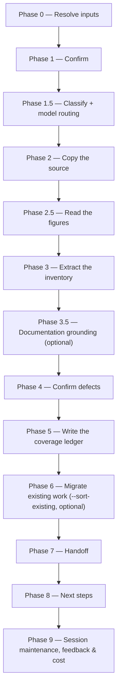

# /brd-intake

Copies a customer-supplied business requirements document into the specs repo verbatim — and with it
every file that document links, wikilinks included, after showing you the list — transcribes every
linked image it takes, extracts a `[BR#n]` requirement inventory from the document, its linked
markdown and those transcriptions, confirms the document's defects with a human, and writes a
coverage ledger where every requirement starts `unallocated`.

## Who runs it

`/brd-intake` runs in the [pm](../roles-and-phases.md#pm--product-management) role, cost-attribution
phase `brd-to-prd` — the phase shared by every command of the BRD-to-PRD route, the way `/idea` and
`/create-prd` share `prd-creation`. It is the route's entry point: nothing else in the route reads a
customer-supplied source document. Downstream, each command of the route gates on whatever the command
immediately before it in the chain produced, not on this one directly. Nothing gates on this
command's own inventory and ledger at all: `/brd-split`, run on the root, reads both from the
working tree and stops on what they contain rather than on where they have been merged. Every
command after that gates on a later hop (`/prd-ground` on the slice's own ledger `/brd-split` copied, `/brd-split` again on
`/prd-ground`'s findings, `/brd-interview` on that ledger and those findings, `/brd-package` on
`/brd-interview`'s register, and `/brd-reconcile` on `/brd-package`'s sent prompt). Every one of
them runs as pm except
[`/prd-ground`](prd-ground.md), which runs as
[pa](../roles-and-phases.md#pa--product-architecture).

## Synopsis

```
/brd-intake <BRD-KEY> @<brd-file> [--sort-existing <dir>] [--no-docs] [--docs <path>]
```

- **`<BRD-KEY>`** (mandatory) — a short stable identifier for the BRD. Format-validated only
  (`^[A-Z][A-Z0-9_]*(-\d+)+$`); a BRD is a markdown file in `$SPECS_PATH`, never checked against a
  tracker.
- **`@<brd-file>`** (mandatory) — the customer's source document. Must already be markdown — a PDF,
  a Word document, or a slide deck is rejected rather than converted.
- **`[--sort-existing <dir>]`** (optional) — additionally migrate an already-hand-written package
  at `<dir>` into seed files. The source is still required and still gated (Phase 0) — this never
  replaces the extraction, it only adds Phase 6 on top of it.
- **`[--no-docs]`** (optional) — turn documentation grounding off for this run.
- **`[--docs <path>]`** — points documentation grounding at that root for this run instead of `${DOCS_PATH:-/workspace/docs}`. The flag and its value are stripped together before the address is parsed.

## How it runs



Three subagents are dispatched: `figure-reader` (Phase 2.5, frontmatter-pinned to Opus — it
transcribes every linked image the run takes, in parallel batches, without reading the document that
links it), `brd-reader` (Phase 3, frontmatter-pinned to Opus — its defect candidates are judgement
over a long, contradictory document, and a conflict it never proposes reaches no one) and
`workflows-core:docs-grounder` (Phase 3.5, read-only grounding on the shipped product docs — default
ON when `$DOCS_PATH` resolves, advisory, never a gate). `workflows-core:impl-maintenance` also runs,
in Phase 9, for session lessons-learned.

## What it needs

- **`<BRD-KEY>`** — mandatory; absent or malformed stops the run with `BRD_INTAKE_NEEDS_KEY`.
- **`@<brd-file>`** — mandatory; absent stops the run with `BRD_INTAKE_NEEDS_SOURCE`.
- **Your answer about what the document links.** Phase 1 walks every link first, read-only, and shows
  you what it found. Where anything lies outside the document's own folder it asks whether to capture
  it; where anything is neither markdown nor an image it asks you to convert it first
  (`BRD_INTAKE_UNREAD_ATTACHMENTS` on *Stop*), because nothing reads such a file.
- **A markdown source.** A non-markdown source (a PDF chief among them) stops the run with
  `BRD_INTAKE_NEEDS_MARKDOWN` rather than being converted automatically — the source becomes
  immutable the moment it is intaken, and every `[BR#n]` this run writes anchors into it, so an
  unchecked machine conversion must never silently become the record of what the customer asked
  for. Converting is the operator's own step, done where the result can be checked against the
  original.
- **`$SPECS_PATH`** (required) — if unset, the run stops naming `SPECS_PATH`.
- **`$DOCS_PATH`** (optional, default `/workspace/docs`) — documentation grounding, resolved once
  in Phase 1 and consumed with grill-rank ranking over Phase 4's defect walk. Missing, unreadable,
  or carrying no markdown file is a silent, non-blocking skip. Turned off explicitly with
  `--no-docs`. The `/epics` consent-ordering exception does not apply here: `/brd-intake` runs no
  `require-on-main` gate, so resolving in the ordinary confirmation step already puts the one
  consent-bearing step ahead of every write.
- **No repos.** `/brd-intake` is cwd-agnostic and needs no `$REPOS_PATH` — grounding against code
  and design is `/prd-ground`'s job, run later.
- **No prior `/brd-*` deliverable.** `/brd-intake` is the entry point of the route: it consumes no
  earlier phase's artifact, so it runs no `require-on-main` gate in Phase 0, unlike every
  downstream command on this route, including `/prd-ground`.

## What it produces

Under `$SPECS_PATH/specifications/BRD-<BRD-KEY>-<slug>/` — the `BRD-` kind prefix is part of the
name the run creates ([addressing](../reference/references.md) §2):

- `brd/source/<basename>` — the customer's source, copied byte-for-byte and never edited again.
- `brd/source/<the paths it links>` — every file that document links from its own directory, copied
  byte-for-byte to the same relative path, so the copied text's links resolve exactly as the
  customer's did. Screenshots are the usual case, and capturing them is the only chance there is:
  nothing under `brd/source/` is ever written again.
- `brd/source-external/<basename>` — every file the document links from outside its own folder, where
  you chose to capture it, by basename; immutable exactly as `brd/source/` is.
- `brd/brd-link-log.md` — the links the copy could **not** capture, each with its reason (a URL, an
  unreadable target, a wikilink matching several files, or — where you chose the document's own folder
  only — a link to a file outside it), the run's counts, and a table mapping every captured link
  that does not resolve as written (a wikilink, an external file) to its copy. Written on every run.
- `brd/brd-figures.md` — what the plugin read in each linked image the run takes: a verbatim
  transcription, the customer's annotations and what they point at, and the rows each image yields
  or illustrates.
- `brd/brd-inventory.md` — one row per `[BR#n]`, each with its `source_anchor` and any confirmed
  `[DEF#n]` defects.
- `brd/brd-defect-log.md` — one entry per confirmed `[DEF#n]`, resolution `open`.
- `coverage-ledger.md` — one row per `[BR#n]`, disposition `unallocated` on every row.
- With `--sort-existing <dir>`: `prd-seed.md`, `ard-seed.md`, `spec-seed.md`, sorted by altitude
  from the hand-written package — seeds only, never findings.

Behind Phase 7's consent choice, these are committed, pushed, and a pull request opened against the
specs repo's default branch under a new `brd/<BRD-KEY>-<slug>` branch prefix.

## Gates

- **Phase 3 — `brd-reader`** (Opus, frontmatter-pinned). Read-only extraction from the document, its
  linked markdown and the image transcriptions: it proposes a `[BR#n]` row per requirement plus
  unconfirmed `defect_candidates` — an `ambiguity` on any obligation only an image states — and
  never decides a defect itself. `EMPTY` (no identifiable requirement) short-circuits Phase 4 and
  writes an empty ledger — and the run says so plainly, because the route stops on a claimless BRD:
  Phase 8 then offers a re-run of this command with a corrected source instead of offering
  `/prd-ground`, which would refuse the BRD. `NOT_FOUND` stops the run and surfaces the agent's
  exact message.

  **The inventory's coverage of its own source is then checked, both directions, from what the run
  already holds** — the anchors written, the image transcriptions, and the rows `brd-reader` said
  each image illustrates. Every `source_anchor` must resolve, in whichever of the format's three
  forms it takes — the document, a linked markdown file, or an image — by
  [`brd-format.md`](../../references/brd-format.md) §2.2's rules. One that resolves to nothing is a
  row nobody can trace back and the run stops, **except a row a re-run deliberately preserved as no
  longer present in a revised source**: that is a recorded state, and stopping on it would refuse a
  customer's revised BRD with a remedy nobody could perform. And every **top-level section** — of
  the document and of each linked markdown file — and every **image** must either hold or illustrate
  a row or be accounted for: one that does neither is a question rather than a stop, since only a
  person can say whether it binds the delivery team to anything, so the run names each — a section
  with what the source has under it, an image with what the plugin read in it, or its reason where
  it could not be read — and asks once for the set. **Section granularity is the point and was
  measured**: real BRDs carry fifty or sixty headings under about fifteen top-level sections, of
  which nine or so legitimately hold nothing, so the operator answers nine questions rather than
  fifty — and on a real package the sections carrying no row included the user stories and the
  acceptance tests, which is exactly the pair worth putting to a human.
- **Phase 3.5 — `docs-grounder`** (optional). Read-only, advisory, never a gate. Its digest is
  consumed grill-rank: `docs_challenges` are ranked into the order Phase 4 walks its candidates,
  and one may be *raised* as an additional defect candidate — but only as `unsourced` (the
  requirement asserts current behaviour a shipped page corroborates or contradicts) or `ambiguity`
  (the BRD uses a term the docs use for something else). **A `[DEF#n]` is the only thing
  documentation can put on a `[BR#n]` row, and only Phase 4's human confirmation puts it there.**
  `docs_references` — what the product already ships and documents — is reported for `/prd-ground`
  to check against code, and written nowhere; the ledger's `evidence` column stays empty until
  grounding runs.
- **Phase 4 — interactive defect confirmation**, not an agent gate: every `defect_candidates` entry
  is walked one class at a time, in the fixed order [`brd-format.md`](../../references/brd-format.md)
  §3 lists its six classes, via `AskUserQuestion`, and only a confirmed candidate is assigned a
  `[DEF#n]` id. A rejected candidate is dropped, not recorded.
- **Phase 5 — the allocation gate downstream.** `/brd-intake` itself never blocks on the ledger — it
  only ever writes `unallocated` rows. The gate that gates on them is the **allocation** gate (no
  `unallocated` row may survive), not a merge-state one, and it belongs to
  [`/brd-split`](brd-split.md), which walks it on both the root and each slice.

## Example

Intake a synthetic customer BRD for a new BRD key:

```
/product-workflows:brd-intake ACME-001 @customer-brd.md
```

The run resolves or creates the BRD folder, shows you every file `customer-brd.md` links, copies it
verbatim into `brd/source/` together with the files you took, records in `brd/brd-link-log.md` each
link it did not copy and why, transcribes the linked images, dispatches `brd-reader` to extract the
`[BR#n]` inventory from all of it, walks its defect candidates with you class by class, writes the
coverage ledger with every row `unallocated`, and offers to branch, commit, push, and open a pull
request.

## See also

- [Roles and phases](../roles-and-phases.md) — what the `pm` role owns and hands off.
- [Model routing](../reference/model-routing.md) — the classification rules this command applies.
- `workflows-core:addressing` — the `<BRD-KEY>` grammar and folder
  resolution this command uses by name (`key-valid`, `resolve-address`).
- [`brd-format.md`](../../references/brd-format.md) — the `[BR#n]` row shape, the immutability rule,
  §1.1's account of what `brd/source/` and `brd/source-external/` hold and of the link log beside
  them, §1.2's figures file, and the six defect classes this command confirms against.
- [`linked-sources.md`](../../references/linked-sources.md) — how Phase 1 finds, resolves and walks
  the document's links.
- [`coverage-ledger-format.md`](../../references/coverage-ledger-format.md) — the ledger row shape,
  the six dispositions, and the ledger line every command of the BRD-to-PRD route ends its final
  report with.
- `workflows-core:docs-grounding` — the `$DOCS_PATH` resolution gate,
  the `docs grounding:` line this command shows verbatim, and the grill-rank consumption mode.
- [Agents](../reference/agents.md) — `figure-reader`'s, `brd-reader`'s and `docs-grounder`'s full
  contracts.
- [Session cost](../reference/session-cost.md), [Session feedback](../reference/session-feedback.md),
  and [Resume and checkpoints](../reference/resume-and-checkpoints.md) — the terminal Phase 9
  bookkeeping every run emits.
