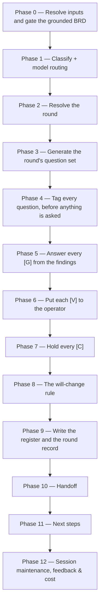

# /brd-interview

Turns a grounded, fully-allocated BRD into a **decided** one. It generates a round of open questions,
tags every one of them `[G]`, `[V]` or `[C]` **before a single one is asked**, answers every `[G]`
from the grounding findings without asking anybody, puts each `[V]` to the operator one at a time
with mandatory argumentation, and holds every `[C]` for the customer. It writes `decisions.md`, the
round's own record, the `[C]` question set, and — where a decision raises a defect in the code or
re-dispositions one already on file — the code-defect log.

## Who runs it

`/brd-interview` runs in the [pm](../roles-and-phases.md#pm--product-management) role,
cost-attribution phase `brd-to-prd` — the phase shared by every command of the BRD-to-PRD route. It
takes over once `/prd-ground` and `/brd-split` have both run on the same slice: a verified finding
set and a fully-allocated ledger are what its Phase 0 gates on.

## Synopsis

```
/brd-interview <BRD-KEY> [--round N]
```

- **`<BRD-KEY>`** (mandatory) — the slice whose questions this run decides. `resolve-address` searches every
  level it bounds (three) — a root, a slice, an idea-route PRD folder or an Epic folder alike — because a root has to resolve before it can be
  refused by name; format-validated only, never checked against a tracker. **Only a slice is
  interviewed**: a resolved root stops with `BRD_INTERVIEW_ROOT_LEVEL`, naming
  [`/brd-split`](brd-split.md) as the way to carve one, and an idea-route PRD folder — a `PRD-`
  folder no BRD carved, carrying no `brd-link.md` — stops with `BRD_INTERVIEW_NOT_A_SLICE`, naming
  [`/create-ard`](create-ard.md) and [`/specify`](specify.md) as the way that route goes on. An `EPIC-` folder stops with `BRD_INTERVIEW_EPIC_LEVEL`, naming the slice the Epic sits in where it sits in one.
- **`--round N`** (optional) — target one round: resume it if it is open, or re-open it if it is
  closed, recorded as a re-open with its cause. Naming the next round opens it only where every
  round is closed: beside an open round it stops with `BRD_INTERVIEW_ROUND_STILL_OPEN`, naming the
  open round, since the bare command would resume that one, and the step each of its holding states
  needs, in the order they must run — a grounding pass for a question that needs grounding, then the
  bare resume for a deferred, untagged or newly grounded one, then the package and the
  reconciliation for a question held for the customer, since the packaging step refuses a round
  still holding any of the others. With no flag the run continues at the first round
  still holding a question without a terminal disposition; with every round closed it generates the
  next round's questions from what changed after the last one was generated — a finding added or
  superseded, or its verdict or verifier outcome changed, whenever that happened, read against the
  `generated against:` line the last round's record carries (a record written before that line
  existed is compared at the earliest commit on any ref, any branch included, that holds it exactly
  as it stands on disk, which misses a grounding change committed before that commit or in it — one
  made while that round was still open, or one a squash commit or a late commit of the record
  carries, which the report flags where that commit itself changed a grounding file — and, where no
  commit on any ref holds the record as it stands, detects no finding change at all), a requirement defect that became this BRD's to ask, or a re-grounding that moved a decision's
  evidence — for a decision the will-change rule held, every finding it rests on superseded and the
  successors no longer `will-change`; for any other, any finding it rests on superseded and that
  finding's successors not confirming it (Phase 3 and Phase 8,
  below), a decision reopened elsewhere — by [`/brd-reconcile`](brd-reconcile.md), on a customer
  answer that constrains it or by its propagation sweep from a BRD it depends on, or by an
  interrupted run of this command — whose question no round still holds unanswered, which the round
  puts again under the decision's own tag (Phase 3, below), or a re-decision an interrupted run left standing at that round, which the round records
  as a `[V]` already disposed *decided* and puts to nobody (*What it produces*, below) — and opens that round only where some question source puts a question, so a
  `--rebaseline` pass that confirms every decision it bears on, or leaves it waiting on its
  prerequisite, is reported as re-grounded with nothing moved and opens nothing — **or, on a BRD with no round record at all, generates round 1's questions and branches on
  what it finds.** At least one question opens the round as ever; none at all writes
  `interview/round-1.md` recording the walk and what it found nothing of, and the run completes
  there. That record is not an empty round: it names each question source and what this BRD held
  under it, so a reader meets an account of a completed walk rather than a silence. **It is also why
  this command is required before packaging even on a slice with nothing to ask** — you cannot know
  there is nothing to ask until it has run, and [`/brd-package`](brd-package.md) refuses a BRD with
  no round record rather than re-deriving that judgement for itself.

  **Every open requirement defect this BRD owns becomes a question for the customer** — an
  ambiguity, a conflict, a duplicate, or an untestable or scope-leaking requirement confirmed at
  intake, including an obligation only an image states — and always a `[C]`: the defect is in the
  customer's own words. At most one slice owns a defect — the one holding the lowest-numbered of the
  rows the defect joins (the row it was raised on and every row it names) that is still built or
  deferred there; where none is, the one holding the lowest-numbered of those rows it rejected citing
  that defect, which asks it on that row's question; where there is neither, no slice owns it and
  this route never puts it to the customer — a slice whose round covers one of its rows says so in
  its round record, naming the rows and their fates, and a defect whose every row the root itself
  settled is named by no slice at all: a slice that once claimed such a row holds it only as an
  orphan row, which is out of its round's scope, and the root is never interviewed. An orphan row
  carrying the parent's own rejection never makes its slice the defect's carrier either. A defect is
  raised once across all the slices: where any slice's `[C]` question set already carries it, none
  raises it again. The one later question that carries it is the re-put of a customer answer the
  will-change rule held `open` (Phase 8, below), which carries the defect that answer could not settle. A row the question names that the asking slice does not claim — another slice's, or
  one the root settled — is written with the parent's key in front, `<PARENT-KEY> [BR#n]`, because
  the package carries only the slice's own inventory and [`/brd-package`](brd-package.md) would
  otherwise stop on the bare id as a citation that resolves to nothing. Everything written from the
  question keeps that form — the held entry, the decision it becomes, and the `[CD#n]`
  [`/brd-reconcile`](brd-reconcile.md) freezes from the customer's answer, save the customer's own
  quoted words. Where a defect's owner cannot be told yet — a row it joins still unallocated, or a
  sibling's ledger or question set unreadable — the run withholds the defect and says why. **Round
  1's record decides which round a defect goes into.** On a slice interviewed before this source
  existed, round 1's record has no requirement-defect line, so its defects belong in round 1: an
  open round 1 takes them at once, and a closed one is re-opened with `--round 1` and the cause
  *requirement defects became a question source* — a bare run names those defects and offers that
  re-open rather than asking them itself, and a new round it opens for a changed finding or decision
  proceeds without them. On a slice interviewed since, a defect that becomes its to ask later goes
  into a new round — the one this run opens on the defect's own account, where every round was
  already closed, so it is asked in the round it made askable. Where this run instead resumed a
  round already open, it waits for the next one, and the run names it as waiting rather than letting
  a package go out silent about it.

  **Every row this BRD rejected becomes a question for the customer too**, always a `[C]`: nothing
  on the route records why a requirement was rejected, so whether the customer accepts not getting
  it is theirs to say. It carries the defect the rejection cites wherever this slice is that
  defect's carrier — no row the defect joins is live anywhere, and this slice holds the
  lowest-numbered one rejected citing it — so the customer's answer settles it; where that row's
  question was already put and is still held for the customer, the defect is added to that question
  as one more line rather than asked beside it. Where no held question can be told to be the row's —
  none names it, more than one could be it, or it was already answered — the defect is asked as a
  question of its own, which names any answer already given as context; the held questions it could
  not choose between are named in the run's final report, not to the customer. A rejected row raises
  nothing where the customer withdrew it themselves, where the defect it cites is already answered or
  already asked, where any slice — this one included — owns that defect through a live row, whose
  question names this row as context, or where another slice carries it. A deferred row raises a
  question only where no rationale for the deferral was ever recorded.

There is **no `--no-docs` flag**, because this command does no documentation grounding at all — see
[What it does not do](#what-it-does-not-do).

## The tag decides who may answer

| Tag | Meaning | Who may answer |
|---|---|---|
| `[G]` | Answerable from code or design grounding | **Nobody.** The command answers it from the findings |
| `[V]` | A delivery-side design decision | The **operator**, with recorded argumentation. Never the customer |
| `[C]` | A genuine business decision | The **customer**, and only via a review package |

The two "never"s are rules, not tendencies, and the reasons they exist are in
[`interview-tagging.md`](../../references/interview-tagging.md) §1–§2. A `[G]` put to a person
returns their belief about the system rather than the system, and that belief then becomes a
requirement nobody re-checks; a `[V]` dressed as a `[C]` extracts authority the customer never meant
to give and cannot defend later.

**How the command guarantees the first of those** is a property of its phase order, not of its
prose. Tagging runs over the whole round before any asking phase opens; the phase that answers `[G]`
questions raises no prompt of any kind; the operator queue holds exactly what the tagging phase has
fixed — including a `[G]` re-tagged to `[V]`, which is re-tested there before it joins — and nothing
reaches it that has not been through that phase, nor anything at all once the queue opens; and a
`[G]` can leave the `[G]` set only by re-tagging, which re-enters at the tagging phase and is
admissible only against a named `NOT-PROVABLE` finding.

**The round is scoped to the rows this BRD is answerable for.** Questions are generated over the
ledger rows reading `covered-here`, `deferred-to`, `rejected` or `superseded-by` — never over a row
reading `covered-by: <OTHER-KEY>`, whose requirement that BRD owns and whose questions belong to its
own round ([`coverage-ledger-format.md`](../../references/coverage-ledger-format.md) §3.1), and never
over an **orphan row**: a row for a requirement the slice's `claims:` no longer names, which its
parent's walk withdrew and settled elsewhere, and which carries the parent's `rejected` or
`superseded-by` across unchanged where the parent settled it that way — so it reads like a row the
slice rejected itself, and only `claims:` tells the two apart. That is the one test that reads
`claims:`; a row's fate is otherwise read off the `disposition` column rather than the inventory,
because a stale inventory would put a withdrawn row back in scope, and the cost is the same
requirement reaching the customer in two packages. A delegated row stays readable as context; what
it may not be is the thing asked about.

**A question carrying two tags is a defect in the question**, not a gap in the taxonomy: it is split
until each part carries exactly one, and the `[G]` part is answered first, because its answer
routinely changes what the business question should ask (§4). A question nobody can tag is
under-specified and is rewritten — never filed with a guessed tag.

## How it runs



A run that finds every round closed and nothing a question source would ask since the last one
opens no new round: it reports that plainly — nothing changed, or each change and why it raised
nothing — with any requirement defect that belongs to a closed round 1, and the re-open
that asks it — removes any torn write an interrupted run left and reports each one, and reaches the handoff with nothing
to commit where the register is already on file, nothing was torn, no interrupted
re-disposition of a code defect was completed and none was left uncommitted; otherwise it hands off what it wrote — `decisions.md`
as its header line alone where none was on file, any file a torn-write removal or a completed
re-disposition changed, and a code-defect log an earlier run left changed and uncommitted.
`workflows-core:impl-maintenance` runs in the terminal phase for session lessons-learned; no other
subagent is dispatched — every finding this command reads was already independently re-derived by
`/prd-ground`'s own verifier pass.

## What it needs

- **`<BRD-KEY>`** — mandatory; absent or malformed stops the run with `BRD_INTERVIEW_NEEDS_KEY`. A
  malformed `--round` value stops with `BRD_INTERVIEW_BAD_ROUND` rather than quietly running a
  different round from the one asked for.
- **A slice, not a root and not an idea-route PRD folder.** The moment the folder resolves, its
  prefix is tested — `BRD-` is a root, `EPIC-` an Epic folder, `PRD-` a slice or an idea-route PRD folder — never the
  folder's asserted `kind:`. An `EPIC-` folder stops with `BRD_INTERVIEW_EPIC_LEVEL` before any gate runs: an Epic holds none of what this command reads, so the stop names `/brd-interview <SLICE-KEY>` on the slice above it where there is one, and no command where there is none. A `PRD-` folder carrying no `brd-link.md` was never carved from a BRD
  and stops with `BRD_INTERVIEW_NOT_A_SLICE` before any gate runs: it has no ledger, no inventory
  and no customer to decide with, so the stop sends it on along the idea route — `/create-ard` or
  `/specify`, each of which reads the folder's `grounding/` findings wherever `/prd-ground` wrote
  them. A resolved root stops with
  `BRD_INTERVIEW_ROOT_LEVEL`, naming `/brd-split <BRD-KEY> "<how to cut it>"` to carve a slice and
  then `/brd-interview <SLICE-KEY>` on it; where the root already carries decisions or interview
  records written under the earlier two-level model, the stop names those files and leaves them in
  place, unread.
- **An existing BRD folder.** No folder for `<BRD-KEY>` — searched at every level
  `resolve-address` bounds (three below `specifications/`) — stops the run with `BRD_INTERVIEW_NOT_FOUND`, which names both ways a folder comes
  to exist rather than asserting one.
- **`/prd-ground`'s findings already merged to the specs repo's default branch.** `require-on-main`
  runs against `grounding/code-grounding.md` before anything else is read; an unmerged grounding pull
  request stops the run naming the branch/PR state, and a BRD never grounded at all stops naming the
  fix that actually applies: `BRD_INTERVIEW_NEEDS_GROUNDING` when the inventory holds at least one
  `[BR#n]` row and grounding has simply not run; `BRD_INTERVIEW_NO_INVENTORY` when a slice has no
  `brd/brd-inventory.md` at all — never written, by an interrupted `/brd-split` on the parent, or
  written and since lost — with a remedy that
  turns on the slice's `claims:` and the parent's ledger; and `BRD_INTERVIEW_EMPTY_INVENTORY` when
  the inventory holds no row, or when a folder naming no parent has none. None of the last three
  names `/prd-ground` as the fix — each names it only to warn against it — because it would not
  produce the findings: it stops on a slice's missing or empty inventory with
  `PRD_GROUND_NO_INVENTORY` or `PRD_GROUND_EMPTY_INVENTORY`, and refuses a folder naming no parent
  before it reads any inventory. So the fix is upstream, and for a slice it follows `/prd-ground`'s
  own remedy table rather than a blanket parent re-run: a slice claiming nothing is a standing empty
  child, which `/brd-split` on the parent resolves, in the form the parent's ledger calls for; a
  slice that claims rows but has no inventory file takes the remedy `/prd-ground`'s table gives for
  that state, the table telling the two causes apart by the slice's `claims:` and the parent's
  ledger; and where the parent's ledger cannot be read, no `/brd-split` form is named. For a folder naming no
  parent, the fix is a fresh intake under a new key — and, where the folder holds an `idea.md` and
  no `prd.md` (an idea handed off before the kind prefixes), also [`/create-prd`](create-prd.md) on
  the same key, which accepts the folder, then — once its handoff is merged, since both gate
  `prd.md` on the default branch — [`/create-ard`](create-ard.md) or [`/specify`](specify.md). Such a folder carries neither a coverage ledger nor an inventory,
  so it is no BRD container, and `/brd-intake` refuses to re-run over it (`BRD_INTAKE_NOT_A_BRD`).
- **Every finding verified.** A finding with no recorded verifier outcome is not evidence, and a
  decision's `evidence` list is a list of findings — so any such finding on file stops the run with
  `BRD_INTERVIEW_UNVERIFIED`. A `code-grounding.md` that is on the default branch and records **no**
  `[CG#n]` at all stops first, with `BRD_INTERVIEW_NO_FINDINGS`: the outcome count is satisfied by an
  empty finding set, and every `[G]` this command answers is answered from the findings and from
  nothing else.
- **Every finding block is well-formed.** The record's field set is closed to the ones
  `workflows-core:grounding-format` §2 defines plus `outcome` and `notes`; a block carrying any other
  key stops the run with `BRD_INTERVIEW_MALFORMED_FINDING`. The keys that occur are the verifier's own return fields — `own_verdict` above all, and `control_outcome` beside it since the record gained a `control` field. `own_verdict` is a
  verifier **return** field, and a block carrying it states two verdicts at once. That matters more
  here than anywhere else on the route: every `[G]` is answered from the findings and from nothing
  else, so such a finding freezes a `[VD#n]` against whichever half the run happened to read, and
  [`/brd-package`](brd-package.md) then puts that decision in front of the customer.
- **A fully-allocated coverage ledger.** Any row still `unallocated` stops the run with
  `BRD_INTERVIEW_UNALLOCATED`, naming `/brd-split` as the fix.
- **At least one row this BRD is answerable for.** A slice every one of whose ledger rows is an
  orphan row — every claim it made withdrawn by its parent's walk, the row now covered by another BRD
  or given a fate the parent settled — kept none of its requirements, so it has nothing of its own to
  decide and stops with `BRD_INTERVIEW_ALL_DELEGATED`. That is a finished state, not a missing step —
  the same slice holds no PRD of its own either. Its inventory is empty too, but the empty-inventory
  gate above counts inventory rows only where grounding is on no branch at all, so it does not see a
  slice whose grounding is merged. The stop says what can and cannot change it: a
  [`/brd-split`](brd-split.md) run on the slice itself moves nothing, since it walks only
  `unallocated` rows and this ledger has none, while one on the parent resolves every child left
  claiming nothing — it offers to remove this slice or keep it against a recorded reason — and, with
  an instruction and no parent row left unallocated, can re-cut onto this slice a row a sibling has
  recorded `deferred-to` against in its own ledger, which is that sibling writing down that it will
  not build it, as long as this slice has never been interviewed. A row its holder is still
  committed to is re-pointed onto another slice by no command; un-delegating that one is a decision taken with the
  customer.
- **`$SPECS_PATH`** (required) — if unset, the run stops naming `SPECS_PATH`.
- **No repository, and no `$REPOS_PATH`.** Every `file:line` this command reads was already pinned
  and verified by `/prd-ground`, so nothing here opens a repository, and there is no baseline gate or
  dirty-tree stop.

## What it produces

Under the resolved BRD folder — `$SPECS_PATH/specifications/BRD-<BRD-KEY>-<slug>/` for a root
BRD, and the `PRD-<SLICE-KEY>-<slug>/` slice folder inside it for a slice
([addressing](../reference/references.md) §2, §6):

- `decisions.md` — the decision register: one block per `[VD#n]` delivery-team decision and per
  `[AS#n]` assumption. A decision carries the thirteen fields
  [`decision-register-format.md`](../../references/decision-register-format.md) §1 defines; an
  assumption carries every one of them §7 admits and none it marks *not applicable*, which §1.1 has
  omitted rather than written empty — §7 accounts for all thirteen, and says of each whether it is
  as-is, means something different, or does not apply. Ids are contiguous within their
  own prefix, assigned once, never renumbered, and never reused after a terminal status, a removed
  torn write (below) aside. A record
  already on file moves only three ways here: reopened, with a closing `Reopened` paragraph naming
  its cause; re-decided after a reopen, keeping its id; or, for a `[VD#n]` whose question a later
  round put again and which reads `open` or `decided` when the answer is written — one the
  will-change rule held, or a reopened one a propagation sweep reverted while its question waited —
  superseded by the new record, with a closing
  `Superseded <YYYYMMDD>: by [VD#m]` paragraph. **Written
  on every run that records a round**, even one that produced no record — a round of `[C]` questions
  alone, or one with nothing to ask — **and on a run that finds every round closed and nothing a
  question source would ask, where none is on file**: as the single header line `# Decision register: <BRD-KEY>`
  wherever no round recorded a decision, so `/brd-package` finds the register it gates on.
- `interview/round-<N>.md` — the round's append-only record: every question in the order it was
  written, its tag, on a question that puts a decision on file again that decision on its own
  line labelled `- **Re-puts:**`, whatever the tag, and on every other `[V]` the same line reading
  `none`, written by the write that first records the question as `[V]` — its first write, or the
  one recording a re-tag from `[G]` or a rewrite out of *untagged* — so a deferred `[V]` whose
  `[V]` tag is on file without the line is one an earlier version wrote, and it is tied
  when its round is resumed: the run asks the operator which reopened or held decision it puts
  again, from those that could be, or none, and writes the answer as the line, so it is asked once;
  an ordinary `[V]` written since carries `none` and is never asked about — every re-tag with the finding that caused it,
  every split with the parts it became, and each question's state — either a **terminal disposition** (*answered from findings*,
  *decided*, *answered by the customer*, *re-tagged*, *split*) or a **holding state** (*held for the
  customer*, *deferred*, *needs grounding*, *untagged*). A re-tagged question keeps its number, so
  two states sit at that one address — *re-tagged*, and whatever the question reached under its new
  tag — and, the file being append-only, the **last** of them is the question's state: a question
  re-tagged and then deferred holds its round open and is resumed at, rather than reading as
  terminally disposed. Its first write carries one `generated against:` line listing every
  finding on file not reading `SUPERSEDED`, with its verdict and verifier outcome — what the next
  round's generation compares against to learn what changed. Plus one line naming the requirement
  defects the round asked and those it withheld, each with its cause, or saying there were none for
  this BRD to ask. Every write of it ends with a `Status:` line — `open`, naming what the round
  waits on, or `closed` with the date and why — and, the file being append-only, its **last**
  `Status:` line records the round's state, which its questions' dispositions decide: where the two
  disagree, the dispositions win. [`/brd-reconcile`](brd-reconcile.md) appends the closing line
  where its answers leave every question in the round with a terminal disposition, and none
  otherwise, so a line it leaves naming a holding state no question is in any more is outvoted by
  the dispositions until the next `/brd-interview` write appends one that agrees. This file is what
  makes a round resumable — an interrupted run returns to the first question carrying no terminal
  disposition rather than restarting the round.
- `interview/customer-questions.md` — the `[C]` questions held for the customer, each with the
  findings that bear on it, on its own line labelled `- **Findings:**` and reading `none` where none
  does, which [`/brd-package`](brd-package.md) renders into the customer prompt and
  [`/brd-reconcile`](brd-reconcile.md) copies into the answering `[CD#n]`'s `evidence`; any `[G]`
  answer that already narrowed it; its altitude — `product`,
  `architecture` or `implementation` — on its own line labelled `- **Altitude:**`, which the
  `[CD#n]` answering it copies; for a rejected row's question, that row, on its own line labelled
  `- **Rejected row:**`, which is how a later run finds it; and — for a question a requirement
  defect raised, or a rejected row's question carrying the defect it cites — the `[DEF#n]` it asks
  about, alone on its own line labelled `- **Requirement defect:**`, which `/brd-reconcile` copies
  into the `settles` field of the `[CD#n]` that answers it and every slice reads to know the defect
  is asked; and, where that defect sits on a row drawn from an image, the image's path relative to
  `brd/` on the next line, labelled `- **Defect image:**`, which
  [`/brd-package`](brd-package.md) renders so the customer can find the picture; and, for a question
  putting a `[CD#n]` again — one the will-change rule held, one this command reopened because a
  re-grounding moved its evidence, or one reopened elsewhere — that record on its own line labelled
  `- **Re-puts:**`, the same line the question carries in the round record, from which
  `/brd-reconcile`, once the customer answers, supersedes a held record that reads `open` or
  `decided` and re-decides a reopened one in place — reading each status as the register stood
  before its run wrote anything — follows a `superseded` one to its live successor and acts on that
  one instead, and, where the record or its successor reads `withdrawn`, freezes nothing, and closes the question, naming the withdrawal, whether
  the operator records the answer for a human or rejects it.
- `code-defect-log.md` — the code-defect log: one `[CDF#n]` per defect in the code that a decision
  turns on, each citing the verified `[CG#n]` that established the behaviour and naming separately
  what the code is supposed to do and what says so. Written where a round raised one **or
  re-dispositioned one already on file** — a later round may change an entry's `disposition`, and add
  or drop its `blocked_on` with it, which is the only way `open` and `conditional` are ever left;
  `id`, `statement`, `behaviour`, `intent` and `intent_basis` never move, because they record what was
  true of the pinned commit the cited finding names. Shipped to the customer in the review package,
  because a defect disposed `in-scope` is part of the delivery boundary rather than delivery-side
  bookkeeping. Format:
  [`code-defect-log-format.md`](../../references/code-defect-log-format.md).

**One phase writes all of it, in one order, and the round record goes last.** Phase 9 writes
`code-defect-log.md`, then `decisions.md` — the log first, so no decision cites a defect entry that
is on no file — then `interview/customer-questions.md`, then the round record. A round record
written before its `code defects:` and `requirement defects:` lines existed first gets a baseline
line naming what was already on file, so nothing this run adds is mistaken for an old item. A
re-disposition of a code defect is applied to the log only after the round record names it, and a
run that stopped in between is completed by the next one's Phase 0. Every phase before it — the `[V]` answers, the held `[C]` entries, a defect line added to a
held entry, a `--round N` re-open, a question the round-1 test adds — builds its part and holds it
there, so a `Cancel`, an abort or an interruption before Phase 9 writes nothing the run decided into
the BRD folder — the one earlier write being Phase 0's completion of a code-defect re-disposition a
round record already names, which decides nothing.
The round record is the commit point
([`decision-register-format.md`](../../references/decision-register-format.md) §8): an item stamped
with a round whose record does not exist or does not name it — what a run that stopped between those
writes leaves behind, or what an earlier version of this command left when a run was cancelled
after holding its `[C]` questions — is a **torn write**. No reader counts one: not this command's
*asked* test or generation, not [`/brd-package`](brd-package.md), which refuses a folder holding one,
not [`/brd-reconcile`](brd-reconcile.md), and not the PRD, ARD and specification commands. Phase 0
reports each one it finds, and Phase 9 removes them before it appends its own — the one deletion
this command makes, of items nothing ever counted. A re-decision a stopped run wrote onto a record
already on file is the exception: what it replaced cannot be restored, so it stands. Where its
round is one no record yet holds, the next round opened at that number records it as a question
of its own, tagged `[V]` and generated already disposed *decided* naming the record: it is never
queued and put to nobody, and it makes that round askable by itself, so the round's record exists
for `/brd-package` to find. Where its round is one on file — the interrupted run was resuming it —
the question whose `- **Re-puts:**` line names the record is recorded *decided* as the round is
resumed, and put to nobody either. A reopen an interrupted run wrote stands as well, and the
question it held for that decision, lost with the run, is put again by the next round opened
(Phase 3, below).

**No `[CD#n]` is ever minted by this command.** A customer decision enters the register only once
the customer has actually answered and an operator has confirmed the answer; the customer answering
and the register recording an answer are two separate acts. The one write it makes to a `[CD#n]`
already on file is a reopen, on a re-grounding that moved its evidence (Phase 3, below): its `status`
and a closing `Reopened` paragraph naming the successor findings, the customer's choice and quoted
reason left exactly as they stand for the customer's next answer to re-decide.

Behind the handoff phase's consent choice, these are committed, pushed, and a pull request opened
against the specs repo's default branch under the shared `brd/<BRD-KEY>-<slug>` branch prefix. That
choice is preceded by a read-only probe for an `origin` remote, and where the specs repo has none
the run says so in a line above the choice: the first option still branches and commits locally,
but the push and the pull request cannot run.

## Gates

- **Phase 0 — the root refusal, tested the moment the folder resolves.** A resolved `BRD-` root
  stops with `BRD_INTERVIEW_ROOT_LEVEL` before any other gate runs: deciding happens at the slice
  and nowhere else. A resolved `EPIC-` folder stops with `BRD_INTERVIEW_EPIC_LEVEL` at the same moment. An idea-route PRD folder stops next, with `BRD_INTERVIEW_NOT_A_SLICE`, before
  any inventory or ledger is read.
- **Phase 0 — grounding merged, findings verified, ledger allocated.** All three run before anything
  else is read. The allocation gate reads the **dispositions in the ledger file**, never the ledger
  line: the line's `unallocated` term is a resolved count that follows every `covered-by` row into
  the BRD it names — a child here, a sibling or the parent on a slice — so a fully-allocated parent
  routinely reports a non-zero term for work that belongs to another BRD's walk
  ([`coverage-ledger-format.md`](../../references/coverage-ledger-format.md) §6.1).
- **Phase 3 — a decision a re-grounding moved is put again.** Where a re-grounding — a
  [`/prd-ground --rebaseline`](prd-ground.md) pass, or any `/prd-ground` run whose verifier
  contradicts an on-file finding, or whose horizon pass moves one's horizon — has superseded any
  finding a `decided` decision the will-change rule did not hold rests on, the successor findings —
  the same requirement's — or, for a design finding tied to no requirement, one citing the same
  frames — grounded against the same repository or frame set and minted later —
  either confirm its premise — each superseded finding with a successor, and each successor carrying
  the verdict its superseded finding carried, which that finding keeps as `prior_verdict`, and the
  horizon that finding carried — or the decision is reopened, naming the successors as the cause,
  and its question put again in the round this run opens. The test is the same for a
  `[VD#n]` and a `[CD#n]`, a finding the re-grounding did not supersede stands as cited, and a
  decision that confirms raises nothing. A finding superseded before
  `prior_verdict` existed carries none, so a decision resting on one is reopened. A `[V]` is
  re-decided in place here, and a `[C]` by `/brd-reconcile` from the customer's answer in the next
  package, each keeping its id — unless another run has meanwhile left the record `withdrawn` or
  `superseded`, when it does not move: a `[V]` answer is then a new record named beside it under
  what still needs a human, while `/brd-reconcile` acts on a superseded `[CD#n]`'s live successor
  and freezes nothing beside a withdrawn one, closing the
  question whichever way the operator takes the answer. The tag
  never moves, and no other question source raises a question on those successors, so one decision
  is never asked about twice. A decision resting on no finding, and a customer answer still waiting
  for its reason, are never taken, and nor is a decision whose question is already put and still
  unanswered.
- **Phase 3 — a decision reopened elsewhere is put again.** A decision can read `reopened` with no
  question putting it: [`/brd-reconcile`](brd-reconcile.md) reopens one when a customer answer
  contradicts or constrains it without replacing it, its propagation sweep reopens one in a BRD
  that depends on the BRD it reconciled, and an interrupted run of this command can leave a reopen
  whose question it never recorded. Every such decision whose question no round still holds
  unanswered — no question naming it on a `- **Re-puts:**` line still *deferred* or *held for the
  customer* — has its question put again in the round this run opens, under its own tag, against
  the current findings, quoting each `Reopened` paragraph as context. The answer re-decides it in
  place: here for a `[V]`, by `/brd-reconcile` from the customer's answer for a `[C]`. One reopened
  while a round is still open waits for the next round, and the run says so. A decision moved to
  `superseded` or `withdrawn` raises nothing.
- **Phase 4 — the tagging gate.** Nothing is asked of anybody until every question in the round
  carries exactly one tag. A question that cannot be resolved into one of the three is left
  in the *untagged* holding state, with what is wrong with it recorded; it is never asked in that
  state.
- **Phase 5 — a re-tag needs a cause.** A `[G]` grounding cannot settle is re-tagged only against a
  named `NOT-PROVABLE` finding or an `unprovable` verifier outcome. A `[G]` no finding bears on at
  all is recorded as *needs grounding* and answered by a `/prd-ground` re-run — it is neither
  re-tagged nor asked, because a re-tag with no finding to name would manufacture the trail from "we
  asked the code" to "we asked a person" instead of recording its absence.
- **Phase 6 — argumentation is mandatory.** No `[VD#n]` is written without a reason that is not a
  restatement of the decision, not "to be filled in later", and not the name of whoever decided it.
  The test is whether a reader who was not in the room can say what would have to change for the
  answer to change.
- **Phase 8 — the will-change rule.** A decision whose `evidence` list is *entirely*
  `horizon: will-change` findings may not be closed. Three resolutions are offered and exactly three:
  re-base it on a `current` finding, make it explicitly `conditional_on` the prerequisite decision, or
  defer it with the blocking prerequisite named. Deleting the `will-change` finding is not one of
  them, and neither is re-filing the position as an assumption. Whichever is taken, the question is
  *decided* and its round can close — deferring here holds the record, not the question, and is not
  the *deferred* holding state. **A held record's exit is a later round** — and, for one written
  `conditional_on`, also [`/brd-reconcile`](brd-reconcile.md)'s propagation sweep, which reaches it
  by that field when the prerequisite's decision moves and may revert or reopen it in place; that
  sweep's citation pass also reaches a held record of either kind that names an id its
  reconciliation changed. The
  round comes once the prerequisite has shipped, which the route observes as a successor finding
  no longer `will-change`: a [`/prd-ground --rebaseline`](prd-ground.md) pass supersedes every
  finding it re-grounds, shipped or not, and keeps `will-change` on a successor until the naming
  decision ships. So once every `will-change` finding a held decision rests on — `open`, or
  `conditional_on` its prerequisite, a `[VD#n]` or a `[CD#n]` that `/brd-reconcile` froze the same
  way — is superseded, each has a successor, and no successor is `will-change`, that is a change which makes a new round
  askable, and the round opened puts the question again against the current findings, under the tag
  it had; until then the record waits on its prerequisite, and the run says so — unless a superseded
  finding it rests on is one no successor will come to, when the record is put again at once, naming
  that finding: it cannot be matched to a successor — its source cannot be read, or it is a
  frame-only finding written before such findings named their field — or the `/prd-ground` run that retired it re-ground
  its frame set and found nothing to succeed it. Its answer is a new
  record, and the held one — where it reads `open` or `decided` — is superseded by it: here for a
  `[V]`, by `/brd-reconcile` for a `[C]`. One a propagation sweep reopened meanwhile is re-decided
  in place instead, and one another run has left `withdrawn` or `superseded` does not move: for a
  `[V]` the answer is a new record named beside it under what still needs a human, and for a `[C]`
  `/brd-reconcile` acts on a superseded record's live successor, and on a withdrawn one freezes
  nothing, closing the
  question whichever way the operator takes the answer.
  **Cancel on this picker writes nothing the run decided**: it stops the run before the register phase, so no
  decision this run took is written, and no `[C]` question it held either, and the next run puts the question again — or, for a round
  this run opened, regenerates it and asks only what is still askable.
- **Round closure.** A round closes only when every question in it carries a **terminal**
  disposition. A holding state — *held for the customer*, *deferred*, *needs grounding*, *untagged* — is not one
  and keeps the round open, so a round never closes around a question the run promised to return to:
  not when the interesting ones are answered, not when the remainder was deferred, and not around a
  `[C]` still waiting on a customer. The resume rule and the closure rule are stated in the same
  vocabulary so they cannot drift apart.

## What it does not do

- **No documentation grounding, and no `--no-docs` flag.** `/brd-intake` and `/prd-ground` already
  ground this BRD against the shipped product documentation when `$DOCS_PATH` resolves; this command
  operates on decisions, and a documentation page settles none of them — it is a claim *about*
  behaviour, not the behaviour. There is nothing to switch off, so no flag exists to switch it.
- **It sends nothing to a customer.** The `[C]` questions are written to a file and held there;
  [`/brd-package`](brd-package.md) is the separate, consented run that carries them out, and
  [`/brd-reconcile`](brd-reconcile.md) is what records the answer once it comes back. A round holding
  a `[C]` stays open across both, because holding a question is not the customer answering it and the
  customer answering it is not the register recording an answer.
- **It changes no ledger disposition.** The final report's ledger line reports where allocation
  stands; allocation itself is `/brd-split`'s walk. Two other runs may move a row afterwards, and
  neither is this one: [`/brd-reconcile`](brd-reconcile.md) freezes a customer decision that settles
  it differently, and a [`/brd-split`](brd-split.md) **re-cut** on the parent re-points a row this
  BRD's own walk sent to `deferred-to: <itself>` onto a sibling that will build it — writing
  `covered-by` on this BRD's row for it. Being interviewed disqualifies a re-cut's *receiver* and
  never its *donor*, so a BRD that has reached this command is an ordinary donor
  ([`coverage-ledger-format.md`](../../references/coverage-ledger-format.md) §3.2).

## Example

Work the first round of a synthetic customer BRD, once its split has merged:

```
/product-workflows:brd-interview EPIC-008
```

The run gates on the grounding being merged and verified and the ledger being fully allocated, opens
round 1, generates its questions, tags every one of them, answers the `[G]`s from the findings,
walks the `[V]`s past the operator one at a time, holds the `[C]`s, writes the register, and offers
to branch, commit, push, and open a pull request. Its next-step offer names
[`/brd-package`](brd-package.md) **only when both of that command's own content gates would pass** —
every question in every round carrying a terminal disposition or held for the customer, *and* the
register actually holding something for a customer to decide. A round still holding a deferred,
needs-grounding or untagged question is offered another interview round or a re-grounding pass
instead. A BRD whose closed round 1 predates the requirement-defect question source, and which owns
defects nobody has asked, is not offered the packaging step either: it is offered the `--round 1`
re-open that asks them, recommended, because a package built first would go out without them. A BRD
whose questions were all settled from the findings — nothing left for a customer at all — is told
plainly that it is decided and needs no customer review, and is offered a `--rebaseline` grounding
pass as the one thing this command can offer that could make a new round askable (a requirement
defect can also become this BRD's to ask, through events outside this command — for instance a
revised source document, an allocation or a re-cut elsewhere under the parent, a sibling's
reconciliation moving its row to `rejected` or `superseded-by`, or a sibling file that could not be
read becoming readable; and a reconciliation can reopen one of its decisions); neither the packaging
step nor another round of this command is offered, because both would stop or report a no-op —
save where the run names a reopened decision that waited on the round it worked, when it says the
BRD is not decided and offers, in a list of its own, the round that puts that decision's question.
A decided slice needs no reconciliation before authoring, so it is also offered the authoring ladder, on the conditions [`/brd-reconcile`](brd-reconcile.md) applies: [`/create-ard`](create-ard.md) and [`/specify`](specify.md) always, and [`/create-prd`](create-prd.md) only where the slice is PRD-eligible — some row it claims is `covered-here` — since `/create-prd` refuses one that is not.
Re-opening a closed round later, with its cause recorded:

```
/product-workflows:brd-interview EPIC-008 --round 1
```

## See also

- [Roles and phases](../roles-and-phases.md) — what the `pm` role owns and hands off.
- [Model routing](../reference/model-routing.md) — the classification rules this command applies.
- [`interview-tagging.md`](../../references/interview-tagging.md) — the authority for the three tags,
  who may answer each, re-tagging and its recorded cause, the split that fixes an untaggable
  question, and how a round opens and closes.
- [`decision-register-format.md`](../../references/decision-register-format.md) — the `[VD#n]` /
  `[CD#n]` / `[AS#n]` record, the five statuses, the mandatory `argumentation`, `conditional_on`, and
  the will-change rule this command enforces.
- `workflows-core:grounding-format` — the finding record, the six
  verdicts, the two horizons, and §8's verification outcomes the Phase 0 gate depends on.
- `workflows-core:addressing` — the `<BRD-KEY>` grammar and folder
  resolution this command uses by name (`key-valid`, `resolve-address`).
- [`coverage-ledger-format.md`](../../references/coverage-ledger-format.md) — the dispositions the
  allocation gate reads, and §6's ledger line the final report ends with.
- [Agents](../reference/agents.md) — `impl-maintenance`'s full contract.
- [Session cost](../reference/session-cost.md), [Session feedback](../reference/session-feedback.md),
  and [Resume and checkpoints](../reference/resume-and-checkpoints.md) — the terminal bookkeeping
  every run emits.
