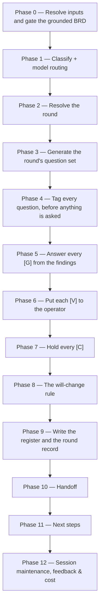

# /brd-interview

Turns a grounded, fully-allocated BRD into a **decided** one. It generates a round of open questions,
tags every one of them `[G]`, `[V]` or `[C]` **before a single one is asked**, answers every `[G]`
from the grounding findings without asking anybody, puts each `[V]` to the operator one at a time
with mandatory argumentation, and holds every `[C]` for the customer. It writes `decisions.md`, the
round's own record, the `[C]` question set, and — where a decision raises a defect in the code or
re-dispositions one already on file — the code-defect log.

## Who runs it

`/brd-interview` runs in the [pm](../roles-and-phases.md#pm--product-management) role,
cost-attribution phase `brd-to-prd` — the phase shared by every command of the BRD-to-PRD route. It
takes over once `/prd-ground` and `/brd-split` have both run on the same slice: a verified finding
set and a fully-allocated ledger are what its Phase 0 gates on.

## Synopsis

```
/brd-interview <BRD-KEY> [--round N]
```

- **`<BRD-KEY>`** (mandatory) — the slice whose questions this run decides. `resolve-address` still
  searches both levels a BRD folder can occupy, because a root has to resolve before it can be
  refused by name; format-validated only, never checked against a tracker. **Only a slice is
  interviewed**: a resolved root stops with `BRD_INTERVIEW_ROOT_LEVEL`, naming
  [`/brd-split`](brd-split.md) as the way to carve one.
- **`--round N`** (optional) — target one round: resume it if it is open, or re-open it if it is
  closed, recorded as a re-open with its cause. With no flag the run continues at the first round
  still holding a question without a terminal disposition, and proposes a new one only if findings
  or decisions have changed, or a requirement defect became this BRD's to ask, since the last round
  closed — **or, on a BRD with no round record at all, generates round 1's questions and branches on
  what it finds.** At least one question opens the round as ever; none at all writes
  `interview/round-1.md` recording the walk and what it found nothing of, and the run completes
  there. That record is not an empty round: it names each question source and what this BRD held
  under it, so a reader meets an account of a completed walk rather than a silence. **It is also why
  this command is required before packaging even on a slice with nothing to ask** — you cannot know
  there is nothing to ask until it has run, and [`/brd-package`](brd-package.md) refuses a BRD with
  no round record rather than re-deriving that judgement for itself.

  **Every open requirement defect this BRD owns becomes a question for the customer** — an
  ambiguity, a conflict, a duplicate, or an untestable or scope-leaking requirement confirmed at
  intake, including an obligation only an image states — and always a `[C]`: the defect is in the
  customer's own words. At most one slice owns a defect — the one holding the lowest-numbered of the
  rows the defect joins (the row it was raised on and every row it names) that is still built or
  deferred there; where none is, the one holding the lowest-numbered of those rows it rejected citing
  that defect, which asks it on that row's question; where there is neither, no slice owns it and
  this route never puts it to the customer — a slice whose round covers one of its rows says so in
  its round record, naming the rows and their fates, and a defect whose every row the root itself
  settled is named by no slice at all: a slice that once claimed such a row holds it only as an
  orphan row, which is out of its round's scope, and the root is never interviewed. An orphan row
  carrying the parent's own rejection never makes its slice the defect's carrier either. A defect is
  asked once across all the slices: where any slice's `[C]` question set already carries it, none
  asks it again. A row the question names that the asking slice does not claim — another slice's, or
  one the root settled — is written with the parent's key in front, `<PARENT-KEY> [BR#n]`, because
  the package carries only the slice's own inventory and [`/brd-package`](brd-package.md) would
  otherwise stop on the bare id as a citation that resolves to nothing. Everything written from the
  question keeps that form — the held entry, the decision it becomes, and the `[CD#n]`
  [`/brd-reconcile`](brd-reconcile.md) freezes from the customer's answer, save the customer's own
  quoted words. Where a defect's owner cannot be told yet — a row it joins still unallocated, or a
  sibling's ledger or question set unreadable — the run withholds the defect and says why. **Round
  1's record decides which round a defect goes into.** On a slice interviewed before this source
  existed, round 1's record has no requirement-defect line, so its defects belong in round 1: an
  open round 1 takes them at once, and a closed one is re-opened with `--round 1` and the cause
  *requirement defects became a question source* — a bare run names those defects and offers that
  re-open rather than asking them itself, and a new round it opens for a changed finding or decision
  proceeds without them. On a slice interviewed since, a defect that becomes its to ask later goes
  into a new round — the one this run opens on the defect's own account, where every round was
  already closed, so it is asked in the round it made askable. Where this run instead resumed a
  round already open, it waits for the next one, and the run names it as waiting rather than letting
  a package go out silent about it.

  **Every row this BRD rejected becomes a question for the customer too**, always a `[C]`: nothing
  on the route records why a requirement was rejected, so whether the customer accepts not getting
  it is theirs to say. It carries the defect the rejection cites wherever this slice is that
  defect's carrier — no row the defect joins is live anywhere, and this slice holds the
  lowest-numbered one rejected citing it — so the customer's answer settles it; where that row's
  question was already put and is still held for the customer, the defect is added to that question
  as one more line rather than asked beside it. Where no held question can be told to be the row's —
  none names it, more than one could be it, or it was already answered — the defect is asked as a
  question of its own, which names any answer already given as context; the held questions it could
  not choose between are named in the run's final report, not to the customer. A rejected row raises
  nothing where the customer withdrew it themselves, where the defect it cites is already answered or
  already asked, where any slice — this one included — owns that defect through a live row, whose
  question names this row as context, or where another slice carries it. A deferred row raises a
  question only where no rationale for the deferral was ever recorded.

There is **no `--no-docs` flag**, because this command does no documentation grounding at all — see
[What it does not do](#what-it-does-not-do).

## The tag decides who may answer

| Tag | Meaning | Who may answer |
|---|---|---|
| `[G]` | Answerable from code or design grounding | **Nobody.** The command answers it from the findings |
| `[V]` | A delivery-side design decision | The **operator**, with recorded argumentation. Never the customer |
| `[C]` | A genuine business decision | The **customer**, and only via a review package |

The two "never"s are rules, not tendencies, and the reasons they exist are in
[`interview-tagging.md`](../../references/interview-tagging.md) §1–§2. A `[G]` put to a person
returns their belief about the system rather than the system, and that belief then becomes a
requirement nobody re-checks; a `[V]` dressed as a `[C]` extracts authority the customer never meant
to give and cannot defend later.

**How the command guarantees the first of those** is a property of its phase order, not of its
prose. Tagging runs over the whole round before any asking phase opens; the phase that answers `[G]`
questions raises no prompt of any kind; the operator queue holds exactly what the tagging phase has
fixed — including a `[G]` re-tagged to `[V]`, which is re-tested there before it joins — and nothing
reaches it that has not been through that phase, nor anything at all once the queue opens; and a
`[G]` can leave the `[G]` set only by re-tagging, which re-enters at the tagging phase and is
admissible only against a named `NOT-PROVABLE` finding.

**The round is scoped to the rows this BRD is answerable for.** Questions are generated over the
ledger rows reading `covered-here`, `deferred-to`, `rejected` or `superseded-by` — never over a row
reading `covered-by: <OTHER-KEY>`, whose requirement that BRD owns and whose questions belong to its
own round ([`coverage-ledger-format.md`](../../references/coverage-ledger-format.md) §3.1), and never
over an **orphan row**: a row for a requirement the slice's `claims:` no longer names, which its
parent's walk withdrew and settled elsewhere, and which carries the parent's `rejected` or
`superseded-by` across unchanged where the parent settled it that way — so it reads like a row the
slice rejected itself, and only `claims:` tells the two apart. That is the one test that reads
`claims:`; a row's fate is otherwise read off the `disposition` column rather than the inventory,
because a stale inventory would put a withdrawn row back in scope, and the cost is the same
requirement reaching the customer in two packages. A delegated row stays readable as context; what
it may not be is the thing asked about.

**A question carrying two tags is a defect in the question**, not a gap in the taxonomy: it is split
until each part carries exactly one, and the `[G]` part is answered first, because its answer
routinely changes what the business question should ask (§4). A question nobody can tag is
under-specified and is rewritten — never filed with a guessed tag.

## How it runs



A run that finds every round closed and nothing changed since the last one proposes no new round: it
reports that plainly — with any requirement defect that belongs to a closed round 1, and the re-open
that asks it — and reaches the handoff with nothing to commit where the register is already on file;
where none is, it writes `decisions.md` as its header line alone and hands that off.
`workflows-core:impl-maintenance` runs in the terminal phase for session lessons-learned; no other
subagent is dispatched — every finding this command reads was already independently re-derived by
`/prd-ground`'s own verifier pass.

## What it needs

- **`<BRD-KEY>`** — mandatory; absent or malformed stops the run with `BRD_INTERVIEW_NEEDS_KEY`. A
  malformed `--round` value stops with `BRD_INTERVIEW_BAD_ROUND` rather than quietly running a
  different round from the one asked for.
- **A slice, not a root.** The moment the folder resolves, its prefix is tested — `BRD-` is a root,
  `PRD-` is a slice — never the folder's asserted `kind:`. A resolved root stops with
  `BRD_INTERVIEW_ROOT_LEVEL`, naming `/brd-split <BRD-KEY> "<how to cut it>"` to carve a slice and
  then `/brd-interview <SLICE-KEY>` on it; where the root already carries decisions or interview
  records written under the earlier two-level model, the stop names those files and leaves them in
  place, unread.
- **An existing BRD folder.** No folder for `<BRD-KEY>` — searched at `specifications/` and the one
  level below it — stops the run with `BRD_INTERVIEW_NOT_FOUND`, which names both ways a folder comes
  to exist rather than asserting one.
- **`/prd-ground`'s findings already merged to the specs repo's default branch.** `require-on-main`
  runs against `grounding/code-grounding.md` before anything else is read; an unmerged grounding pull
  request stops the run naming the branch/PR state, and a BRD never grounded at all stops naming the
  fix that actually applies: `BRD_INTERVIEW_NEEDS_GROUNDING` when the inventory holds at least one
  `[BR#n]` row and grounding has simply not run, and `BRD_INTERVIEW_EMPTY_INVENTORY` when it holds
  none — because then `/prd-ground` has nothing to ground and would stop on the same emptiness, so
  the fix is upstream (re-intake with a corrected source, or `/brd-split` on the parent for a
  slice).
- **Every finding verified.** A finding with no recorded verifier outcome is not evidence, and a
  decision's `evidence` list is a list of findings — so any such finding on file stops the run with
  `BRD_INTERVIEW_UNVERIFIED`. A `code-grounding.md` that is on the default branch and records **no**
  `[CG#n]` at all stops first, with `BRD_INTERVIEW_NO_FINDINGS`: the outcome count is satisfied by an
  empty finding set, and every `[G]` this command answers is answered from the findings and from
  nothing else.
- **Every finding block is well-formed.** The record's field set is closed to the ones
  `workflows-core:grounding-format` §2 defines plus `outcome` and `notes`; a block carrying any other
  key stops the run with `BRD_INTERVIEW_MALFORMED_FINDING`. The keys that occur are the verifier's own return fields — `own_verdict` above all, and `control_outcome` beside it since the record gained a `control` field. `own_verdict` is a
  verifier **return** field, and a block carrying it states two verdicts at once. That matters more
  here than anywhere else on the route: every `[G]` is answered from the findings and from nothing
  else, so such a finding freezes a `[VD#n]` against whichever half the run happened to read, and
  [`/brd-package`](brd-package.md) then puts that decision in front of the customer.
- **A fully-allocated coverage ledger.** Any row still `unallocated` stops the run with
  `BRD_INTERVIEW_UNALLOCATED`, naming `/brd-split` as the fix.
- **At least one row this BRD is answerable for.** A slice every one of whose ledger rows is an
  orphan row — every claim it made withdrawn by its parent's walk, the row now covered by another BRD
  or given a fate the parent settled — kept none of its requirements, so it has nothing of its own to
  decide and stops with `BRD_INTERVIEW_ALL_DELEGATED`. That is a finished state, not a missing step —
  the same slice holds no PRD of its own either. Its inventory is empty too, but the empty-inventory
  gate above counts inventory rows only where grounding is on no branch at all, so it does not see a
  slice whose grounding is merged. The stop says what can and cannot change it: a
  [`/brd-split`](brd-split.md) run on the slice itself moves nothing, since it walks only
  `unallocated` rows and this ledger has none, while one on the parent resolves every child left
  claiming nothing — it offers to remove this slice or keep it against a recorded reason — and, with
  an instruction and no parent row left unallocated, can re-cut onto this slice a row a sibling has
  recorded `deferred-to` against in its own ledger, which is that sibling writing down that it will
  not build it, as long as this slice has never been interviewed. A row its holder is still
  committed to is moved by no command; un-delegating that one is a decision taken with the
  customer.
- **`$SPECS_PATH`** (required) — if unset, the run stops naming `SPECS_PATH`.
- **No repository, and no `$REPOS_PATH`.** Every `file:line` this command reads was already pinned
  and verified by `/prd-ground`, so nothing here opens a repository, and there is no baseline gate or
  dirty-tree stop.

## What it produces

Under the resolved BRD folder — `$SPECS_PATH/specifications/BRD-<BRD-KEY>-<slug>/` for a root
BRD, and the `PRD-<SLICE-KEY>-<slug>/` slice folder inside it for a slice
([addressing](../reference/references.md) §2, §6):

- `decisions.md` — the decision register: one block per `[VD#n]` delivery-team decision and per
  `[AS#n]` assumption. A decision carries the thirteen fields
  [`decision-register-format.md`](../../references/decision-register-format.md) §1 defines; an
  assumption carries every one of them §7 admits and none it marks *not applicable*, which §1.1 has
  omitted rather than written empty — §7 accounts for all thirteen, and says of each whether it is
  as-is, means something different, or does not apply. Ids are contiguous within their
  own prefix, assigned once, never renumbered, and never reused after a terminal status. **Written
  on every run that records a round**, even one that produced no record — a round of `[C]` questions
  alone, or one with nothing to ask — **and on a run that finds every round closed and nothing
  changed, where none is on file**: as the single header line `# Decision register: <BRD-KEY>`
  wherever no round recorded a decision, so `/brd-package` finds the register it gates on.
- `interview/round-<N>.md` — the round's append-only record: every question in the order it was
  written, its tag, every re-tag with the finding that caused it, every split with the parts it
  became, and each question's state — either a **terminal disposition** (*answered from findings*,
  *decided*, *answered by the customer*, *re-tagged*, *split*) or a **holding state** (*held for the
  customer*, *deferred*, *needs grounding*, *untagged*). A re-tagged question keeps its number, so
  two states sit at that one address — *re-tagged*, and whatever the question reached under its new
  tag — and, the file being append-only, the **last** of them is the question's state: a question
  re-tagged and then deferred holds its round open and is resumed at, rather than reading as
  terminally disposed. Plus one line naming the requirement
  defects the round asked and those it withheld, each with its cause, or saying there were none for
  this BRD to ask. Every write of it ends with a `Status:` line — `open`, naming what the round
  waits on, or `closed` with the date and why — and, the file being append-only, its **last**
  `Status:` line records the round's state, which its questions' dispositions decide: where the two
  disagree, the dispositions win. [`/brd-reconcile`](brd-reconcile.md) appends the closing line
  where its answers leave every question in the round with a terminal disposition, and none
  otherwise, so a line it leaves naming a holding state no question is in any more is outvoted by
  the dispositions until the next `/brd-interview` write appends one that agrees. This file is what
  makes a round resumable — an interrupted run returns to the first question carrying no terminal
  disposition rather than restarting the round.
- `interview/customer-questions.md` — the `[C]` questions held for the customer, each with the
  findings that bear on it, on its own line labelled `- **Findings:**` and reading `none` where none
  does, which [`/brd-package`](brd-package.md) renders into the customer prompt and
  [`/brd-reconcile`](brd-reconcile.md) copies into the answering `[CD#n]`'s `evidence`; any `[G]`
  answer that already narrowed it; its altitude — `product`,
  `architecture` or `implementation` — on its own line labelled `- **Altitude:**`, which the
  `[CD#n]` answering it copies; for a rejected row's question, that row, on its own line labelled
  `- **Rejected row:**`, which is how a later run finds it; and — for a question a requirement
  defect raised, or a rejected row's question carrying the defect it cites — the `[DEF#n]` it asks
  about, alone on its own line labelled `- **Requirement defect:**`, which `/brd-reconcile` copies
  into the `settles` field of the `[CD#n]` that answers it and every slice reads to know the defect
  is asked; and, where that defect sits on a row drawn from an image, the image's path relative to
  `brd/` on the next line, labelled `- **Defect image:**`, which
  [`/brd-package`](brd-package.md) renders so the customer can find the picture.
- `code-defect-log.md` — the code-defect log: one `[CDF#n]` per defect in the code that a decision
  turns on, each citing the verified `[CG#n]` that established the behaviour and naming separately
  what the code is supposed to do and what says so. Written where a round raised one **or
  re-dispositioned one already on file** — a later round may change an entry's `disposition`, and add
  or drop its `blocked_on` with it, which is the only way `open` and `conditional` are ever left;
  `id`, `statement`, `behaviour`, `intent` and `intent_basis` never move, because they record what was
  true of the pinned commit the cited finding names. Shipped to the customer in the review package,
  because a defect disposed `in-scope` is part of the delivery boundary rather than delivery-side
  bookkeeping. Format:
  [`code-defect-log-format.md`](../../references/code-defect-log-format.md).

**No `[CD#n]` is ever written by this command.** A customer decision enters the register only once
the customer has actually answered and an operator has confirmed the answer; the customer answering
and the register recording an answer are two separate acts.

Behind the handoff phase's consent choice, these are committed, pushed, and a pull request opened
against the specs repo's default branch under the shared `brd/<BRD-KEY>-<slug>` branch prefix. That
choice is preceded by a read-only probe for an `origin` remote, and where the specs repo has none
the run says so in a line above the choice: the first option still branches and commits locally,
but the push and the pull request cannot run.

## Gates

- **Phase 0 — the root refusal, tested the moment the folder resolves.** A resolved `BRD-` root
  stops with `BRD_INTERVIEW_ROOT_LEVEL` before any other gate runs: deciding happens at the slice
  and nowhere else.
- **Phase 0 — grounding merged, findings verified, ledger allocated.** All three run before anything
  else is read. The allocation gate reads the **dispositions in the ledger file**, never the ledger
  line: the line's `unallocated` term is a resolved count that follows every `covered-by` row into
  the BRD it names — a child here, a sibling or the parent on a slice — so a fully-allocated parent
  routinely reports a non-zero term for work that belongs to another BRD's walk
  ([`coverage-ledger-format.md`](../../references/coverage-ledger-format.md) §6.1).
- **Phase 4 — the tagging gate.** Nothing is asked of anybody until every question in the round
  carries exactly one tag. A question that cannot be resolved into one of the three is left
  in the *untagged* holding state, with what is wrong with it recorded; it is never asked in that
  state.
- **Phase 5 — a re-tag needs a cause.** A `[G]` grounding cannot settle is re-tagged only against a
  named `NOT-PROVABLE` finding or an `unprovable` verifier outcome. A `[G]` no finding bears on at
  all is recorded as *needs grounding* and answered by a `/prd-ground` re-run — it is neither
  re-tagged nor asked, because a re-tag with no finding to name would manufacture the trail from "we
  asked the code" to "we asked a person" instead of recording its absence.
- **Phase 6 — argumentation is mandatory.** No `[VD#n]` is written without a reason that is not a
  restatement of the decision, not "to be filled in later", and not the name of whoever decided it.
  The test is whether a reader who was not in the room can say what would have to change for the
  answer to change.
- **Phase 8 — the will-change rule.** A decision whose `evidence` list is *entirely*
  `horizon: will-change` findings may not be closed. Three resolutions are offered and exactly three:
  re-base it on a `current` finding, make it explicitly `conditional_on` the prerequisite decision, or
  defer it with the blocking prerequisite named. Deleting the `will-change` finding is not one of
  them, and neither is re-filing the position as an assumption.
- **Round closure.** A round closes only when every question in it carries a **terminal**
  disposition. A holding state — *held for the customer*, *deferred*, *needs grounding*, *untagged* — is not one
  and keeps the round open, so a round never closes around a question the run promised to return to:
  not when the interesting ones are answered, not when the remainder was deferred, and not around a
  `[C]` still waiting on a customer. The resume rule and the closure rule are stated in the same
  vocabulary so they cannot drift apart.

## What it does not do

- **No documentation grounding, and no `--no-docs` flag.** `/brd-intake` and `/prd-ground` already
  ground this BRD against the shipped product documentation when `$DOCS_PATH` resolves; this command
  operates on decisions, and a documentation page settles none of them — it is a claim *about*
  behaviour, not the behaviour. There is nothing to switch off, so no flag exists to switch it.
- **It sends nothing to a customer.** The `[C]` questions are written to a file and held there;
  [`/brd-package`](brd-package.md) is the separate, consented run that carries them out, and
  [`/brd-reconcile`](brd-reconcile.md) is what records the answer once it comes back. A round holding
  a `[C]` stays open across both, because holding a question is not the customer answering it and the
  customer answering it is not the register recording an answer.
- **It changes no ledger disposition.** The final report's ledger line reports where allocation
  stands; allocation itself is `/brd-split`'s walk. Two other runs may move a row afterwards, and
  neither is this one: [`/brd-reconcile`](brd-reconcile.md) freezes a customer decision that settles
  it differently, and a [`/brd-split`](brd-split.md) **re-cut** on the parent re-points a row this
  BRD's own walk sent to `deferred-to: <itself>` onto a sibling that will build it — writing
  `covered-by` on this BRD's row for it. Being interviewed disqualifies a re-cut's *receiver* and
  never its *donor*, so a BRD that has reached this command is an ordinary donor
  ([`coverage-ledger-format.md`](../../references/coverage-ledger-format.md) §3.2).

## Example

Work the first round of a synthetic customer BRD, once its split has merged:

```
/product-workflows:brd-interview EPIC-008
```

The run gates on the grounding being merged and verified and the ledger being fully allocated, opens
round 1, generates its questions, tags every one of them, answers the `[G]`s from the findings,
walks the `[V]`s past the operator one at a time, holds the `[C]`s, writes the register, and offers
to branch, commit, push, and open a pull request. Its next-step offer names
[`/brd-package`](brd-package.md) **only when both of that command's own content gates would pass** —
every question in every round carrying a terminal disposition or held for the customer, *and* the
register actually holding something for a customer to decide. A round still holding a deferred,
needs-grounding or untagged question is offered another interview round or a re-grounding pass
instead. A BRD whose closed round 1 predates the requirement-defect question source, and which owns
defects nobody has asked, is not offered the packaging step either: it is offered the `--round 1`
re-open that asks them, recommended, because a package built first would go out without them. A BRD
whose questions were all settled from the findings — nothing left for a customer at all — is told
plainly that it is decided and needs no customer review, and is offered a `--rebaseline` grounding
pass as the one thing this command can offer that could make a new round askable (a requirement
defect can also become this BRD's to ask, through events outside this command — for instance a
revised source document, an allocation or a re-cut elsewhere under the parent, a sibling's
reconciliation moving its row to `rejected` or `superseded-by`, or a sibling file that could not be
read becoming readable); neither the packaging step nor another round of this command is offered,
because both would stop or report a no-op.
Re-opening a closed round later, with its cause recorded:

```
/product-workflows:brd-interview EPIC-008 --round 1
```

## See also

- [Roles and phases](../roles-and-phases.md) — what the `pm` role owns and hands off.
- [Model routing](../reference/model-routing.md) — the classification rules this command applies.
- [`interview-tagging.md`](../../references/interview-tagging.md) — the authority for the three tags,
  who may answer each, re-tagging and its recorded cause, the split that fixes an untaggable
  question, and how a round opens and closes.
- [`decision-register-format.md`](../../references/decision-register-format.md) — the `[VD#n]` /
  `[CD#n]` / `[AS#n]` record, the five statuses, the mandatory `argumentation`, `conditional_on`, and
  the will-change rule this command enforces.
- `workflows-core:grounding-format` — the finding record, the six
  verdicts, the two horizons, and §8's verification outcomes the Phase 0 gate depends on.
- `workflows-core:addressing` — the `<BRD-KEY>` grammar and folder
  resolution this command uses by name (`key-valid`, `resolve-address`).
- [`coverage-ledger-format.md`](../../references/coverage-ledger-format.md) — the dispositions the
  allocation gate reads, and §6's ledger line the final report ends with.
- [Agents](../reference/agents.md) — `impl-maintenance`'s full contract.
- [Session cost](../reference/session-cost.md), [Session feedback](../reference/session-feedback.md),
  and [Resume and checkpoints](../reference/resume-and-checkpoints.md) — the terminal bookkeeping
  every run emits.
