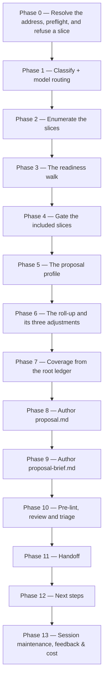

# /brd-proposal

Rolls a BRD container's slice proposals into one programme-level effort proposal: one row per included slice, the cross-slice effort that exists in no slice, and a coverage statement computed from the root ledger.

## Who runs it

`/brd-proposal` runs in the [pm](../roles-and-phases.md#pm--product-management) role, cost-attribution phase [proposal](../roles-and-phases.md#proposal) — the same role and the same phase as its sibling [`/prd-proposal`](prd-proposal.md), because pricing a programme and pricing a slice are the same activity at two altitudes. It is optional, it gates nothing, and nothing waits on it.

## Synopsis

```
/brd-proposal <ADDRESS> [--no-brief] [--profile] [--redo]
```

`<ADDRESS>` is a key or an `@<path>` naming a `BRD-` container. **This command's natural altitude is the root**, which inverts the rest of the BRD route: [`/prd-ground`](prd-ground.md), [`/brd-interview`](brd-interview.md), [`/brd-package`](brd-package.md) and [`/brd-reconcile`](brd-reconcile.md) each refuse a root and demand a slice, and this one refuses a slice and demands the root. A `PRD-` folder is refused with `BRD_PROPOSAL_NOT_A_CONTAINER`, on the directory prefix and before any file inside the folder is read; the stop names `/prd-proposal` for that slice and, where the folder's `brd-link.md` records a `parent:`, this command against that parent key.

The three flags:

- `--no-brief` — write `proposal.md` only, and skip the rationale brief that would otherwise render at tier 2 and above.
- `--profile` — re-grill the shared proposal profile in full before rolling up, regardless of what is on disk.
- `--redo` — discard the prior revision as an anchor and re-derive every umbrella figure from scratch, for when the previous programme estimate is known to be wrong.

**There is no `--baseline`**, and its absence is a decision rather than a gap: a prior estimate reconciles against the slice that was estimated, not against the umbrella over it. Reconciliation stays on `/prd-proposal`, where the figures it argues with were computed.

## How it runs



Two subagents are dispatched: `proposal-reviewer` (Phase 10, Opus-pinned) and `workflows-core:impl-maintenance` (Phase 13, session lessons-learned). Both artifacts are authored inline, on the session's own model, rather than through a delegated writer — exactly as the sibling authors a slice's proposal.

## What it needs

- **A `BRD-` container with at least one slice carved from it.** Slices are enumerated by the positive test [`/brd-split`](brd-split.md) uses: an immediate subdirectory carrying a `brd-link.md` whose `parent:` names this BRD. A name match is not the test. Zero slices stops with `BRD_PROPOSAL_NO_SLICES`, which names `/brd-split` as the way to carve them — there is no roll-up over an empty set, and a programme total computed from nothing would read as a real figure.
The readiness walk carries a computed recommendation per slice and leaves the decision to you. Where a slice holds no `proposal.md` and is estimable, the recommendation is to price it first, and answering that way **ends the run**: the walk finishes so you see the whole picture, then the run stops before the gate, names every slice still to price, and writes nothing at all — nothing is excluded by that answer, and the session's own bookkeeping still lands.

- **A `proposal.md` on the specs repo's default branch for every slice the readiness walk includes** — gated via `require-on-main`, per included slice, with every failure collected into one stop rather than one run per slice. A slice whose proposal is written but on no ref stops with `BRD_PROPOSAL_SLICE_NOT_HANDED_OFF`: the umbrella would otherwise roll up numbers no later reader can reproduce. A slice with **no** proposal at all never reaches that gate — the readiness walk has already decided whether to stop for it or exclude it.
- **The proposal profile** at `$SPECS_PATH/.dev-workflows/proposal-profile.yml` — the same file `/prd-proposal` reads, because one team, one productivity basis and one engagement model span the programme and every slice in it. It is grilled into existence on the first run that needs it, shown back for confirmation on every later run rather than read silently, and re-grilled under `--profile`. A run that cannot obtain one stops with `BRD_PROPOSAL_NEEDS_PROFILE`. It carries no rates and no money of any kind.
- **`$SPECS_PATH`** (required) — if unset, the run stops naming `SPECS_PATH` and offers to enter a path or cancel.

**Nothing else is required, and nothing at this altitude could be**: a `BRD-` container holds no `prd.md`, `ard.md` or `specification.md` of its own — those are authored in the `PRD-` slice folders under it — so there is no ARD gate and no specification gate to have. The umbrella's own readiness tier is the **minimum** of its included slices' tiers, and the document prints the mix behind it: a programme cannot claim to be specified because three of its five slices are.

The run opens no code repository at any point, and it re-prices nothing. Every hours figure it carries was computed by `/prd-proposal` on the slice it belongs to.

## What it produces

- **`proposal.md`**, always, written into the resolved BRD folder — so its traceability section is relative links that reach down into the slice folders where the priced detail lives. It carries the same twenty-three-section set fixed by [`proposal-format.md`](../../references/proposal-format.md) §4, read at umbrella altitude per §14: one row per included slice with that slice's hours, range, tier and confidence; the umbrella's own work packages for the effort that exists in no slice; aggregated roles, one team, one schedule and the cross-slice dependency graph; and the coverage statement. It does not restate a slice's driver table and never re-derives a slice's hours.
- **`proposal-brief.md`**, at tier 2 and above unless `--no-brief` was given — the same short pre-read, derived from the same resolved data set rather than re-authored from it. The tier tested is the umbrella's own, so one tier-1 slice withholds the brief for the whole programme; the final report says which of the two reasons applied.
- **The archived prior revision**, on a re-run — the previous `proposal.md` moved to `revisions/<KEY>_proposal_<YYYYMMDD>.md`, and the previous brief beside it where this run rendered a new one. The changelog section classifies every moved figure as a **correction** or a **re-estimate**, including a figure that moved only because a slice beneath it was re-priced.

**The roll-up is not a sum**, and each adjustment is named in the document rather than absorbed into a total: the umbrella effort that exists in no slice; a de-duplication check over the finding identifiers the slices' driver tables cite, which flags every finding claimed by more than one included slice and asks the operator whether it is genuinely two pieces of work; and sequencing, where slices sharing a team do not add their FTE figures and peak concurrency is computed from the programme schedule instead. Ranges are summed and stated as summed. **The de-duplication check discloses its own limit in the document**: shared work described from two different findings is not detected, and the umbrella then overstates.

Behind Phase 11's consent choice, both artifacts and any archived prior are committed and pushed on a `brd/` branch — the shared prefix every `/brd-*` command uses — and a pull request is opened against the specs repo's default branch.

Every figure in both artifacts is **hours of human delivery time**. Neither carries a rate, a currency symbol or a monetary total, at any tier and under any flag. The USD figure the run prints at the end is [session cost](../reference/session-cost.md) — this run's own model spend — and is a different quantity entirely.

## Gates

- **The `proposal.md` gate on each included slice**, described under *What it needs*. It is this command's only hard refusal on readiness, and it runs only over the slices the walk included: an excluded slice is not gated, because nothing of it enters the roll-up.
- **`proposal-reviewer`** (Phase 10, Opus-pinned by frontmatter, no override) — the review gate, and it is the **same agent, unchanged**, that reviews a slice's proposal. Only its Coverage check tells the two apart: it applies here, reading the root ledger and independently re-deriving the coverage statement, and is `N/A` on a slice's own proposal. Its arithmetic check additionally re-derives the umbrella's totals against the slice rows plus the named adjustments, never as a bare sum of the rows. Its findings are triaged by the orchestrator before anything is edited, only survivors are fixed, and the cap is one fix cycle plus one re-review. The agent, its model pin, its tools and what it returns are on the `proposal-reviewer` row of [Agents](../reference/agents.md).
- **A structural pre-lint** runs first, as the cheap pass before the expensive one — the universal checks, identifier integrity over the umbrella's own `[WP#n]` and `[ED#n]` series, and required-section presence. Advisory, never blocking. Its auto-link collision check deliberately does **not** run here, for the reason the format records: that check is scoped to documents that get pasted into a tracker, and a proposal is sent to a customer instead.

## What it does not do

- **It offers no forward advance.** The umbrella is the end of this branch, not a phase in the build ladder, so its next-step offer names only re-pricing a flagged slice and re-running the umbrella once those land — and no option carries a merge clause, because no command named there gates on anything this run wrote.
- **It gates nothing downstream, and nothing reads what it writes.** No command of the build ladder reads a proposal; the one command that reads a proposal at all is this one, and it reads a **slice's**, never an umbrella's. That is why its handoff presents the consent array for an artifact nothing downstream reads.
- **It prices nothing in money.** No rate card, no currency, no monetary total — those are contractual and belong in a document this pipeline does not produce.
- **It never sweeps a slice's defect sources again.** Each slice's confirmed defects are already priced inside its own row, so re-sweeping them would price the same repair twice. The umbrella sweeps only what the container itself holds — normally nothing, since grounding findings, the code-defect log and a packaged self-review are all slice-level artifacts — and the report says what it found either way.
- **It re-prices no slice and edits none.** A reviewer finding whose location is a slice document is recorded and reported with the slice named, never fixed from here: editing another phase's deliverable would leave that slice's own reviewer verdict standing over content it never saw.
- **It never asserts coverage.** The proportion of the BRD's requirements the programme covers is computed from the root `coverage-ledger.md` on every run, and the remainder is enumerated **by requirement identifier** rather than summarised — "two slices were excluded" tells a customer nothing about which of their own requirements are unpriced. Where the folder holds no root ledger at all, the document says so and claims no proportion.
- **It does no documentation grounding**, and takes no `--no-docs` flag. Its inputs are the slice proposals, the root ledger and the profile.
- **It writes no code repository, no docs repository and nothing in your current working directory.**

## Example

Price a programme whose slices have each been through grounding, an interview round and their own proposal:

```
/product-workflows:brd-proposal PRODUCT-1234
```

The run refuses nothing (the address resolves to a `BRD-` folder), enumerates the four slices carrying a `brd-link.md` that names this BRD, and walks them: three hold a `proposal.md` newer than everything feeding it, and the fourth holds none while grading tier 2 — so the walk's computed recommendation for that one is **stop and price it**, printed beside a two-option array that leaves the decision yours. You exclude it. The run gates the three included proposals on the default branch, shows the profile back, builds one row per included slice, adds its own work packages for programme management and one acceptance campaign, flags one verified finding two slices both priced against and asks you whether that is one piece of work or two, computes peak concurrency from the schedule rather than adding the slices' FTE figures, and grades the umbrella at the minimum of the three tiers while printing the mix. Coverage comes out of the root ledger with the excluded slice's requirements enumerated by identifier. Then the pre-lint, `proposal-reviewer`, triage, and the handoff offer.

Re-run it after the excluded slice has been priced:

```
/product-workflows:brd-proposal PRODUCT-1234
```

Same run, now including four slices. The prior umbrella is archived under `revisions/`, and the changelog names the cause of every figure that moved — including the ones that moved only because a slice joined the roll-up.

## See also

- [Roles and phases](../roles-and-phases.md) — what the `pm` role owns, and what the `proposal` phase means on a cost report.
- [`/prd-proposal`](prd-proposal.md) — the sibling that prices one slice, and whose `proposal.md` this run gates on and reads. Run it once per slice before running this.
- [`proposal-format.md`](../../references/proposal-format.md) — the canonical shape of both artifacts, including §14, which owns the umbrella's row set, its three adjustments, the tier and range rules, the coverage statement and the de-duplication check with its disclosed limit.
- [`/brd-split`](brd-split.md) — where the slices come from, and the source of the positive `brd-link.md` test this run enumerates them with.
- [The BRD-to-PRD route](../brd-workflow.md) — the six commands that carry a customer BRD to the point where its slices can be priced.
- [Agents](../reference/agents.md) — the subagent inventory, including the reviewer this command's Phase 10 dispatches.
- [Model routing](../reference/model-routing.md) — the classification and Opus fallback chain, plus the hard model gate this command applies: `SIGNIFICANT` is its floor.
- [Session cost](../reference/session-cost.md), [Session feedback](../reference/session-feedback.md), and [Resume and checkpoints](../reference/resume-and-checkpoints.md) — the terminal Phase 13 bookkeeping every run emits.
