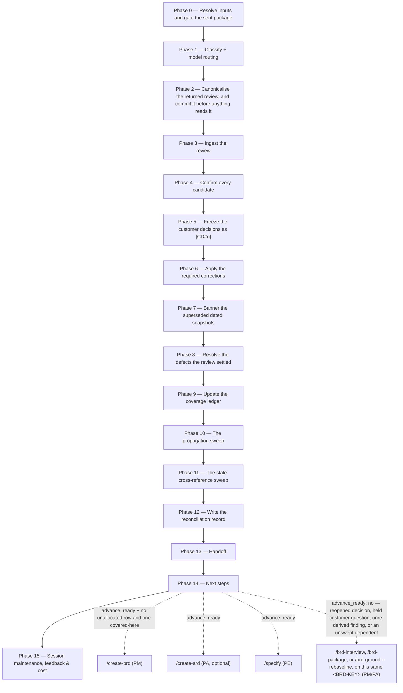

# /brd-reconcile

Takes the customer's returned review, freezes what they actually decided as `[CD#n]` records, and
then goes looking for everything in the tree that still asserts a position their answer overturned.
It is the command that closes the customer loop: the `[C]` questions `/brd-interview` held and
`/brd-package` sent stay open until this run confirms an answer to them.

## Who runs it

`/brd-reconcile` runs in the [pm](../roles-and-phases.md#pm--product-management) role,
cost-attribution phase `brd-to-prd` — the phase shared by every command of the BRD-to-PRD route. It
is the route's last command in the ordinary case, but not the end of every slice's route: a reopened
decision sends the slice back to [`/brd-interview`](brd-interview.md), a question still held for the
customer to [`/brd-package`](brd-package.md), and a challenged code claim to
[`/prd-ground --rebaseline`](prd-ground.md), each of which leads back here. It runs again on the
same review itself in two cases: to finish a run cancelled or stopped partway, where the re-run skips
what the earlier pass already froze and offers the rest, and to sweep a dependent it could only
record, once that dependent has its own register on the default branch.

## Synopsis

```
/brd-reconcile <BRD-KEY> @<review-file> [--sent <path>…]
```

- **`<BRD-KEY>`** (mandatory) — the slice this review answers. `resolve-address` searches every
  level it bounds (three) — a root, a slice, an idea-route PRD folder or an Epic folder alike — because a root has to resolve before it can be refused by name;
  format-validated only, never checked against a tracker. **Only a slice is reconciled**: a resolved
  root stops with `BRD_RECONCILE_ROOT_LEVEL`, naming [`/brd-split`](brd-split.md) as the way to carve one, and an idea-route PRD folder — a `PRD-`
  folder no BRD carved, carrying no `brd-link.md` — stops with `BRD_RECONCILE_NOT_A_SLICE`, naming
  [`/create-ard`](create-ard.md) and [`/specify`](specify.md) as the way that route goes on. An `EPIC-` folder stops with `BRD_RECONCILE_EPIC_LEVEL`, naming the slice the Epic sits in where it sits in one. `--sent`
  does not lift it.
- **`@<review-file>`** (mandatory) — the file the customer sent back, **at whatever path it arrived
  on**. It does not have to be inside `$SPECS_PATH`, and it is never searched for: the operator says
  which file is the review, because a file the command picked is a file nobody submitted as the
  customer's answer.
- **`--sent <path>`** (optional, repeatable) — the material the customer was *actually* sent, for a
  review that answers a package this plugin did not build: one authored by hand before the route
  existed, or sent out of band. Each path may be a file or a directory and may sit anywhere. The
  run copies every path verbatim into the BRD folder's **customer-sent-`<YYYYMMDD>`/** and commits
  it beside the review, before anything reads either.

  Without it, such a review cannot be reconciled at all. The ordinary gate requires a
  `customer-review-prompt-<YYYYMMDD>.md` that `/brd-package` built and handed off, and there is no
  way to produce one after the fact — re-running `/brd-package` today builds a *different* document
  from the one the customer answered. What the gate is really protecting is that a quotation can be
  checked against a committed copy of the document it came from; `--sent` supplies that copy from
  the other direction, so the invariant holds and only its provenance changes. The run records
  which of the two it worked from, in the reconciliation record and in the final report, because
  operator-supplied material was not assembled under the packaging rules and a later reader needs
  to know that.

  It replaces the package gate and nothing else: every other input is still read, wherever it is on
  file. A slice never interviewed is admitted too. It holds no question set and, unless
  [`/create-prd`](create-prd.md) recorded an assumption there, no `decisions.md`, so the run creates
  the register — its header line alone — and a candidate there can answer only such an `[AS#n]`;
  any other goes to a human rather than being frozen. The run refuses the flag where a handed-off
  package already exists, rather than admitting a second answer to what the customer saw.

There is **no `--no-docs` flag**, because this command does no documentation grounding at all — see
[What it does not do](#what-it-does-not-do).

## No inferred decision becomes a `[CD#n]` without a human

That single rule is what the command is built around, and it is decision row D14: **normalising
prose into a decision register is inference, and promoting inference to customer authority silently
is the one way this workflow could fabricate a mandate the customer never gave.** A `[CD#n]` reads
downstream as frozen customer authority, decisions are built on it, and nothing on the page would
record that a sentence of prose was read into it by an agent.

**How the command guarantees it** is a property of its phase order, not of its prose:

- `customer-review-reader` is the only thing that reads the review, and it **cannot mint** — every
  free-text decision comes back a `candidate` with `confirmed: false`, and its hard rules forbid it
  any identifier in the delivery side's namespaces.
- The command **never widens that agent's mode**. It passes `auto`, or `free-text` where the operator
  says the file is prose, and never `schema`. There is no second dispatch to get a different answer.
- Confirmation runs to completion **before** the freeze phase opens, and the freeze phase reads the
  confirmed set and nothing else.
- Every candidate is put **one at a time, with its verbatim quotation**. There is no bulk
  confirmation, and that omission is required rather than permitted — the quotation is the whole
  mechanism, and batching turns a confirmation into a formality.
- A reason nobody gave is **never supplied**. A candidate returned `reason: not stated` cannot be
  frozen as `decided` by anyone in the run.

## How it runs



`customer-review-reader` is dispatched once, on the detection chain. `workflows-core:impl-maintenance` runs in the
terminal phase for session lessons-learned. No other subagent is dispatched.

## What it needs

- **`<BRD-KEY>` and `@<review-file>`** — either absent or malformed stops the run with
  `BRD_RECONCILE_NEEDS_KEY` or `BRD_RECONCILE_NEEDS_REVIEW`.
- **A slice, not a root and not an idea-route PRD folder.** The moment the folder resolves, its
  prefix is tested — `BRD-` is a root, `EPIC-` an Epic folder, `PRD-` a slice or an idea-route PRD folder — never the
  folder's asserted `kind:`. An `EPIC-` folder stops with `BRD_RECONCILE_EPIC_LEVEL` before any gate runs: an Epic holds none of what this command reads, so the stop names `/brd-reconcile <SLICE-KEY>` on the slice above it where there is one, and no command where there is none. A `PRD-` folder carrying no `brd-link.md` was never carved from a BRD
  and stops with `BRD_RECONCILE_NOT_A_SLICE` before any gate runs: it has no package, ledger or inventory for a returned review to land in, and `--sent` does not lift it, so the stop sends it on along the
  idea route — `/create-ard` or `/specify`, or, where the folder holds a `prd.md`, `/update-prd` to revise that PRD from what the review says. A resolved root stops with
  `BRD_RECONCILE_ROOT_LEVEL`, naming `/brd-split <BRD-KEY> "<how to cut it>"` to carve a slice and
  then `/brd-reconcile <SLICE-KEY> @<review-file>` on it; where the root already carries
  reconciliation artifacts written under the earlier two-level model, the stop names those files and
  leaves them in place, unread.
- **An existing BRD folder.** No folder for `<BRD-KEY>` — searched at `specifications/` and the one
  level below it — stops with `BRD_RECONCILE_NOT_FOUND`, which names both ways a folder comes to
  exist rather than asserting one.
- **A review the reader could read.** Where `customer-review-reader` returns no decisions, no
  required changes and no challenges, the run reads **section 2's verdict** to tell two states
  apart: `approved` beside three empty sets is a customer who approved and asked for nothing, and is
  recorded as the approval it is; any other verdict — or an absent one — beside three empty sets is
  a review contradicting itself or a parse that failed, and stops with
  `BRD_RECONCILE_EMPTY_DIGEST`.
- **A package already handed off to the specs repo's default branch — or `--sent` in its place.**
  `require-on-main` runs against
  the most recent `customer-review-prompt-<date>.md` before anything else is read, and an unmerged
  pull request stops the run naming the branch/PR state. The gate is the prompt rather than the
  register because the committed package is what makes a quotation in the returned review checkable
  against the version the customer actually received. Where the gate reports the prompt is on no ref
  at all, the run **splits a state the gate cannot**: no prompt in the folder means no package was
  ever built (`BRD_RECONCILE_NEEDS_PACKAGE`, run `/brd-package`), while a prompt in the folder means
  the package was built and its handoff declined (`BRD_RECONCILE_PACKAGE_NOT_HANDED_OFF`, land the
  files that are already on disk). The second must **not** send the operator back to `/brd-package`:
  that command will not rewrite a dated bundle, so it stops today and builds a *different* package on
  any other date.
- **`$SPECS_PATH`** (required) — if unset, the run stops naming `SPECS_PATH`.
- **No repository, and no `$REPOS_PATH`.** Every finding this run reads was pinned and independently
  re-derived by `/prd-ground`.

## What it produces

Under the BRD folder:

| Artifact | What it is |
|---|---|
| `customer-review-<date>.md` | The returned review, copied in byte for byte and committed **before** anything reads it. Stamped with the **customer's** date, not the run's; a second review of that date takes a `-<suffix>` |
| `reconciliation-<date>.md` | What changed, why, which ids, and what still needs a human. Stamped with the run's date; a second pass on the same day appends rather than overwriting |

A **customer decision that overturns an earlier customer decision** is handled like any other
overturn, not left to mint a rival answer: the earlier `[CD#n]` is `superseded` where the new answer
replaces it — answers its own question again, whatever it chooses, so the same option with a
different reason replaces it too — naming it in a closing `Superseded <YYYYMMDD>: by [CD#m]`
paragraph, and moving nothing else — and `reopened` where it contradicts or constrains without
replacing, which only a `decided` record can be. A record the will-change rule held `open` is
superseded where an answer to its own question replaces it; one `open` for want of its reason is
completed by such an answer instead, minting nothing; a `reopened` one is re-decided in place where
the answered entry names it on a `- **Re-puts:**` line, and superseded where an answer to its
question names it no such way. Where
the answer bears on any of the three without replacing it, the record keeps its status and is named,
with the constraining `[CD#n]`, under what still needs a human. `superseded` and `reopened` are
both statuses the register already defines for `[VD#n]` *and* `[CD#n]`, and an incoming customer decision is one of
the two causes that may reopen anything. The case this exists for is the corrected resend the
canonicalisation step calls ordinary — without it, two `decided` answers to one question sit in the
register with nothing to adjudicate between them. A resend's answer that re-affirms the question's live
record never gets that far: Phase 4 records it and freezes nothing (below).

And it updates, in place: `decisions.md` (the new `[CD#n]`, the superseded `[AS#n]` and `[CD#n]`,
each with its closing `Superseded` paragraph, the reopened `[VD#n]` and `[CD#n]`, the `[CD#n]`
re-decided in place — created first, as its header line alone, where a `--sent` run finds none), the `[C]`
question set where one is on file — a slice never interviewed holds none, nor any round record —
`coverage-ledger.md`, the defect log — **the parent's**, when the
run stands on a slice — every dated artifact it banners, every dependent BRD's register the
propagation sweep wrote, and every artifact the stale-reference sweep corrected. The round record is
**appended to**, never bannered: each answered question's terminal disposition, and, where the run's
answers leave every question in a round with a terminal disposition, a closing `Status:` line — the
round's state being what its questions' dispositions decide, and its last `Status:` line the record
of it.

Each new `[CD#n]` copies its `evidence` from the held question's own `- **Findings:**` line, and
nothing else in the entry — `evidence: []` where that line names no finding, never because the
findings were written somewhere the run could not read them. It copies its `altitude` the same way,
from what it answers — the held question's own
`- **Altitude:**` line, an assumption's field, or, for an escalated self-review finding, the altitude
of the record or question it targets — and where there is nothing to copy the run decides it by the
downstream artifact the answer must reach, and says so in the reconciliation record. An answer
outside the options the question put is frozen as the customer gave it: `chosen` carries it after
the register's one fixed marker, and `options_considered` stays as it was put — `["as assumed", "not
as assumed"]` for an assumption, which puts no options. **An answer matching no question the package
put is never frozen**: the operator records it for a human, quoting the customer, or rejects it —
or, where the reader mis-matched it, names the question it does answer, which re-points it and puts
it to the operator again on the full confirmation picker, the re-point recorded in the
reconciliation record.

The run makes **two** handoff offers, and they are two different questions: the first hands off the
customer's document, the second hands off what the run decided about it. Both land on one `brd/`
branch and one pull request, in the order they happened.

## The three id shapes section 7 can carry

A returned review's decision log answers what the package's *decisions the customer must make* part
put to it, and that part is filled from three sources — so the parser accepts three shapes, not two.

| Shape | Where it came from |
|---|---|
| a `[C]` question, by its round and position | the `[C]` question set `/brd-interview` held |
| an `[AS#n]` | every open assumption in the register |
| an `[SR#n]` | a self-review finding `/brd-package` disposed `escalated-to-customer` |

**The third is not an oversight to narrow away.** `/brd-package` puts an escalated finding to the
customer under its own `[SR#n]` rather than minting a `[C]`, precisely because minting one would put
a question to the customer that never went through the tag test. A parser accepting only the first
two would silently drop every answer to a finding the delivery team escalated on purpose — and the
drop would look like customer silence. A row citing none of the three is carried as `unmatched`,
and is never frozen into a `[CD#n]` — it answers nothing the package put, so nothing records what it
was offered or what it settles.

**All three question sets are handed to the reader**, and that is what makes the third shape
matchable rather than merely asserted: `interview/customer-questions.md`, `decisions.md`, and the
`self-review-<date>.md` of the package the review answers — named by the `Package reviewed` line
the prompt prints and the review's section 1 repeats, else by a date section 1 names that matches
exactly one package, else the only package on file, else the operator's pick from the dated
prompts on file. Every package numbers its escalated findings from `[SR#1]` again, so no other
package's file is ever handed over: where the operator cannot tell either, no self-review is
passed, and every `[SR#n]` answer comes back `unmatched` and goes to a human. A
reader given only the first two returns every escalated
finding's answer as `unmatched` — an answer the customer gave, reported as matching nothing, which is
indistinguishable from one they never gave. The reader also reports which sets it was given, so an
unmatched row can be told apart from a question set nobody passed.

**A torn write matches nothing.** An entry, a record or a code-defect entry stamped with a round
whose `interview/round-<N>.md` does not exist or does not name it — what a
[`/brd-interview`](brd-interview.md) run left when it stopped before writing that record — counts
for nothing ([`decision-register-format.md`](../../references/decision-register-format.md) §8). An
answer citing a torn entry or a torn `[AS#n]` is carried `unmatched` and never frozen, a torn record
is neither superseded, reopened nor swept, and the final report names each torn write found. This
command removes none of them; the next `/brd-interview` run does.

## Gates

- **Phase 0 — the root refusal, tested the moment the folder resolves.** A resolved `BRD-` root
  stops with `BRD_RECONCILE_ROOT_LEVEL` before any other gate runs: reconciling happens at the slice
  and nowhere else. A resolved `EPIC-` folder stops with `BRD_RECONCILE_EPIC_LEVEL` at the same moment. An idea-route PRD folder stops next, with `BRD_RECONCILE_NOT_A_SLICE`, before any
  other gate runs.
- **Phase 0 — the package merged, or `--sent` supplying it.** Reconciling against a package that exists only in a working tree
  would freeze customer authority against a document nobody can produce later. `--sent` meets that same requirement from the other direction, by committing the material the customer was actually sent into the folder beside the review; it is refused where a handed-off package already exists. Allocation and the
  interview rounds are **not** re-gated: both were gated upstream, and a second differently-worded
  copy of either rule would eventually disagree with the first.
- **Phase 2 — the date is derived from the review, not from the package.** The ladder reads the
  review's own section 1 date first, then a `<YYYYMMDD>` in the supplied filename, then prompts. The
  filename rung is **rejected when its date equals the packaging date** of the prompt this run gated
  on: the two matching is the signature of a reviewer echoing the stamp already printed in the
  package rather than dating their own work, and a date that records when the package was *sent*
  is no more the review's date than today's is.
- **Phase 2 — a returned review is never overwritten, and a second one that day is not refused.** A
  destination that already exists and is byte-identical is a resumed run and proceeds. One that
  **differs** is a second review carrying the same date — a corrected resend, or two reviewers on the
  customer side — which is ordinary, not an error: the run prompts for a disambiguating suffix and
  copies to `customer-review-<date>-<suffix>.md`. A date cannot disambiguate two files genuinely
  written the same day, and telling the operator to rename the incoming file would be telling them to
  record a date the review does not carry. Only declining to name a suffix stops the run
  (`BRD_RECONCILE_REVIEW_EXISTS`).
- **Phase 6 — a section-12 row instructs an edit; it does not authorise a field this command may not
  write.** Prose, `slices.md` and the seed files are corrected in place — with two exceptions whose
  prose is not corrected in place either: `code-defect-log.md`, and an effort proposal
  (`proposal.md` or `proposal-brief.md`, a slice's or the umbrella's, reachable only where a
  `--sent` package carried one, since a package [`/brd-package`](brd-package.md) builds carries
  none). A row asking to change a coverage-ledger `disposition`, an inventory row's
  `id`/`text`/`source_anchor`, **any field of a register record** — all thirteen of them,
  `argumentation` among them —
  `brd-link.md`'s `parent:`/`claims:`, any field of a `[CDF#n]` in the code-defect log, or any line
  of an effort proposal or of an archived revision of one is **`refused-with-reason`** — each is
  fixed by a rule this command does not own, and the customer cannot be expected to know which; a
  proposal moves only by a revision, which archives the prior and classifies what moved, so it is
  never edited at all. The refusal names the channel that *does* carry the substance: a `[CD#n]`, a
  `customer-amended` defect resolution, a later [`/brd-interview`](brd-interview.md) round, whose
  operator owns every code-defect disposition, the next [`/brd-intake`](brd-intake.md) run, a re-run
  of the command that wrote the proposal ([`/prd-proposal`](prd-proposal.md) for a slice's,
  [`/brd-proposal`](brd-proposal.md) for the umbrella's, none for a row naming only an archived
  revision, and the row carried into *what still needs a human* either way), or — for a row asked to
  be built that already carries a fate, which no command allocates — a person, named in the
  reconciliation record's *what still needs a human*.
  **What is refused is the edit, not the change** — and saying so is the difference between a
  refusal the customer accepts and one they re-request next round. **A correction to the
  transcription of a customer's image is applied**: the review's section 4 asks the customer to
  confirm or correct it, and a correction the transcription itself must carry comes back as a
  section-12 row naming the figures file, whose *Text*, *Annotations*, *Flow*, *Illegible* or
  *Depicts* the run corrects in place — it is the plugin's reading of the picture, not the
  customer's document. On a slice that file is the parent's, so where the cross-BRD guard stops the
  write the row is `deferred-to-next-round`, never `applied`. The image is never touched, the file's
  *Read*, *Appearance*, hash, *Linked from* and *Rows* lines are refused as
  [`/brd-intake`](brd-intake.md)'s, and the correction **closes no defect**: an inventory row
  quoting the corrected element is not rewritten, and since a corrected transcription is not
  corrected requirement text, any defect the row carries stays open for its own question while the
  row goes to *what still needs a human*. A later intake keeps the corrected transcription for as
  long as the image's bytes are unchanged.
- **Phase 4 — the confirmation gate.** No `[CD#n]` is written while any decision the reader returned
  is unconfirmed. The four values are `confirm`, `correct`, `reject` and `ask-the-customer`, and a
  candidate answering no question the package put takes one of two instead — recorded for a human,
  quoting the customer, or rejected — and is never frozen on that form, save that a free-text answer
  naming the question it does answer re-points it onto the four; the picker carries no bulk
  confirmation, and a free-text answer is otherwise **normalised into those values or the candidate
  is re-asked** — never written through as another.
  `workflows-core:escalation-rules` names this picker for that reason:
  the prompt's free-text option is supplied by the harness and no picker can decline it, so a picker through which customer authority enters the register — this one, the missing-reason picker, the conflicting-answer picker and the propagation sweep's — is protected by what the run does with
  the answer rather than by what the array leaves out. Aborting the walk stops the run with **nothing
  frozen**: no record exists until the freeze phase, so an aborted walk loses its confirmations and
  a re-run re-offers every candidate.
- **Phase 4 — a resumed run never re-asks what it already settled.** Every target is first
  resolved to its question's **live record**: the earliest record frozen against it — the one its
  first answer names, an answer frozen `open` for want of its reason on a question still held, the
  assumption itself, or the record its `- **Re-puts:**` line names — followed through every
  supersession to the successor that stands. An escalated `[SR#n]` resolves only through the
  self-review file of the package the review answers, since every package numbers those findings
  from `[SR#1]` again, and follows a `- **Re-escalates:**` line on its entry — one the operator
  confirmed names the same finding — to the earlier finding the customer already answered; where
  nothing resolves, nothing is skipped and the answer supersedes
  nothing. A candidate whose chain holds a record an earlier pass over **the same
  review** wrote is skipped as already reconciled, whatever that record's status is now, so
  re-running an earlier review never reverts a later one's answer. A different review — a corrected
  resend — freezes nothing where its answer re-affirms the live record, tested once the operator
  has confirmed the row, and so the option it maps to and, in free-text mode, a missing reason: on
  a `decided` record, `conditional_on` or not, the same `chosen` and a reason byte-equal to the
  customer's words the record's `argumentation` closes on once whitespace is collapsed; on a
  `decided` or `open` one, the same `chosen` with no reason stated at all, since a missing reason is
  not a different one. It is reported as *already reconciled, re-affirmed by* that review, mints
  nothing, marks nothing answered and adds nothing to the propagation sweep; any other answer to
  that record, once frozen — the same option with a different reason included — is a new answer
  that supersedes it. An answer whose live record is `withdrawn` freezes nothing: the operator
  records it for a human or rejects it, and where it is recorded for a human, a held question it
  answers is closed, naming the withdrawal, so its round can close; rejected, the question stays
  held. A live record `open` for want of its reason is **completed**,
  minting nothing, by an answer with its own `chosen` and a reason now stated, and superseded by one
  choosing differently. A record
  the will-change rule held open is never completed: it already carries the customer's choice and
  reason, so a later review's answer against it mints a new `[CD#n]` that supersedes it — never
  reopens it, since a record held `open` was never decided — and the rule is tested on the new one.
  One the rule wrote `conditional_on` its prerequisite is decided, so an answer that constrains it
  without replacing it may reopen it instead. And an answer to a question that puts a record again,
  on an entry naming it on a `- **Re-puts:**` line, turns on that record's status, read as the
  register stood before the freeze wrote anything: a record the rule held is superseded by the new
  `[CD#n]`; one that reads `reopened` — reopened by `/brd-interview` because a re-grounding moved its
  evidence, or reopened by this command, by a propagation sweep or by an interrupted run before
  [`/brd-interview`](brd-interview.md) put its question again — is **re-decided in place**, keeping its id, the customer's new reason appended beneath the `Reopened` paragraph;
  one another answer superseded while the question travelled is followed to its live successor,
  which the answer then acts on as though the line named it; and one withdrawn while it travelled
  keeps its status and takes no answer — nothing is frozen, and where the operator records the
  answer for a human, it is named there and the question is closed, naming the withdrawal. Where another
  answer in the same run also bears on that record, the `- **Re-puts:**` line decides it. Where
  answers reach one record with none naming it on such a line — one replacing it, others only
  constraining it — the one that replaces it decides it, as it would for the status the record held:
  superseded by that `[CD#n]`, or, where it was frozen `open` for want of its reason and the answer
  chose what it chose, completed by it; a terminal record takes nothing. Two or more answers that
  only constrain one `decided` record reopen it once, naming every one of them as the cause. In
  every case the record is named with every `[CD#n]` that reached it under what still needs a human.
- **Phase 4 — two candidates answering one question are never both frozen.** Where a second
  candidate is confirmed onto a question another candidate of the walk already took, the operator is
  shown both and picks one to freeze — or asks the customer and freezes neither; the one set aside is
  named under what still needs a human as a conflicting answer, beside the one frozen in its place (or noting that the one kept went back to the customer for its reason); a later candidate onto a question the operator sent back to the customer goes back with it.
- **Phase 4 — a reason nobody gave.** A confirmed candidate whose reason is `not stated` takes one
  of exactly two routes: ask the customer and freeze nothing, or freeze it `status: open`, which
  puts the answer on the record and makes it unusable downstream until the reason arrives. Supplying
  the reason is not on the list — a supplied reason is the delivery team's argument recorded as the
  customer's, and it will be defended later as theirs. A held question whose `[CD#n]` is `open` for
  want of its reason **keeps** its *held for the customer* state and its round stays open, so the
  next package asks for the missing reason; closing the round there would retire the only mechanism
  that would ever chase it. A question an earlier review already answered is not held again: a new
  `chosen` given there with no reason supersedes its record with an `open` one that no package
  re-asks, so the record is named under what still needs a human. The same `chosen` with no reason
  never reaches this picker: it re-affirms the record and is skipped.
- **Phase 5 — a row the slice does not claim is written with the parent's key in front.** Every
  field the freeze writes names such a row `<PARENT-KEY> [BR#n]`, as
  [`/brd-interview`](brd-interview.md) wrote the question — the decision's statement and the options
  put, a question that names such a row bare qualified as it is copied — because the register ships
  in the slice's next package, which carries only the slice's own inventory. The customer's quoted
  reason, and an answer quoted outside the options, stay exactly as they wrote them, and
  [`/brd-package`](brd-package.md) reports a hit there rather than stopping on it.
- **Phase 5 — the will-change rule binds a customer decision too.** Where *every* finding in a
  `[CD#n]`'s `evidence` list carries `horizon: will-change`, the record is still written with the
  customer's answer verbatim, but never as an unconditional `decided`: `conditional_on` the
  prerequisite decision where every such finding names the same one, and `status: open` where they
  name more than one. Re-basing it on a `current` finding is not offered here, because a `[CD#n]`'s
  evidence is the question's as the customer was put it. A finding whose prerequisite does not carry
  its BRD key is never resolved into one: the record is held `open` and the unqualified value named.
  Either way the record is listed under what still needs a human in the reconciliation record. The
  customer did answer, so the question closes as *answered by the customer* and its round can close.
  Another answer to the question as put never settles a record held `open` or `conditional_on` — the
  new record's evidence is the question's too, so the rule fires on it again and it is written the
  same way in turn — superseding one held `open`, and one written `conditional_on` where the customer
  answered differently. What settles it is the prerequisite
  shipping, a `--rebaseline` grounding pass that supersedes the findings it rests on, and a later
  interview round — proposed once every round is closed, and only once the new findings no longer
  carry `will-change` — that puts the question against them on an entry naming the record on a
  `- **Re-puts:**` line, whose answer, frozen by a later run of this command, supersedes it
  ([`decision-register-format.md`](../../references/decision-register-format.md) §6). A record held
  `open` fires no re-entry option of its own, and is named in what remains. One written
  `conditional_on` is decided and consumable downstream, fires no re-entry option either, and has a
  second exit: the propagation sweep reaches it by that field when the prerequisite's decision
  moves, and may revert or reopen it in place. The propagation sweep's citation pass also reaches a
  held record of either kind that names an id a later reconciliation changed, and may withdraw or
  revert one held open.
- **Phase 6 — the correction gate.** Every section-12 row takes `applied`,
  `applied-with-deviation`, `refused-with-reason` or `deferred-to-next-round`.
- **Phase 7 — dated snapshots are bannered, never rewritten.** A banner is prepended; nothing beneath
  it changes. Rewriting a dated prompt or self-review to match a later position falsifies the record
  the customer's review responds to, and every quotation in that review then points at a sentence
  that no longer exists.
- **Every phase that writes into another BRD — one guard, not four.** A transcription correction
  into a parent's figures file, defect resolutions into a parent's log, sweep dispositions into a
  dependent's register, and stale-reference corrections into a sibling slice's artifacts are all
  cross-BRD writes, and each runs `require-on-main` against the
  target first. Any stopping row — including the artifact being on no ref at all — means **record,
  never write**, naming the intended change and the branch/PR state. It never stops the run: letting
  a dependent's open pull request block the prerequisite's own customer loop is the D20 failure
  arriving from the other direction.
- **Phase 10 — the sweep gate.** Every position the propagation sweep reaches takes
  `inherited-unchanged`, `reverted`, `reopened` or `withdrawn`, and an `inherited-unchanged` row is
  written too: an item checked and found unaffected and an item never reached are different facts.
  Two of the four are withheld where the format cannot carry them; the item takes one of the others,
  and where the withheld one is what it would have taken, it is also named for a human: `reopened` on an assumption, whose status vocabulary admits only `open`, `superseded` and
  `withdrawn`, so writing it would drop the assumption out of the *open* set the next package puts
  to the customer, and on any decision that is not `decided`, since `reopened` follows `decided`;
  and `reverted` where the record no longer says what the earlier position was — a re-decision
  overwrote those fields, and only the reasoning appended to `argumentation` survives it — or where
  the restored evidence fires the will-change rule and the restored position carries none of its
  resolutions. An item whose record is `superseded` or `withdrawn` is not presented at all: its row
  is written `inherited-unchanged`, and it is named for a human where this run's change would have
  moved it. A resumed run skips what an earlier pass disposed **and wrote**, and re-sweeps in full every
  dependent that pass could only record — otherwise merging that dependent's pull request, which is
  exactly what unblocks the sweep, would never let it land.

## The two sweeps

**Propagation.** Two sets are swept, and only the first is a scan: every BRD whose `brd-link.md`
declares `depends-on:` carrying this key — a slice, in practice, since every command that writes
the field refuses a root, though the scan searches every level for a hand-edited one; **and every BRD
this ledger delegates to**, looked up from its own `covered-by` rows. The second exists because a
child is carved with `parent:` and `claims:` and no `depends-on:` naming the BRD it was carved from
— so the scan alone could not reach it, and a customer withdrawing a
requirement this BRD had delegated would have left the owning BRD still grounding, interviewing and
packaging an obligation that was gone. A row whose disposition this run moved puts its owning BRD in
the set on that account alone, whether or not anything there cites a changed id. Decisions and assumptions carrying `conditional_on` are the **first** target and are
swept whether or not they cite a changed id — that is what the field is for, and the order is
load-bearing: the `conditional_on` pass is the complete one, found mechanically by a field, and
running the incomplete textual pass first makes the complete one an afterthought. A dependent whose
own register is in flight is **recorded, never written**, so nothing overwrites somebody else's open
pull request and no downstream BRD can stall the prerequisite's customer loop. Every id a sweep
write names carries the key of the BRD whose numbering it is, always in prose as `<BRD-KEY> [CD#n]`
— never the `<BRD-KEY>/[CD#n]` shape of a declared field such as `conditional_on`, since no sweep
write names the changed id in one: a `reverted` write restores that field to the value the record
already held, in the field's own shape — because the dependent's register numbers its own records,
and a bare id there names one of them or none. Each write says where the id goes: a `reverted`,
`reopened` or `withdrawn` record takes it — a reopened record's cause included — in a closing
paragraph appended to its `argumentation`, opening `Reverted`, `Reopened` or `Withdrawn` and the
date, beneath everything that field already holds and, on a customer decision, beneath the
customer's quoted reason and never inside it; an `inherited-unchanged` item
is left unwritten, and its row, naming both records, is in this run's reconciliation record.

**Stale cross-references.** Rooted at the **parent's** folder, so a sibling slice is reached. Two
searches: the changed ids, matched whitespace-tolerantly because an identifier is routinely broken
across a line wrap; and prose asserting a now-superseded position with no id in it at all. The second
cannot be reduced to a pattern, and it is the one that matters — **updating a register while a value
document still states the old position is the characteristic failure of this step**, and the
contradiction is invisible from the register, which is the only place anybody looks.

A hit is corrected only where it is **prose** that nothing else owns. Inside a coverage ledger's
`disposition`, an inventory row's `id`/`text`/`source_anchor`, **any field of a register record bar
its `argumentation`** — the one field of a record an `updated` may reach, being the route's own
prose — any entry of the code-defect log, any line of the figures file, any line of an effort
proposal or its brief (a slice's or the umbrella's, archived revisions included), or any line of the
customer's own captured files, it becomes `needs-a-human` instead: each of those is fixed by a rule
the sweep does not own — allocation belongs to [`/brd-split`](brd-split.md)'s walk, an inventory row
mirrors an immutable source, a decision moves only through this command's own freeze, the four sweep
dispositions or the two reopening causes — and its `consumed_by` through the stamp
[`/create-prd`](create-prd.md), [`/create-ard`](create-ard.md) or [`/specify`](specify.md) writes on
a record it drew on — every code-defect disposition is the operator's, a transcription records what
the customer's image shows, which no decision changes, a proposal moves only by a revision —
re-running [`/prd-proposal`](prd-proposal.md) or [`/brd-proposal`](brd-proposal.md), which archives
the prior and classifies each change as a correction or a re-estimate, is the fix the reconciliation
record names — and the customer's document and every file captured with it are never touched at all.
The scope is every markdown file under the parent, which is exactly why the carve-out has to be
written down.

## What it does not do

- **No documentation grounding, and no `--no-docs` flag.** `/brd-intake` and `/prd-ground` already
  ground this BRD against the shipped product documentation when `$DOCS_PATH` resolves. The whole
  content of this run is what the **customer** said; a documentation page is a claim about behaviour
  written by the delivery organisation, so consulting one here could only produce a sentence
  contradicting the one party whose authority the run is recording. There is nothing to switch off,
  so no flag exists to switch it.
- **It writes no finding.** A customer challenge to a code or design claim is recorded verbatim and
  named as needing a `/prd-ground` pass — a finding is not evidence until independently re-derived
  by a different agent, and this command re-derives nothing.
- **It never supersedes a `will-change` finding.** One whose prerequisite decision this run froze is
  named with `--rebaseline` as the fix; a supersession written here would have nothing on the other
  side of it.
- **It never allocates.** It may move a ledger row to `deferred-to`, `rejected` or `superseded-by`
  on a frozen customer decision — a withdrawn requirement is `rejected`, citing the defect-log entry
  resolved `withdrawn`, or, where no entry was, the `[CD#n]` that withdrew it — but `covered-here`
  and `covered-by` stay `/brd-split`'s walk — a customer decision is not a statement about which BRD
  in the delivery organisation owns the work — and no row of its ledger ever returns to
  `unallocated`. So a row the customer asks to be built after it was rejected, deferred or
  superseded has no command to name: [`/brd-split`](brd-split.md) on the slice walks only
  `unallocated` rows, and its sibling re-cut, run on the parent, moves only a row a slice deferred,
  on an instruction a person gives. It is recorded, with the customer's words, as needing a human. A
  row still `unallocated` is named for `/brd-split` — an interviewed slice never holds one, but a
  `--sent` review of a slice never interviewed can.
- **It never writes into another BRD's ledger, and it never mints a `[BR#n]`.** A requirement the
  customer asked for that no `[BR#n]` covers is recorded as needing a human, naming the one route a
  command takes — a revised source document from the customer, intaken over the root BRD with
  [`/brd-intake`](brd-intake.md), whose read extracts it as a new `[BR#n]` at the cost of returning
  every row of the root's ledger to `unallocated` — and otherwise leaving it to a person to take up
  with the customer. No command logs an amendment for a requirement the inventory never held.
- **It never edits `brd/source/`.** The customer's document stays immutable; an amendment stays in
  the slice's returned review it came from, which the defect's `customer-amended <SLICE-KEY> <date>`
  resolution names.
- **It never banners inside `bundle-<date>/`.** That directory is the permanent record of exactly
  what was sent and its whole value is that it is byte-identical to the customer's copy. An
  overturned bundle document is named in the reconciliation record instead.

## Where the route goes next

This is where the BRD-to-PRD route **hands over**, not where it ends. A reconciled BRD — decisions
frozen, dependents swept, every artifact under the parent checked — is the state the PRD pipeline
was waiting for, and Phase 14 offers all three of the route's entry points into the PRD pipeline against the same
`<SLICE-KEY>` — **on a slice, on a run that left nothing to re-enter for**, and each under the
precondition the offered command actually enforces:

| Handover | Offered when | Why |
|---|---|---|
| [`/create-prd <SLICE-KEY>`](create-prd.md) (PM) | **On a slice**, and only where no ledger row is still `unallocated` and one is `covered-here` | Exactly the three refusals its own Phase 0 raises; offering it otherwise hands over a run that stops immediately |
| [`/create-ard <SLICE-KEY>`](create-ard.md) (PA, optional) | **On a slice**, with no further condition | Consults no tracker; the PRD gate runs on every route, but its `absent` branch proceeds, so no wait on an unauthored PRD; it reads neither `claims:` nor the ledger as an authoring input |
| [`/specify <SLICE-KEY>`](specify.md) (PE) | **On a slice**, with no further condition | The same reasons, read out of its own Phase 0 rather than assumed symmetric with `/create-prd`'s |

**A root BRD never reaches this phase.** `/brd-reconcile` refuses one at its own Phase 0, with
`BRD_RECONCILE_ROOT_LEVEL`, naming `/brd-split <BRD-KEY> "<how to cut it>"` as the way to carve a
slice first. `prd.md`, `ard.md` and `specification.md` are authored in the `PRD-` slice folders
under a BRD, one of each per slice, and every one of the three also refuses a `BRD-` folder in its
own Phase 0 (`CREATE_PRD_BRD_NOT_SLICED`, `CREATE_ARD_BRD_NOT_SLICED`, `SPECIFY_BRD_NOT_SLICED`) —
so by the time Phase 14 makes this offer, the level question has already been settled twice over,
once by this command's own Phase 0 and once by each command it offers.

Both `/create-prd` tests are read over the slice's **own claimed ledger rows** — narrowed by
`brd-link.md`'s `claims:` — and
off the ledger **file**, never off a `ledger:` line, whose `unallocated` term is a resolved count
that also holds rows a child has not walked yet. Where either test fails the option is **dropped from
the array** rather than annotated, and the text says which one failed: a row still `unallocated` is
walked to a terminal disposition by [`/brd-split`](brd-split.md), while a slice with no `covered-here`
row holds no PRD of its own at all.

Each takes **one** address: a second positional token is refused (`CREATE_ARD_ONE_ADDRESS` / `SPECIFY_ONE_ADDRESS`), on every route,
so neither of the optional two is ever offered with an Epic beside it. The three are **alternatives,
not a sequence** — neither of the unconditional two waits on the PRD — and **all three carry the
`<merge-clause>` placeholder**, because each runs `require-on-main` on the slice's `decisions.md`
before it reads the register, and the register is one of the files this command hands off: each
would stop on a register this run wrote and has not merged (`workflows-core:next-phase-offer`). The
clause names that wait and no other — `/create-prd`'s gate on `idea.md` and the other two's on
`prd.md` target files this command does not write. No option in either of
Phase 14's arrays carries `(Recommended)`: which one is right depends entirely on what the reconciliation left behind.
An option whose condition this run did not meet is **dropped** from the array rather than annotated,
so every option an operator sees is one that applies.

The same phase also offers the route's **re-entries** — another [`/brd-interview`](brd-interview.md)
round where this run reopened a decision and left every round closed — while a round stays open, the
reopened decision is named as waiting behind the re-package, since `/brd-interview` puts its question
only in a round it opens — [`/brd-package`](brd-package.md) where questions remain for
the customer, [`/prd-ground --rebaseline`](prd-ground.md) where the review challenged a code claim,
and a second `/brd-reconcile` pass on this same review once a dependent recorded-not-written has its
own register on the default branch.

**Advancing and re-entering are two lists, and a run gets exactly one of them.** Phase 14 resolves
`advance_ready` from what the run left behind — any reopened decision, any `[C]` still held for the
customer, any finding the review left to re-derive, any dependent it could only record — and where
any of those is true the three the BRD route options are **dropped**, not annotated. That is a
refusal only this phase can make, unlike the level refusal above, which each of the three now makes
for itself: `/create-ard` on the BRD route and `/specify` on the BRD route run no gate
that catches a reopened decision — their gate on `decisions.md` tests which ref the register is on,
never what it holds — since routing an `open` or `reopened` record into their own
open-questions section is correct behaviour rather than a stop, so an operator sent there would get
an artifact built around a hole with nothing having refused it. Each re-entry option is likewise
conditioned on its own trigger and dropped otherwise, so the list an operator actually sees is
short and every option on it names something this run genuinely left.

## Example

Reconcile the review that came back for a synthetic customer BRD's slice, from wherever the
attachment was saved:

```
/product-workflows:brd-reconcile EPIC-008-01 "@~/Downloads/EPIC-008-01 Customer Review 20260422.md"
```

The `@<review-file>` token is **quoted**, because the command parses its arguments positionally and
a returned review routinely arrives under a name with spaces in it — the same reason
[`/brd-package`](brd-package.md)'s customer-facing note tells reviewers to quote the filename they
send back. Unquoted, `Customer`, `Review` and `20260422.md` are three further positional tokens and
the path the run resolves is not the file the customer sent.

The date in the name is the reviewer's own — `EPIC-008-01` was **packaged** on 15 April and the
review came back finished on the 22nd — which is what makes the filename rung usable here. Had the
reviewer returned the file still carrying the packaging date, the run would have rejected that rung
and asked.

The run gates on the package being merged — the ordinary path, where a review answering a
hand-authored package takes `--sent` instead — copies the file to `customer-review-20260422.md` and
offers to commit it, dispatches `customer-review-reader`, surfaces every schema anomaly before
anything is confirmed, walks each candidate against its verbatim quotation, freezes the confirmed
answers as `[CD#n]` and closes their `[C]` questions, applies the review's required changes, banners
the dated prompt and self-review the answers overturned, writes `customer-amended EPIC-008-01 20260422`
and `withdrawn` rows to the defect log, moves the ledger rows the decisions settled, sweeps `EPIC-014`
and every other dependent starting with its `conditional_on` positions, sweeps every artifact under
`EPIC-008` — this slice's parent — for the changed ids and for prose still asserting the old
position, and writes `reconciliation-<date>.md`.

Phase 14 then hands the route over. Nothing this run left behind reopened a decision, held a `[C]`
for the customer, left a finding to re-derive, or left a dependent only recorded — so
`advance_ready` is `yes` — and this slice's ledger leaves no row `unallocated` and at least one
`covered-here`, so all three exits are offered off the same key:

```
/product-workflows:create-prd EPIC-008-01
/product-workflows:create-ard EPIC-008-01
/product-workflows:specify EPIC-008-01
```

Had this ledger left a row `unallocated`, or left none `covered-here`, the first line would be
dropped from the offer and the stop would say which test failed; the other two would still be
offered. Had the run instead reopened a decision or left a question held for the customer,
`advance_ready` would be `no`, and Phase 14 would offer the re-entry the trigger names — another
`/brd-interview` round where every round is closed, a re-package, or a `/prd-ground --rebaseline`
pass — never the three above. Whatever else it offers, a record its propagation sweep reopened in a
dependent BRD is named beside the list with `/brd-interview` on that dependent's key.

## See also

- [Roles and phases](../roles-and-phases.md) — what the `pm` role owns and hands off.
- [Model routing](../reference/model-routing.md) — the classification rules this command applies.
- [`customer-review-schema.md`](../../references/customer-review-schema.md) — the twelve sections the
  returned review carries, and the one-new-file rule that makes section 12 the only channel for a
  change to a package document.
- [`decision-register-format.md`](../../references/decision-register-format.md) — the `[CD#n]` record,
  the mandatory `argumentation`, the two causes that may reopen a decision, `conditional_on`, and the
  will-change rule the freeze applies to a `[CD#n]`.
- [`interview-tagging.md`](../../references/interview-tagging.md) — the `[C]` tag and the round
  vocabulary whose terminal disposition *answered by the customer* this command writes.
- [`coverage-ledger-format.md`](../../references/coverage-ledger-format.md) — the dispositions, and
  §6's roll-up behind the ledger line every run ends with.
- [`brd-format.md`](../../references/brd-format.md) — the four defect resolutions, three of which
  this command writes — `customer-amended <SLICE-KEY> <date>`, `withdrawn`, and
  `resolved-by: <SLICE-KEY>/[CD#n]` for a defect whose question the customer answered, the first and
  the last qualified by the slice's key because each slice keeps its own reviews and numbers its own
  decisions — and the slice's one-hop inheritance of its parent's defect log.
- [`bundle-packaging.md`](../../references/bundle-packaging.md) — why the committed bundle is the
  permanent record, and therefore why nothing inside it is bannered.
- [Agents](../reference/agents.md) — `customer-review-reader`'s and `impl-maintenance`'s full
  contracts.
- [Session cost](../reference/session-cost.md), [Session feedback](../reference/session-feedback.md),
  and [Resume and checkpoints](../reference/resume-and-checkpoints.md) — the terminal bookkeeping
  every run emits.
