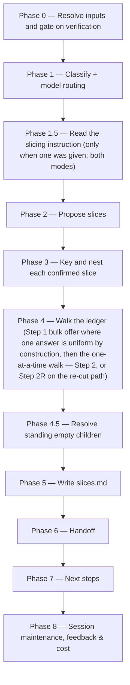

# /brd-split

On a **root** — a BRD that owns its source document — proposes candidate slices from a mandatory
slicing instruction, since a root is never ground and carries no findings to cluster by; keys and
nests a `PRD-` folder per confirmed slice with its own `brd-link.md`, an inventory of the rows it
inherits, and an unallocated coverage ledger of its own. On a **slice** it instead gates on every
grounding finding carrying a verifier verdict. Both runs then walk every unallocated
coverage-ledger row one at a time through four resolutions until none remain `unallocated`, and
write `slices.md` with the rationale for each slice and each deferral. Where one answer is uniform
by construction **and two or more rows are still `unallocated`** — exactly one slice standing on a
parent, or any run on a slice — the walk first offers to write that single disposition across every
remaining row in one confirmation, stating each row it would write and letting any of them be held
back to the one-at-a-time walk. Run on a **slice** it allocates but does not slice: the proposal and
child-creation phases are skipped and the walk offers its own four resolutions — the same count as `full` mode, a different set.
Run again on a **fully allocated root with an instruction**, and finding at least one row it can move, it performs the
**sibling re-cut**: a row this BRD
delegated to a child whose own ledger now records `deferred-to` against it is re-pointed onto a sibling that has not
been interviewed — the one case in which this command re-allocates a row that already carries a fate, taken against
the owner's own written refusal and needing no flag.

## Who runs it

`/brd-split` runs in the [pm](../roles-and-phases.md#pm--product-management) role,
cost-attribution phase `brd-to-prd` — the phase shared by every command of the BRD-to-PRD route. It
is the only command of the route that runs more than once: once on the root, right after
[`/brd-intake`](brd-intake.md), to carve slices from a slicing instruction; and once more on each
slice it carved, after [`/brd-ground`](brd-ground.md) has grounded that slice, to walk its ledger to
a recorded fate and hand on to [`/brd-interview`](brd-interview.md). There is a **third** occasion,
and it is a re-run on the **parent**: once a grounded slice's own walk has recorded `deferred-to`
against a row that parent delegated to it, an instruction typed against the parent's now
fully-allocated ledger re-points that row onto a sibling — the **sibling re-cut**. It takes no flag
and adds no command; it is this same command, on the same parent key, given the argument the route
already made mandatory for carving a root.

## Synopsis

```
/brd-split <BRD-KEY> [<instruction>]
```

- **`<BRD-KEY>`** (mandatory) — the BRD to split and allocate. A key naming either level a
  BRD folder can occupy works, and the level decides the run mode (below). Resolved via
  `resolve-address`; format-validated only, never checked against a tracker.
- **`<instruction>`** (**mandatory on a root that still has a row to place, optional on a slice**) — every non-flag token after
  the key, joined verbatim: a slicing instruction in your own words, such as `cover orders and
  measurements in the first iteration` or `slice everything this BRD still holds that no child
  covers`. **On a root with a row still `unallocated` it cannot be omitted**: a root is never ground,
  so it carries no findings to cluster candidate slices from, and the instruction is the only
  grouping signal there is — absent, the run stops with `BRD_SPLIT_NEEDS_INSTRUCTION`. A root run
  that proposes nothing needs none and does not stop: on a fully allocated ledger there is nothing
  to group, whether the run is a no-op or is there to resolve a standing empty child. **That is the
  one run on which the argument is otherwise free, and it is given a meaning there rather than a
  flag being added for it** — on a fully allocated root it selects the sibling re-cut (below). On a slice it stays optional and seeds only the
  walk's per-row recommendation; omitted there, the command behaves exactly as it did before the
  argument existed. It is prose and is never validated against anything — what it means is settled
  against this BRD's own rows in Phase 1.5.

## What an instruction does

**It seeds two things on an ordinary run, and it decides nothing.** In `full` mode it seeds the Phase 2 grouping and the
Phase 4 walk's per-row recommendation; in `allocate-only`, where Phase 2 never runs, it seeds the
walk alone — which is what makes it a real argument on a slice rather than an ignored one.

**Phase 1.5 reads it in two steps.** *Step A* places every row the instruction plainly determines,
asking nothing: a set operation over the ledger (*everything no child covers*) resolves entirely
here. *Step B* grills only the residue — one question at a time, each with a recommended answer,
**capped at five and gated on a value test: ask only where one answer places more than one row.**

**The value test is the real gate, and the reason is the fallback.** Phase 4 settles every
unallocated row regardless — one at a time, or inside its Step 1 offer where that fires — and
Phase 2's picker lets you move rows by hand, so an unplaced row costs nothing you were not already
paying, and a question that disambiguates a single row spends a turn to save at most one prompt that
was coming anyway. What earns a question is a terminology decision that
moves several rows at once. That also sizes the cap: in [`/idea`](idea.md) an unresolved bounded
question ships as a marker inside the artifact, so ≤10 earns its length; here the residue has a free
fallback, so ≤5 does.

**In `full` mode the instruction is the whole picture — there is no grounded one yet.** A root is
never ground, so Phase 2's clustering has nothing to weigh a placement against beyond what the
instruction itself says; whether a row is `NOT-PROVABLE` or `will-change` is not knowable until its
slice is ground, which is why grounding runs next. It is the slice's own walk — never this one —
that resolves a blocked row's disposition, with the finding already in hand.

**Nothing is invented for a row it could not place.** That row is left unclustered and walked with no
recommendation in Phase 4 — the same fate a row nothing clusters with already had, and the same
picker a run with no instruction has always shown. `slices.md` records the instruction verbatim
alongside how it was read.

**On a `full` run whose ledger is already fully allocated, and which finds at least one row it can move, it
seeds a third thing — and that thing is the run: the sibling re-cut.** There the argument is otherwise free — Phase 1.5 places `unallocated` rows and
there are none — so the command gives it a meaning there instead of taking a flag for it. Phase 0 step 9a
builds a **re-cut candidate set** out of the rows two ledgers already agree nobody is building: this BRD's
row for a `[BR#n]` reads `covered-by: <A>`, and A's own row for that same `[BR#n]` reads `deferred-to: <A>`.
Both halves are read from the `disposition` column at both levels — never from a `claims:` list, which a
child still carries for a row it has deferred, and never from an inventory, which a source-owning BRD holds
every row in whatever its fate. The same instruction is then read over that set exactly as it is read over
an unallocated one: Phase 1.5 places it, Phase 2 groups it and **fixes a receiver per group**, Phase 3 keys
whatever new slice was confirmed, and Phase 4's Step 2R offers each move one row at a time, receiver
already settled. Step 9a runs in `full` mode only, so the re-cut is unreachable on a slice.

**The precondition is the whole of it.** `deferred-to: <A>` is A stating in its own ledger that it is not
building this, so the parent re-points against a refusal the row's owner wrote down and never over a live
commitment: a row A still intends to build reads `covered-here` and cannot be moved, and a row A never took
does not read `covered-by: <A>` here to begin with. That is what makes this the one case in which
`/brd-split` re-allocates a row already carrying a fate
([`coverage-ledger-format.md`](../../references/coverage-ledger-format.md) §3.2).

**The receiver has not been interviewed.** An eligible receiver is a child of this same parent holding no
`decisions.md` with a `[VD#n]` or `[CD#n]` record in it and no `interview/round-*.md` on disk — a register
that exists and holds decisions is closed to added scope, since adding scope is neither of the two causes
that may reopen a decision ([`decision-register-format.md`](../../references/decision-register-format.md)
§4) — or a slice this same run carves, which has neither by construction. Being interviewed disqualifies a
**receiver** and never a **donor**, so an uninterviewed donor stays eligible for every other row; what
excludes it is a per-row clause instead — **a row's own donor is never that row's receiver**, so a standing
child donating any row in a group cannot be that group's target.

**A second per-row clause sits beside that one: a child already holding a ledger row for that `[BR#n]` is
not a receiver for that row.** The seeded row on a receiver is a **new** row born in the initial state, and
where a row for that id already exists there is no new row to be born: writing `unallocated` over it would
return a terminal row to the initial state, which no command may do, and leaving it would have the receiver
claim a requirement its own ledger says somebody else owns — a row its `allocate-only` walk never visits,
since that walk visits only `unallocated` rows, so it could never reach `covered-here`. The state is
ordinary rather than exotic: a child whose provisional claim on that same `[BR#n]` an earlier walk withdrew
holds exactly one orphan row for it and stays standing on its other claims, which is often the very child
you would name. Where the requirement is genuinely that child's to build, the two routes that work are
Phase 4.5's removal repair, which returns the requirement to the parent's own live obligations, and a
**new sibling**, which holds no row for anything and is eligible for every candidate by construction.

Phase 0 step 9a reports both sets before
anything else runs, names the children it excluded and why — including, per candidate row, which of the two
per-row clauses excluded which child — and, where the candidate set is empty while
children exist, says which of the two reasons emptied it, so "nothing to re-cut" is never
indistinguishable from an instruction the command failed to parse.

**Nothing travels with the row.** The donor ground it before deferring it, so a `[CG#n]` or `[DG#n]` in the
donor's grounding files may cite a `[BR#n]` it no longer owns: those findings cannot move, because an id is
assigned once and never renumbered, and they cannot be inherited either, because a finding carried in from
an earlier run is unverified by definition (`workflows-core:grounding-format` §8). The receiver re-derives
against the same pins, at the cost of one row's grounding. The donor's decisions stay too, and stay true —
a `[VD#n]` or a frozen `[CD#n]` about deferring the row records *the donor's refusal to build it*, which the
move acts on rather than reverses. The run **reports** every decision in the donor's register whose
`evidence` touches the moved row, by `id` and `statement`, resolved in two hops — a decision's `evidence`
names findings, and a finding's `claim` names the `[BR#n]` it was derived against — and a donor holding none
is reported as holding none rather than omitted. Nothing here edits a decision, a register or a grounding
file.

**On the re-cut path an unplaced candidate is not walked at all**, and that is a resolution of a
different kind: the row already carries a fate on both ledgers, so there is no picker that could leave it
where it is more cheaply than not showing it. It stays with its donor, Step 2R passes over it, the final
report names it, and `slices.md` records it. `slices.md` records the instruction verbatim alongside how it
was read on this path too — one instruction, read once, and only the set it was read against differs.

## Two modes

Phase 0 step 5 reads the resolved folder's `brd-link.md` and sets the mode from its `parent:` field
— the only reliable signal, since a key's segment count is a naming convention rather than a depth
declaration.

| | `split_mode: full` | `split_mode: allocate-only` |
|---|---|---|
| Applies to | a BRD that owns its source document | a **slice** (`parent:` present) |
| Phase 1.5 — read the slicing instruction | runs — mandatory, gated in Phase 0 | runs (when one was given) — it seeds the walk, not a grouping |
| Phase 2 — propose slices | runs | skipped |
| Phase 3 — key and nest children | runs | skipped — this is the child creation the one-level cap forbids |
| Phase 4 — walk the ledger | runs, **four** resolutions — no `covered-here` | runs, **four** — this walk offers no `covered-by` |
| Phase 4 Step 1 — the bulk offer | on an ordinary run, fires only when **exactly one** slice stands and ≥2 rows are unallocated; writes `covered-by: <that slice>` | fires whenever ≥2 rows are unallocated; writes `covered-here`, and carries the marker the per-row picker already carries |
| Phase 4 Step 2R — the re-cut walk | runs **in place of** the walk above on a fully allocated ledger an instruction found a re-cuttable row on | never — the candidate set is built in `full` mode only |
| Phase 4.5 — resolve standing empty children | runs | skipped — a slice has no children |
| `rejected: [DEF#n]` resolves in | this BRD's own defect log | the **parent's** log, one hop ([`brd-format.md`](../../references/brd-format.md) §4) |
| Phase 7 — next steps | ground each child that **gained a row this run**, never every non-empty one | **the route does not end here** — [`/brd-interview`](brd-interview.md) on this slice, Recommended; *Stop here* is the other option, not the only one |
| Announced? | no — the ordinary case | yes, `BRD_SPLIT_ON_SLICE`, a **notice, not a stop**, at Phase 0 and again in the final report |

A slice's walk offers no `covered-by`, and the reason is about **who writes** it, not about whether
a slice may carry one. On a slice the disposition names a **sibling under the same parent, or that
parent** — never a child, since no child can exist below a slice — only its Epics — and it records an
**orphan row**: a ledger row for a `[BR#n]` this slice no longer claims, whose claim the **parent's**
own walk withdrew. **Two routes reach that one state, and neither is a second kind of row.** On the
first the claim was never more than provisional: Phase 3 writes a child's `claims:` provisionally, and
where Phase 4 settles a claimed requirement elsewhere the claim and the copied inventory row are
withdrawn while the ledger row stays and takes that walk's terminal disposition. On the second the
claim was committed by an earlier run and then deferred by the slice itself, and a re-cut moved it to a
sibling — the same withdrawal, over a row that already carried a fate
([`coverage-ledger-format.md`](../../references/coverage-ledger-format.md) §2, §3, §3.2). Either way
the ledger row stays: a ledger row is never deleted. Every row a
slice's own walk stands on is a row that slice claims, so there is nothing for it to delegate. The
walk states that reason before its first row rather than presenting a shorter list without
explanation. **The cap is on nesting, not on allocation**: a slice whose rows could never leave
`unallocated` could never become PRD-eligible (§5), which is the deadlock the coverage ledger exists
to prevent.

## How it runs



**Phase 0 chooses between four paths once it has read the ledger, the child set and the re-cut
candidate set, and the first that matches is the run's own.** The order is stated because a fully
allocated ledger satisfies the front of two of them and only one is the run the operator asked for:

- **The re-cut** — no row `unallocated`, and an instruction that found a re-cuttable row. Phase 1.5
  places the candidate set, Phase 2 proposes from that placement and fixes a receiver per group,
  Phase 3 keys whatever was confirmed, Phase 4 runs **Step 2R in place of Step 2**, and Phases 4.5,
  5, 6 and 7 run as usual — so a parent holding both a re-cuttable row and a standing empty child
  resolves both in the same run.
- **The no-op** — no row `unallocated`, no child standing empty, and no re-cuttable row: the run
  skips straight from Phase 0 to Phase 6, which reports nothing to commit. A **bare** re-run builds
  no candidate set at all, so on a fully allocated parent it is this path **where no child is
  standing empty** — where one is, it takes the third path below, which is exactly what keeps a bare
  run the reachable fix the three stops naming it promise.
- **Phase 4.5 alone** — no row `unallocated`, but a child standing empty. Not a no-op: the walk it
  has no rows for is skipped and the empty-child resolution runs on its own, which is what keeps a
  child kept empty by an earlier run reachable by the one command that can remove it.
- **The ordinary run** — anything else: Phases 2–6 as written, in whichever mode Phase 0 resolved.

**The re-cut branch and the Phase 4.5-only branch were each added for the same reason.** Deciding the no-op on the ledger alone made a
standing empty child unreachable in every run after the one that created it; deciding it before the
candidate set was built would have swallowed the re-cut, whose starting state is indistinguishable
from a no-op's until that set exists. The decision is taken in **both** run modes, so a fully allocated
slice reaches it exactly as a parent does — `allocate-only` simply satisfies the other two parts by
construction, since no child exists or can be created below a slice and the candidate set is built in
`full` mode only. `workflows-core:impl-maintenance` runs in
Phase 8 for session lessons-learned; no other subagent is dispatched — every finding this command
reads was already independently verified by `/brd-ground`'s own agents.

## What it needs

- **`<BRD-KEY>`** — mandatory; absent or malformed stops the run with `BRD_SPLIT_NEEDS_KEY`.
- **`<instruction>`, on a root that still has a row to place.** A root is never ground, so it has no
  findings to cluster candidate slices from; an absent instruction on a `split_mode: full` run whose
  ledger still holds an `unallocated` row stops with `BRD_SPLIT_NEEDS_INSTRUCTION`, naming the same
  run again with one. Where nothing is `unallocated` the run groups nothing, so it needs no
  instruction and does not stop — and one supplied there is not discarded either: it is the sibling
  re-cut's invocation, and this stop is unreachable on that path, which only exists where an
  instruction was given. A slice needs no instruction at
  all — its walk takes recommendations from one but does not require it.
- **An existing BRD folder.** No folder for `<BRD-KEY>` — searched at `specifications/` and the
  the levels below it that `resolve-address` searches — stops the run with `BRD_SPLIT_NOT_FOUND`. That stop names both ways a folder
  comes to exist rather than asserting one: `/brd-intake` for a BRD with a source document of its
  own, `/brd-split` on the parent for a slice. With no folder there is no `brd-link.md` to say
  which of the two the key was meant to be, and a key's segment count is a naming convention, not a
  depth declaration.
- **Nothing more, at either level.** A key that resolves to a **slice** does not stop the run; it
  sets `allocate-only` (see "Two modes" above) and emits the `BRD_SPLIT_ON_SLICE` notice. What the
  one-level cap forbids is creating anything below a slice but its Epics
  (`workflows-core:addressing` §6): a slice of a slice would inherit
  `brd/source/` and a defect log from a parent that holds neither, so its inventory header would
  name a path that does not exist.
- **On a slice: `/brd-ground`'s findings already merged to the specs repo's default branch.**
  `split_mode: allocate-only` only — a root is never ground, so this gate and the next two do not
  run there at all; a root's own inventory-only check is stated separately below. Phase 0 gates
  `grounding/code-grounding.md` on `origin/<default>` via `require-on-main` before reading
  anything else — an open, unmerged grounding pull request stops the run naming the branch/PR
  state, and a BRD that has never been grounded at all stops naming the fix — but which fix depends
  on why no findings exist. With at least one `[BR#n]` row in the inventory, grounding simply has
  not run: `BRD_SPLIT_NEEDS_GROUNDING`, naming `/brd-ground`. With **no** row, there is nothing to
  ground and `/brd-ground` would stop on the same emptiness, so naming it would be a loop:
  `BRD_SPLIT_EMPTY_INVENTORY (split_mode: allocate-only)` instead, naming `/brd-split` on the
  parent.
- **On a slice: there is grounding to verify.** Two presence tests run before the count below,
  because a count is vacuously satisfied by an empty set and this gate once shipped as the count
  alone — a BRD with two indexed frame sets and no design grounding at all passed it, and its
  slices could reach build with their designs never reconciled. A `code-grounding.md` that is on
  main but records no `[CG#n]` stops with `BRD_SPLIT_NO_FINDINGS`. Where the folder's **design/**
  holds any frame set, `design-grounding.md` must itself be on the default branch — the run
  executes `require-on-main` against it rather than trusting the code gate's single-commit
  implication, which `/brd-ground --no-code` breaks by design. A **design/** subdirectory that no
  entry in `design-grounding.md`'s frame-set list covers — absent from it, or listed as having no
  index — stops with `BRD_SPLIT_DESIGN_NOT_GROUND`, which names `/brd-ground <KEY> --no-code` as
  the repair so the missing design pass can be added without re-deriving verified code findings. A
  set the operator explicitly skipped with `--no-design` passes, and is recorded in `slices.md` as
  a limit on what the split could check.
- **On a slice: every finding verified.** A finding with no recorded verifier outcome (`agree` /
  `extend` / `contradict` / `unprovable`) is not evidence this command may act on. Any such finding
  on file stops the run with `BRD_SPLIT_UNVERIFIED: N findings have no verifier verdict — run
  /product-workflows:brd-ground first.`
- **On a slice: every finding block is well-formed.** The finding record's field set is closed to
  the ones `workflows-core:grounding-format` §2 defines plus `outcome` and `notes`. A block carrying
  any other key stops the run with `BRD_SPLIT_MALFORMED_FINDING`, naming each finding and key. The
  key that actually occurs is `own_verdict` — a field the verifier *returns* to its caller, which
  leaves a block that carries it stating two verdicts at once while `verdict` is the one every
  consumer reads. The verified-outcome test above cannot catch it, because such a block does carry
  an outcome; the repair is to remove the offending key by hand, not to re-derive the corpus.
- **On a root: the inventory is non-empty.** A root is never ground, so there is no grounding gate
  here at all — `/brd-intake`'s inventory is what this mode reads. Zero `[BR#n]` rows stops with
  `BRD_SPLIT_EMPTY_INVENTORY (split_mode: full)`, naming a corrected `/brd-intake` re-run over the
  same folder rather than `/brd-ground`, which would stop on the same emptiness.
- **`$SPECS_PATH`** (required) — if unset, the run stops naming `SPECS_PATH`.

## What it produces

Under the resolved BRD folder — `$SPECS_PATH/specifications/BRD-<BRD-KEY>-<slug>/` for a root
BRD, and the `PRD-<SLICE-KEY>-<slug>/` slice folder inside it for a slice
([addressing](../reference/references.md) §2, §6):

- `coverage-ledger.md` — updated so no row remains `unallocated`: each row now reads
  `covered-by: <SLICE-KEY>`, `deferred-to: <this BRD>`, `rejected: [DEF#n]`, or
  `superseded-by: [BR#n]`. **On a re-cut run this file is written where no row was `unallocated` to
  begin with**: each re-pointed row takes `covered-by: <B-KEY>` for the receiving sibling, and the
  **donor's** own `coverage-ledger.md` takes the same value on its row for that `[BR#n]` — the
  parent's row written first, so a run interrupted between the two leaves the parent pointing one hop
  at the receiver rather than a second hop through the donor. No row returns to `unallocated` on
  either ledger, and no ledger row is ever deleted.
- `slices.md` — one block per confirmed slice (its key, its folder, and the rationale that grouped
  its rows: the buildable / blocked / depends-on reading, or, for a group a slicing instruction
  placed, what in the instruction placed it); one block per row deferred this run; one block for the
  Phase 4 Step 1 bulk offer where it fired, naming what it wrote and what was held back; and, when the run
  was given an instruction, one block for the instruction itself — **verbatim**, with how it was
  read: which rows Phase 1.5's Step A placed directly, which the Step B grill settled and by what
  terminology decision, and which it could not place. That block is written whether or not the
  instruction produced a slice, because a reading that produced nothing is the one a later reader
  most needs, and the verbatim text is what shows whether the instruction or the reading was wrong.
  On a re-cut run the same block records that same reading over the **candidate** set — one
  instruction, read once, and only the set it was read against differs.

  Two further blocks exist because the ledger cannot say what they say. **On a re-cut run**, one
  entry per candidate row: its `[BR#n]`, the donor it stood on, and either the receiver it went to —
  with whether that receiver is a slice this run keyed or a child that already stood, and whether the
  write came from the per-row picker or from the bulk offer — or the fact that it was **left with its
  donor**, with the reason, alongside the donor's decisions the run reported for it by `id`. A
  re-pointed row and a row this BRD allocated to the same slice on its first pass read identically on
  both ledgers afterwards, so nothing else in the tree records that a requirement changed hands, which
  slice gave it up, or what that slice had already decided about it. And **whenever Phase 4.5 removes
  a child**, one block for it: its key, that it was removed for claiming nothing, and every row the
  removal re-pointed onto this BRD by `[BR#n]` and by the ledger it sits on — this BRD's own
  included — or that it re-pointed none.
In `allocate-only` mode the run writes exactly the first two of the following; Phase 3 never runs,
so no child folder is created.

- One nested folder per confirmed slice still claiming at least one row after the walk
  (`split_mode: full` only),
  `BRD-<KEY>-<slug>/PRD-<CHILD-KEY>-<child-slug>/`, each holding three files: `brd-link.md` naming its
  parent and its claimed `[BR#n]` rows; `brd/brd-inventory.md`, the claimed rows copied verbatim
  from this BRD's inventory under a header naming the parent's `brd/source/`, which every
  `source_anchor` in it still resolves against
  ([`brd-format.md`](../../references/brd-format.md) §2.1); and its own `coverage-ledger.md` with
  every row `unallocated`. The claim list is **provisional** until the walk ends: a row proposed for
  a child but settled elsewhere loses its claim and its inventory row, while its ledger row stays as
  an **orphan row** carrying the disposition the walk settled — including `covered-by: <SIBLING-KEY>`
  where another child took it. A ledger row is never deleted. **A re-cut withdraws a claim that was
  no longer provisional** — the donor committed to the row in an earlier run and then recorded
  `deferred-to` against it — and it is withdrawn the same way and produces the same orphan row: the
  donor's `claims:` entry and its copied inventory row go together, and the receiver gains a
  `claims:` entry, a copied inventory row and one `unallocated` ledger row of its own, whether it is
  a slice this run keyed or a child that already stood.

  Those last two files are what let the child re-enter the route: `/brd-ground`
  gates on the child's ledger and reads the child's inventory, and `/brd-intake` — the only other
  command that writes either — never runs on a slice, which has no document to intake. Those rows
  are then allocated by `/brd-split` run on the child itself, in `allocate-only` mode, which is what
  makes the child PRD-eligible. The same requirement carries a fate at both levels, saying two
  different things: `covered-by: <CHILD-KEY>` here records **which** BRD owns it, and the child's own
  row records **what that BRD decided to do with it**
  ([`coverage-ledger-format.md`](../../references/coverage-ledger-format.md) §3). A slice whose
  every row ends up resolved elsewhere is either removed or kept empty with a recorded reason
  (Phase 4.5).

Behind Phase 6's consent choice, these are committed, pushed, and a pull request opened against
the specs repo's default branch under the shared `brd/<BRD-KEY>-<slug>` branch prefix — skipped
with a "nothing to commit" report on the no-op path.

## Gates

- **Phase 0 — the instruction gate, on a root.** `split_mode: full` cannot propose a slice with
  nothing to group by, so an absent `<instruction>` on a run whose ledger still holds an
  `unallocated` row stops it. The stop fires **late in Phase 0**, after the ledger has been read,
  the existing children enumerated and the re-cut candidate set built, because only then is it known
  whether this run proposes anything at all: where nothing is `unallocated` the run groups nothing
  and needs no instruction, and one supplied there is the sibling re-cut's invocation rather than a
  missing input (see [What it needs](#what-it-needs)). A slice needs none either: its walk's per-row
  recommendation is the only thing an instruction seeds there.
- **Phase 0 — grounding merged to main, on a slice only.** `split_mode: allocate-only` only — a root
  is never ground, so this gate is skipped entirely there and a root's own gate is the inventory
  count above. On a slice, `require-on-main` against `grounding/code-grounding.md` runs before
  anything else is read — an unmerged grounding pull request, or a BRD never grounded at all, stops
  the run rather than acting on a deliverable that might still change underneath it.
- **Phase 0 — verification gate, on a slice only.** Same mode restriction. No row is resolved
  against a claim no one has verified: every grounding finding on file must carry a verifier
  outcome before this command does anything else.
- **Phase 4 — the allocation walk.** The command cannot complete while any coverage-ledger row is
  `unallocated`. Every remaining row is presented one at a time via `AskUserQuestion`, through
  exactly four resolutions in `split_mode: full` — assign to a named
  slice (`covered-by`), defer to this BRD (`deferred-to`), reject citing a `[DEF#n]`, or mark
  superseded by another `[BR#n]`. `allocate-only` offers a different four: `covered-here` replaces
  `covered-by`, which is the one that walk does not offer. `covered-here` is what makes a **slice**
  PRD-eligible, and it is absent from the parent's picker because a BRD is a container that builds
  nothing itself — every row that must be built goes to a slice, and Phase 2 always produces at
  least one.
- **Phase 4 Step 1 — the bulk offer, and it is an offer.** Slicing is mandatory, so a whole BRD
  becoming one slice is the ordinary shape of this route: every row on the parent takes
  `covered-by: <the one slice>`, and every row on that slice then takes `covered-here`. Where that
  answer is fixed by construction — **exactly one** slice standing on a parent, any run on a slice —
  and two or more rows are still `unallocated`, the walk asks **once** instead of once per row. A
  forty-row BRD resolved to a single slice costs 40 + 40 = **80** prompts without it and **2** with
  it, across the same two runs and the same two pull requests. **On a re-cut run it fires on a third
  condition, over a different uniformity**: two or more placed candidates carrying **one** confirmed
  receiver between them. The count is over the rows Phase 2 gave a target, never over standing
  folders — an uninterviewed donor stands and is eligible and receives none of these rows, so counting
  folders would fire this offer only where every donor happened to have been interviewed, which is the
  opposite of the ordinary case.

  Three things keep it an offer rather than a mode. It **states what it will write** before you
  answer — the disposition spelled out, the count, every `[BR#n]` with the first line of its text,
  and, on an ordinary run, the `brd-link.md` `claims:` entries it adds alongside. On the re-cut path
  it states a different second write and touches no `claims:` list at all: the donor's ledger row,
  taking `covered-by: <B-KEY>` after the parent's — the `claims:` entries are the reconcile's there,
  withdrawn from the donor and added to the receiver a step later. It is **refusable per row**: the second
  option takes a list of `[BR#n]` ids to hold back and walks exactly those one at a time, so three
  exceptions out of forty cost one offer, one naming prompt and three row prompts — **5**, not 40.
  And the **third option is the ordinary walk**, which is where *every* answer the run cannot use
  falls through to — at the offer itself and at the hold-back prompt, an empty answer included — so
  nothing is ever written in bulk that you were not shown and did not confirm.

  Its vocabulary is those two dispositions and the re-point, and no others: `deferred-to` needs a
  per-row rationale, `rejected` a `[DEF#n]`, and `superseded-by` a `[BR#n]`, and a bulk form of any of
  the three would either skip a prompt that carries content or copy one row's reason onto rows that do
  not share it. The re-point needs none of those — the donor came from the candidate set and the
  receiver from Phase 2's confirmation, and neither is a sentence you have to type.
  It does not fire where two or more slices stand — which slice owns a row is the per-row judgement
  the walk exists to take — nor where the placed candidates carry two or more distinct receivers,
  where one `<B-KEY>` in the list would stand for two destinations and the rows going to each would be
  invisible in it; nor on a single remaining row, where it would spend a prompt to save
  one. A row the run's `<instruction>` placed on a different disposition is excluded from the set
  and named in the offer, never absorbed by it; on a re-cut run the exclusion is instead every
  candidate the placement left unplaced, named with the donor it stays with. Neither the `full` offer nor the re-cut one
  recommends an option, and for the same reason each time: the run knows which slice a delegated row
  would go to, not whether this row is one to delegate — and which sibling a re-pointed row would go
  to, not whether this row is one to move. `slices.md` records that the offer fired, what it
  wrote, and what was held back, because the ledger rows read identically either way.
- **Phase 4 Step 2R — the re-cut walk, and it is a per-row offer.** It runs **in place of** the
  ordinary walk on the re-cut path — never beside it, because on that path no row is `unallocated` and
  the ordinary walk's opening set is empty. Each candidate is presented one at a time, quoting the
  row's `id` and `text` from **this BRD's own** inventory, the donor's key, **both** dispositions
  quoted from the two ledgers rather than asserted, the receiver Phase 2 fixed, and every decision in
  the donor's register whose `evidence` touches the row. The picker is two options — re-point, or
  leave it with the donor — and an answer the step cannot use falls to the second, the answer that
  writes least and changes nothing. §4's allocation gate does **not** bear on any of this: a candidate
  already carries a terminal disposition on both ledgers, so a run that ends with every candidate left
  where it was is a complete run rather than a stalled one. **There is no no-receiver stop, and adding
  one would be wrong.** A candidate set with no eligible child standing is not a failure — Phase 3 can
  always key a new slice — and a proposal you read and declined is an answer, not an error: Step 2R
  simply has nothing to offer, every candidate is reported left with its donor, and Phases 4.5, 5, 6
  and 7 run as usual.
- **Phase 4.5 — no child left standing while claiming nothing** (`split_mode: full` only). The set is
  **every** child standing now, not only the ones this run created: a slice whose every proposed row
  ended the walk resolved elsewhere, any child an earlier run left empty, and — on the re-cut path —
  a **donor** whose last remaining claim was moved to a sibling. Emptiness is **recomputed here,
  after the walk**, off each standing child's `claims:` list as the reconcile left it, never taken
  from what Phase 0 marked: on a re-cut run that marking goes stale inside the same run in both
  directions, since a child it marked may have just been given a row and a child it did not mark may
  have just lost its last one. A child with no
  recorded reason is offered removal (recommended); one already carrying a reason is offered keeping
  it (recommended), removing it now, or updating the reason — so a deliberate decision is not
  re-litigated, and removal stays reachable. A reason recorded before that child was given a row and
  emptied again is printed with a note saying so, because it was answered about a different
  situation. Such a child's ledger is not necessarily empty — it
  keeps one terminal orphan row per withdrawn claim — but its `claims:` list is, which is what every
  stop naming this phase reacts to. The phase never gives a child rows: `covered-by: <child>` is
  Phase 4's walk and nothing else — its ordinary walk, against a row still `unallocated` on this
  BRD's ledger, or its re-cut walk, against a row the child holding it recorded `deferred-to`
  against.
- **Phase 4.5 — a removal repairs the keys that pointed at what it deletes.** Before deleting a
  folder, the phase reads this BRD's own ledger **and** every other standing child's for rows whose
  `disposition` names the child being removed, and names each in the removal confirmation — with its
  `[BR#n]`, the ledger it sits on, and what it will be rewritten to — as prose beside the unchanged
  picker. On removal, a row on this BRD's own ledger takes `deferred-to: <this BRD>` and a row on
  another child's takes `covered-by: <PARENT-KEY>`: never back to the slice that donated it, which
  recorded that it will not build it, and never to `unallocated`, which no command may write — so a
  removal never reopens the allocation gate. Every such write lands **before** the deletion, so an
  interrupted run leaves an empty folder still on disk and every reading accurate, rather than a key
  naming a folder that is gone. This repair became reachable with the re-cut, which is what made a
  child that a ledger still names able to end a run claiming nothing; where the read finds no such
  row nothing extra is written, which is every removal on a tree no re-cut has touched.
- **No-op on a fully-allocated ledger, with two exceptions.** Re-running `/brd-split` once every row
  already has a disposition changes nothing **unless** a child is standing empty, in which case
  Phase 4.5 still runs, **or** the run was given an instruction that found a re-cuttable row, in
  which case it is the sibling re-cut. A **bare** re-run builds no candidate set at all,
  so with no child standing empty it reports the ledger line and stops.

## Example

Split a synthetic customer BRD once its intake pull request has merged, naming the slicing
instruction a root cannot omit:

```
/product-workflows:brd-split EPIC-008 cover orders and measurements in the first iteration
```

A root is never ground, so the instruction is the only grouping signal there is; with rows still to
place, an invocation without one stops with `BRD_SPLIT_NEEDS_INSTRUCTION`.

Step A places the rows whose text names an order or a measurement; Step B asks at most five
questions, and only where one answer moves several rows — *the BRD writes "form" for an order record
and for a compliance artifact; which is meant in these six?* Phase 2 then proposes
`orders-and-measurements` as a slice. Phase 4 walks each row with
`(Recommended — your instruction grouped this as an order)` on `covered-by`. A second run,
`/product-workflows:brd-split EPIC-008 slice everything no child covers`, resolves entirely in Step A and
asks nothing.

Later, `EPIC-008-01` is ground, its own `allocate-only` walk records `deferred-to: EPIC-008-01`
against the measurement rows, and a third run on the **parent** —
`/product-workflows:brd-split EPIC-008 peel the measurement rows off the first slice` — is the sibling
re-cut. `EPIC-008`'s ledger has no `unallocated` row, so the instruction is read over the re-cut
candidate set instead: the measurement rows, which read `covered-by: EPIC-008-01` here and
`deferred-to: EPIC-008-01` there. Phase 2 proposes a `measurements` slice as their receiver, naming
`EPIC-008-01` as each row's donor; Step 2R offers each move one row at a time, showing what
`EPIC-008-01` decided about the row before you answer. Each accepted row takes `covered-by` for the
new slice on **both** ledgers, `EPIC-008-01` gives up the claim and the copied inventory row, and the
new slice re-enters at `/brd-ground` with a row nobody has yet ground for it. Had every child able to
take those rows already been interviewed, the run would still not stop — Phase 3 can always key a new
slice — and declining every proposal is an answer, after which each row simply stays where it was.

The run resolves the BRD, confirms an instruction was given, proposes candidate slices from it,
keys and nests a folder per confirmed slice, walks every remaining ledger row to one of the four
resolutions, writes `slices.md`, and offers to branch, commit, push, and open a pull request. Its
next-step offer names [`/brd-ground`](brd-ground.md) on **each child that gained a row this run** —
the slices this run keyed and still claiming a row after the empty-child phase, and any child that
already stood which the walk newly resolved a row to — once
this run's deliverables reach the specs repo's default branch — the `<merge-clause>` placeholder
(`workflows-core:next-phase-offer`) resolves that, since a no-op run and a declined handoff open no
pull request to wait on. The offer says which of three cases each child is, because only one of them
is a re-run: a slice keyed this run and a standing child nobody ever ground are each a first pass,
while a standing child that is **already** ground needs `/brd-ground` again — the row arrived after
its findings, so no finding on file was derived against it, and a finding carried in from an earlier
run is unverified by definition. A child that gained nothing is not in the set and nothing is offered
for it, a donor that gained no row included. **This BRD's own next step is nothing**: a root is never ground, so
[`/brd-interview`](brd-interview.md) refuses it outright (`BRD_INTERVIEW_ROOT_LEVEL`) and is not
offered here. It is each such child's own re-entry at `/brd-ground` and then, in
`allocate-only` mode, `/brd-split` again that carries the route forward — and that second
`/brd-split` run is what offers `/brd-interview` next, on the child's own key.

## See also

- [Roles and phases](../roles-and-phases.md) — what the `pm` role owns and hands off.
- [Model routing](../reference/model-routing.md) — the classification rules this command applies.
- `workflows-core:addressing` — the `<BRD-KEY>` grammar and folder
  resolution this command uses by name (`key-valid`, `resolve-address`), including how a slice
  nests inside its parent and why that nesting — and only the nesting — is capped at one level
  (§3).
- [`coverage-ledger-format.md`](../../references/coverage-ledger-format.md) — the authority for
  the ledger row shape, the six dispositions, the allocation gate this command enforces, the
  PRD-eligibility rule a slice's `covered-here` rows satisfy, and §3.2's re-cut: what makes a row
  movable, which rows change and in what order, who may receive one, and what the mechanism does not
  relax.
- [`decision-register-format.md`](../../references/decision-register-format.md) — §4's two causes for
  reopening a decision, which is why a sibling holding decisions cannot receive a re-pointed row.
- `workflows-core:grounding-format` — §8's four verification outcomes,
  which this command's Phase 0 gate depends on.
- [Agents](../reference/agents.md) — `impl-maintenance`'s full contract.
- [Session cost](../reference/session-cost.md), [Session feedback](../reference/session-feedback.md),
  and [Resume and checkpoints](../reference/resume-and-checkpoints.md) — the terminal Phase 8
  bookkeeping every run emits.
