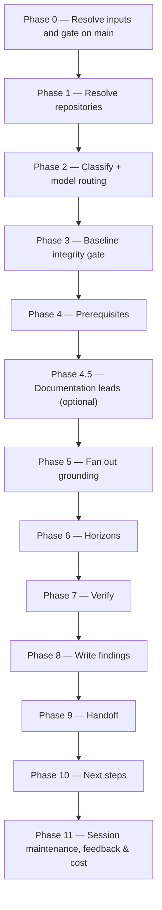

# /prd-ground

Grounding workflow serving both routes into a PRD, its route detected from the resolved folder and
never declared. Pins every mounted repository to a verified commit, grounds every claim in the
resolved folder's own claim list against code (`code-grounder`, Opus) and an exported design frame set
(`design-grounder`, Opus), independently re-derives every live finding (`grounding-verifier`, Opus), and, on
the BRD route, assigns each finding a `current` / `will-change` horizon against declared
prerequisite BRDs.

## Which route, and how it is detected

The moment `<KEY>` resolves to a folder, this command tests the **directory prefix**, never the
folder's asserted `kind:` — a BRD-route slice's own `brd-link.md` asserts `kind: brd` while being
exactly the folder this command must accept, so a kind-based test would refuse every slice.

- **A resolved `BRD-` folder is a root** — refused (`PRD_GROUND_ROOT_LEVEL`); a root BRD is never
  ground — grounding happens at a `PRD-` folder, a slice or an idea-route PRD folder.
- **A resolved `EPIC-` folder is refused too** (`PRD_GROUND_EPIC_LEVEL`) — grounding is PRD-altitude
  on both routes, and an Epic folder holds no `prd.md` of its own (it sits one level up). A legacy
  folder with no prefix whose carrier asserts `kind: epic` is an Epic folder, and is refused the same
  way.
- **A `PRD-` folder carrying `brd-link.md` → the BRD route.** Every existing step applies unchanged,
  over that slice's own `[BR#n]` inventory.
- **A `PRD-` folder with no `brd-link.md`, sitting inside a `BRD-` folder → a stop,
  `PRD_GROUND_CARVE_INTERRUPTED`.** Only a slice sits inside a BRD, so this is one a
  [`/brd-split`](brd-split.md) run created and stopped on before writing its `brd-link.md`; no
  `/brd-split` run finds it again, since that command finds a child by that file. The stop names
  removing the folder and then the parent's instructed re-run, and never `/create-prd`, which would
  author a PRD inside a BRD.
- **Any other `PRD-` folder with no `brd-link.md` → the idea route.** `/create-prd`'s own unprompted
  output; its claims come from its own `prd.md`.
- **Resolved through the legacy unprefixed fallback, with no ledger and no inventory** — split on
  `prd.md` being present and asserting `kind: prd`: present → the idea route; absent, or present
  without `kind: prd` → the BRD route's no-link branch, which stops naming what the folder carries
  (`PRD_GROUND_NO_INVENTORY` or `PRD_GROUND_NEEDS_INTAKE`). Since product-workflows 3.7.0
  `/brd-intake` writes the inventory's header before it copies anything; a folder an earlier intake
  left with `brd/source/` alone carries neither BRD file, and `/brd-intake` refuses it too, so the
  remedy is the same. It is no BRD container, so the stop names a fresh `/brd-intake` under a new
  key rather than a re-run over this folder, which that command refuses. **Where the folder holds an
  `idea.md` and no `prd.md`** — an idea handed off before the kind prefixes — the stop also names
  [`/create-prd`](create-prd.md) on the same key, which accepts the folder and writes the `prd.md`
  that puts a re-run of this command on the idea route.

## Who runs it

`/prd-ground` runs in the [pa](../roles-and-phases.md#pa--product-architecture) role,
cost-attribution phase `brd-to-prd`, on either route. On the BRD route it is the phase shared by
every command of the route, and the only one of the six that does not run as
[pm](../roles-and-phases.md#pm--product-management): a slice reaches it already carved by
[`/brd-split`](brd-split.md), which is also what its own findings hand back to, for that same
slice's ledger to be allocated. On the idea route it is PM-initiated the same way — typically run
by whoever just ran [`/create-prd`](create-prd.md) — but PA/Dev-executed identically: it is the
step that actually opens the mounted repositories and design assets to check a claim, work that
sits with PA/Dev rather than PM. On this route it is **optional and ungated**: nothing in
[`/create-ard`](create-ard.md) or [`/specify`](specify.md) requires it to have run.

## Synopsis

```
/prd-ground <KEY> [--depends-on <BRD-KEY>…] [--derivation-matrix|--no-derivation-matrix] [--no-code] [--no-design] [--no-docs] [--docs <path>] [--rebaseline]
```

- **`<KEY>`** (mandatory) — the folder to ground, on either route. `resolve-address` searches every
  level it bounds (three), because a root or an Epic has to resolve before it can be refused by
  name; format-validated only, never checked against a tracker. **Only a slice or an idea-route PRD
  folder is ground**: a resolved `BRD-` root stops with `PRD_GROUND_ROOT_LEVEL`, naming
  [`/brd-split`](brd-split.md) as the way to carve one; a resolved `EPIC-` folder stops with
  `PRD_GROUND_EPIC_LEVEL`, naming the PRD folder it sits in.
- **`--depends-on <BRD-KEY>`** (optional, repeatable, **BRD route only**) — declares a prerequisite
  BRD. Persisted to `brd-link.md` additively across runs; the file may also be edited by hand. A
  prerequisite contributes a `will-change` horizon only through its **frozen** decisions, and frozen
  is a field test rather than a judgement — `status: decided` in that BRD's own register
  ([`decision-register-format.md`](../../references/decision-register-format.md) §3), never a record
  that merely reads as settled. A prerequisite declared while it is still in flight carries `open`
  records and contributes nothing, which is ordinary and is reported as its own state rather than as
  a silent absence. A horizon a new prerequisite moves on a finding an earlier run wrote — an
  on-file finding — is never rewritten in place: the finding is superseded and a successor with the
  same verdict and the new horizon is appended and verified — or, for a design finding no frame
  set places, it is superseded with none — so a decision taken on the old horizon
  is put again by [`/brd-interview`](brd-interview.md). **Refused outright on the idea route** —
  `PRD_GROUND_NO_PREREQUISITES` — because a `will-change` horizon needs a decision register to
  freeze a prerequisite's decision in, and the idea route has none anywhere: every finding there is
  `current`, whatever this flag names, so accepting it and doing nothing would leave a documented
  flag with a stated effect that never happens.
- **`--derivation-matrix` / `--no-derivation-matrix`** (optional, mutually exclusive) — force the
  implementation-altitude data-source matrix on or off. Left unset, the command defaults it on when
  the claim list reads as reporting- or data-centric, on either route, and off otherwise.
- **`--no-code`** (optional) — add design grounding over a code grounding that is already on file
  and already verified, without re-deriving it. This is a **run mode**, not a step skip:
  `grounding/code-grounding.md` is read-only for the whole run, this run produces no `[CG#n]` at
  all, and every finding already in that file keeps its verdict, its evidence and its verifier
  outcome — it is neither re-derived nor re-verified. It is the flag to reach for when a folder turns
  out to have exported frame sets and no design grounding: without it, the only way to add the
  missing pass is a full re-run that puts every verified code finding back through derivation. The
  repositories are still resolved and still pinned, because a design finding that reconciles
  against code is pinned to the commit of the code finding it cites. Documentation grounding and the
  derivation matrix are off under this mode — both are written into the file it holds read-only —
  and the run refuses outright when combined with `--no-design` (nothing left to ground), with
  `--rebaseline` (which rewrites code findings by id), with an explicit `--derivation-matrix`, or
  against a folder with no verified code grounding to build on.
- **`--no-design`** (optional) — skip the `design-grounder` pass even when an exported frame set
  is present. Frame sets live in the resolved folder's reserved **design/** subdirectory, one
  subdirectory per set — images plus an index file naming what each frame depicts, which
  `design-grounder` refuses to run without, since a filename is not a reliable statement of what a
  frame shows (`workflows-core:grounding-format` §6.1). No **design/**
  folder means the pass is skipped and the run says so.
- **`--no-docs`** (optional) — turn documentation grounding off for this run.
- **`--docs <path>`** (optional) — point documentation grounding at that root for this run instead of `${DOCS_PATH:-/workspace/docs}`. The flag and its value are stripped together before the address is parsed.
- **`--rebaseline`** (optional) — re-run grounding against code that has moved since the last
  pass. Supersedes the affected findings by id rather than renumbering them, so a citation into an
  already-sent package still resolves, and keeps on each the verdict it carried as `prior_verdict`,
  which is what lets [`/brd-interview`](brd-interview.md) tell a re-grounding that came back as it
  stood from one that moved a decision's ground.

## How it runs



The phases are the same shape on either route — only Phase 0's gate and claim-list source fork, per
"Which route" above. Four subagents are dispatched, all read-only against every repository or root
they touch: `workflows-core:docs-grounder` (Phase 4.5, read-only grounding on the shipped product
docs — default ON when `$DOCS_PATH` resolves, advisory, never a gate), `code-grounder` (Phase 5, one
per repository, ≤4 concurrent), `design-grounder` (Phase 5, one per exported frame set, after every
`code-grounder` instance has returned — its fourth reconciliation class cites a `[CG#n]`), and
`grounding-verifier` (Phase 7, one per finding, pinned to Opus). `workflows-core:impl-maintenance`
also runs, in Phase 11, for session lessons-learned.

## What it needs

- **`<KEY>`** — mandatory; absent or malformed stops the run with `PRD_GROUND_NEEDS_KEY`.
- **Not a root, and not an Epic folder.** `PRD_GROUND_ROOT_LEVEL` and `PRD_GROUND_EPIC_LEVEL`, per
  "Which route" above.
- **`$REPOS_PATH`** — required, on either route; resolved as one directory or a colon-separated
  list. No resolvable entry stops the run naming `REPOS_PATH`.
- **`$DOCS_PATH`** (optional, default `/workspace/docs`) — documentation grounding, resolved once
  in Phase 1 alongside the repo prompt and consumed **lead-only** in Phase 4.5. Missing,
  unreadable, or carrying no markdown file is a silent, non-blocking skip. Turned off with
  `--no-docs`, and also off under `--no-code` — a divergence is written into `code-grounding.md`,
  which that mode does not write. **A document is never evidence for a `[CG#n]`** — see the Phase 4.5 gate below.
- **A clean working tree per resolved repository.** The Phase 3 baseline-integrity gate runs
  `rev-parse HEAD`, a `diff --ignore-cr-at-eol --stat`, and a line-count check on anything
  `status --porcelain` reports, **before any finding is written**. Any non-empty content diff stops
  the run with `PRD_GROUND_DIRTY_TREE` — grounding a dirty tree would cite an unidentifiable
  snapshot. The stop names the repository, the commit, and the remedy: settle that working tree
  (commit, stash, or check out a clean copy) and re-run, or commit the changes and re-run with
  `--rebaseline` if they are what you meant to ground (unavailable under `--no-code`, which names
  the plain re-run instead). The plugin never settles it for you — it mounts code repositories
  read-only and writes to none of them.
- **`--rebaseline` when code has moved.** If a repository's `HEAD` has moved since the last
  recorded pin and `--rebaseline` was not given, the run stops with `PRD_GROUND_NEEDS_REBASELINE`
  rather than silently grounding against a snapshot the last package never saw.
- **A repository that stays put for the whole run.** If a resolved repository's `HEAD` moves
  *after* Phase 3 pinned it, the verifier refuses rather than verifying and the run stops with
  `PRD_GROUND_VERIFY_COMMIT_MISMATCH`, naming the finding, the pinned commit, and the `HEAD` it
  actually found. The remedy is a re-run from a clean tree **with `--rebaseline`**: a new pin is
  written to `grounding/baselines.md` only in Phase 8, with the findings it pins, so the pin an
  earlier run recorded still stands, and a plain re-run would find its `HEAD` no longer matching it
  and stop again, this time with `PRD_GROUND_NEEDS_REBASELINE`. Because no stop before Phase 8
  records a pin, a `--rebaseline` run that stops midway leaves the old pin recorded, and its re-run
  supersedes the old findings as a completed run would have. The same applies to a `code-grounder` dispatch that reports a
  moved `HEAD` in Phase 5.

### On the BRD route

- **An inventory with at least one `[BR#n]` row.** A slice whose inventory holds none has nothing to
  ground, so this command writes no finding and hands nothing off — and every downstream command on
  the route gates on that handoff. Rather than reporting a quiet success that leaves `/brd-split`
  and `/brd-interview` refusing the slice and naming this command as the fix, the run stops with
  `PRD_GROUND_EMPTY_INVENTORY` and names the upstream fix: `/brd-split` on the parent, since a
  slice that was allocated nothing has no document of its own to intake. Which form of that run to
  type depends on the parent's own ledger, and the stop says so — and where that ledger cannot be
  read it names neither form, a case every remedy table that hands this stop's remedy on inherits. Where the parent still holds an `unallocated` row the
  run walks it too and can offer `covered-by` against this slice — and a run with rows still to place
  needs a slicing instruction to group them. Where none is left, the **bare** run offers to remove
  this slice or to keep it against a recorded reason, and that is the whole of what it offers; adding
  an instruction to that same run can additionally **re-cut** onto this slice a row the parent
  delegated to a sibling that has since recorded `deferred-to` against it — the one case in which
  `/brd-split` re-allocates a row already carrying a fate, apart from the key repair a removal
  performs (its Phase 4.5). That third outcome is not guaranteed to be
  on offer: it needs such a row to exist and it needs this slice never to have been interviewed, so a
  slice emptied after its own interview can only be removed or kept.
- **This BRD's own inventory and ledger already on the specs repo's main branch.** `/prd-ground`
  gates `coverage-ledger.md` on `origin/<default>` via `require-on-main` before reading anything
  else; an unmerged pull request stops the run naming the branch/PR state. It gates
  `brd/brd-inventory.md` separately, never inferring it from the ledger's gate, and splits that
  file's own "on no ref" the same way. **The ledger's gate resolves first** — including, where the
  ledger is on no ref, whether it is in the folder at all — and the inventory's is evaluated only
  after it, so where both stop, the ledger's stop is the one printed: the ledger's never-produced
  branch accounts for an inventory an interrupted carve left behind, and an inventory stop printed
  first would name the wrong remedy. **The one exception** is a ledger in the folder and on no ref
  beside a missing inventory: there the inventory's own stop prints, because a slice missing a file
  cannot be reconciled against its parent. No inventory in the folder stops with
  `PRD_GROUND_NO_INVENTORY`, and under that order the ledger was always written when it does, so
  on a slice the inventory was written and then lost: its remedy turns on the slice's `claims:` and
  the parent's ledger — a slice claiming nothing gets the empty-inventory remedy; a slice whose
  ledger is on the default branch but missing from the working tree is told to restore it from
  there; and otherwise the inventory is restored from the ref that carried it, or reported, since a parent `/brd-split` writes nothing into a slice
  with a file missing and never re-creates one — and on a folder naming no
  parent it names a fresh intake under a new key, and also `/create-prd` on the same key where the
  folder holds an `idea.md` and no `prd.md`. An inventory in the folder and on no ref, with a `coverage-ledger.md` there too, stops with
  `PRD_GROUND_INVENTORY_NOT_HANDED_OFF`, whose action is to commit and merge it, and which names no
  `/brd-intake` run: that command refuses a slice and any folder that is not a container, and every
  container has already been refused as a root. Where the gate reports
  the ledger is on no ref at all, the run **splits a state the gate cannot**, exactly as
  [`/brd-reconcile`](brd-reconcile.md) does on its own row F. No `coverage-ledger.md` in the folder
  means it was never produced or was lost after it was written, and the stop names the producing run by level: a folder naming no
  parent — no slice, and no container [`/brd-intake`](brd-intake.md) would re-run over — stops with
  `PRD_GROUND_NEEDS_INTAKE`, naming a fresh intake under a new key, and also `/create-prd` on the
  same key where the folder holds an `idea.md` and no `prd.md`; a
  **slice** — recognised by the `parent:` field in its `brd-link.md` — stops with
  `PRD_GROUND_NEEDS_SPLIT`, whose remedy turns on the slice's `claims:` and the parent's ledger — it
  gives the empty-inventory remedy where the slice claims nothing; where none of the rows it claims
  is settled onto it on the parent's ledger, the files that run had not reached were never written, by a parent
  [`/brd-split`](brd-split.md) interrupted after writing the slice's `brd-link.md`, so it names
  removing that folder — which no command committed, and which is removed from every branch carrying it where it was committed by hand, the default branch included — and then that parent's instructed re-run where one of those
  rows is still `unallocated` there, and otherwise the hand edit that empties the left-over `claims:`
  followed by the parent re-run in the form its ledger calls for; otherwise it says the ledger was lost after it was written, with the inventory where that is missing too, and what is missing must be restored from the ref that carried it; and it names no form where the
  parent's ledger cannot be read — because a slice has no
  source document of its own to intake and its ledger and inventory are written by the parent's split
  ([`brd-format.md`](../../references/brd-format.md) §2.1,
  [`coverage-ledger-format.md`](../../references/coverage-ledger-format.md) §3). A ledger **in** the
  folder and on no ref means it was produced, but not whether the carve that wrote it finished:
  `/brd-split` writes a slice's three files before its walk places a row and reconciles them against
  the parent's ledger only when the walk completes. So the run reads the **parent's** ledger first
  — unless the inventory is missing, the exception above. Where that ledger still holds an `unallocated` row — an interrupted carve, or a `/brd-intake`
  re-run over the parent, which resets every row; the stop says what the ledger shows and not
  which — the run stops with `PRD_GROUND_CARVE_UNFINISHED`: the slice's files are provisional,
  nothing in the folder is to be committed, and the fix is the parent's **instructed** re-run,
  `/brd-split <PARENT-KEY> "<how to cut it>"`, taken to completion, since the bare form stops asking
  for an instruction while a row is unallocated. Where the parent is fully allocated but this slice
  is not what it records — a carve stopped after its last walk write and before it reconciled this
  slice — the run stops with `PRD_GROUND_SLICE_UNRECONCILED` (below). Where the parent's ledger
  cannot be read, the run stops with `PRD_GROUND_SLICE_UNRECONCILED`, reporting that ledger by path
  and naming no `/brd-split` form, and so does a slice whose `brd-link.md` names no `parent:`. Only where the parent
  is fully allocated and this slice agrees with it was the handoff simply declined, and the run stops
  with `PRD_GROUND_NOT_HANDED_OFF`, whose action is to commit and merge the files already on disk. It
  names the producing command only where re-running it would actually stage them, and the clause it
  carries is read off this slice's own `claims:` list. Where this slice **claims rows**, a **bare**
  `/brd-split` on a fully-allocated parent writes nothing into this slice and declares none of its
  files — but an instruction typed after the key can still make it a live run, where the parent holds a row a
  child has recorded it will not build; that run stages what its own walk moved, never these files as
  they stand. Where this slice **claims nothing** the parent re-run is not a no-op at all: the bare
  form resolves the empty child and stages that decision rather than this slice's inventory and
  ledger, while an **instructed** run that re-cuts a row onto this slice does declare all three and
  lands them as its own walk leaves them. Committing what is already on disk stays the direct route to
  landing them as they stand. `/brd-intake` is never named here: it re-runs only over a BRD
  container, and every container has already been refused as a root.
- **This slice in step with its parent.** Once both gates pass, both files must be in the working
  tree: a gate passes a file that is on the default branch and missing from a working tree on a
  branch this run reuses, and there the run stops with `PRD_GROUND_RESTORE_FROM_DEFAULT`, naming the
  restore, rather than reading a missing inventory as an empty set and sending the operator to a
  `/brd-split` run that writes nothing into a slice with a file missing. Then the run compares three sets of
  `[BR#n]` ids: the slice's `brd-link.md` `claims:`, the rows of its `brd/brd-inventory.md`, and the
  rows of the parent's `coverage-ledger.md` reading exactly `covered-by: <this slice's key>`. Every
  completed `/brd-split` run leaves the three equal, so a difference means the slice's files are not
  the allocation the parent records — typically a carve cancelled mid-walk whose provisional files
  were committed by hand, which both gates pass. The run stops with `PRD_GROUND_SLICE_UNRECONCILED`,
  naming each id by the set that lacks it, and grounds nothing. Its remedy is the parent's
  **instructed** re-run where the parent still holds an `unallocated` row, and otherwise the **bare**
  `/brd-split <PARENT-KEY>`, which reconciles every child against the parent's ledger and writes
  nothing for a child already in step; where the parent's ledger cannot be read, it names no form.

### On the idea route

- **`prd.md` already on the specs repo's main branch.** `/prd-ground` gates `<PRD-dir>/prd.md` on
  `origin/<default>` via `require-on-main` for the same reason the BRD route gates its ledger: a
  claim list read off an unmerged artifact produces a finding set nothing downstream can reproduce.
  Where `prd.md` is on no ref and not in the folder either, no [`/create-prd`](create-prd.md) run has
  ever landed here and the run stops with `PRD_GROUND_NEEDS_PRD`. Where it is written in the folder
  but on no ref — produced, handoff declined — the run stops with `PRD_GROUND_PRD_NOT_HANDED_OFF`,
  naming committing and merging it as the fix and explicitly **not** re-running `/create-prd`, which
  would author a second PRD over the one already written.
- **A claim list built from `prd.md`, not an inventory.** Every `[AC#n]` row under
  `## Acceptance Criteria`, every `[FR#n]` row under `## Functional requirements` (present only on a
  `--full`-profile PRD), and every `[US#n]` row **whose story carries no acceptance criterion of its
  own** — a story is reached through its own acceptance criteria wherever it has any, so grounding
  both would ground one capability twice, and this fallback is what keeps a PRD that skipped
  acceptance criteria from contributing nothing at all.
- **Three prefixes excluded, and the exclusion reported by count, never merely applied**: `[UC#n]` —
  a narrative journey whose evidence is a list of sites rather than a single anchor, which is where a
  plausible-but-adjacent finding hides most easily; `[SM#n]` and `[SMC#n]` — measurable,
  technology-agnostic outcomes that no commit satisfies or falsifies, so grounding one would return
  evidence about whether the metric is *instrumented*, a claim adjacent to the one the row states.
  The count and the excluded prefixes are reported before Phase 1's repo prompt and again in the
  Final report.
- **At least one resulting claim.** A `--lean` PRD with no `[AC#n]` and no `[FR#n]` — and, by the
  `[US#n]` fallback above, no `[US#n]` either — stops with `PRD_GROUND_NO_CLAIMS`, naming
  [`/update-prd`](update-prd.md) as the fix to add acceptance criteria and explicitly **not**
  `/create-prd`, which would rewrite the PRD rather than add to it. Writing an empty
  `grounding/code-grounding.md` instead would hand `/create-ard` and `/specify` a folder that reads
  as *checked, nothing found* rather than *never run*.

## What it produces

Under the resolved folder — the `PRD-<SLICE-KEY>-<slug>/` slice folder inside a BRD on that route
([addressing](../reference/references.md) §2, §6), or `/create-prd`'s own
`PRD-<KEY>-<slug>/` folder on the idea route:

- `grounding/baselines.md` — one dated entry per repository: the pinned commit and how it was
  verified, appended in Phase 8 with the findings it pins, never earlier. `--rebaseline` appends rather than overwrites.
- `grounding/code-grounding.md` — every `[CG#n]` finding, plus the optional derivation matrix and,
  when documentation grounding ran, a `## Documentation divergences` section: one identifier-free
  prose entry per page that contradicts a verified `[CG#n]`, naming that finding by id.
- `grounding/design-grounding.md` — every `[DG#n]` finding, or a note explaining why design
  grounding did not run, **plus a `## Frame sets covered` section listing every subdirectory of the
  folder's design/ with its disposition** — `ground`, `skipped: --no-design`, or `skipped: no index`.
  That census is written on every run, including one that ground no designs at all, and it is what
  `/brd-split`'s design gate reads on the BRD route. On this route the frame sets it names are the
  idea's own source images, vendored under `design/idea-sources/` by `/idea` Phase 4.5. **Under
  `--no-code` this is the only grounding file the run writes**: `code-grounding.md` and
  `baselines.md` are held read-only and stand exactly as the run that wrote them left them. The
  ledger's `evidence` column below is rebuilt in that mode too, and is the one other thing such a
  run writes.
- `coverage-ledger.md`'s `evidence` column — **BRD route only**, rebuilt as the last write of Phase
  8 over every row of the slice's ledger: each row takes the id of every `[CG#n]`/`[DG#n]` whose
  claim names that row's `[BR#n]`, and a row no finding names keeps an empty cell. Nothing else in
  the row is touched — this command allocates nothing and writes no disposition. It is an index over
  the two grounding files and never a second copy of what they say, which is why a finding marked
  `SUPERSEDED` stays listed: the verdict lives in the file the id resolves to. Without it the
  column would be empty on every ledger for ever, and since the ledger and both grounding files all
  ship in the customer bundle, the package would hand the customer the one document listing every
  requirement and unable to tell a checked one from an unchecked one.
- `brd-link.md` — **BRD route only.** The `depends-on:` list, merged additively across runs. Never
  written on the idea route, since `--depends-on` is refused there before Phase 4 could persist one.

Behind Phase 9's consent choice, these are committed, pushed, and a pull request opened against the
specs repo's default branch — under the shared `brd/<KEY>-<slug>` branch prefix on the BRD route
(shared by every `/brd-*` command), or `prd/<KEY>-<slug>` on the idea route (shared with
`/create-prd`, `/update-prd` and `/prd-proposal`). A collision between the two is unreachable in the
sanctioned flow: an idea-route run has already gated `prd.md` with `require-on-main`, so it only
ever proceeds once `/create-prd`'s own `prd/<KEY>-<slug>` branch has merged.

## Gates

- **Phase 0 — the level refusals, tested the moment the folder resolves.** A resolved `BRD-` root
  stops with `PRD_GROUND_ROOT_LEVEL`; a resolved `EPIC-` folder stops with `PRD_GROUND_EPIC_LEVEL`.
  Grounding happens at the slice, or at an idea-route PRD folder, and nowhere else.
- **Phase 0 — `require-on-main`, on whichever artifact the route makes authoritative.** On the BRD
  route, this slice's inventory and its ledger, separately — the inventory's own stops name whether
  it is missing from the folder or merely unmerged, because re-running the producer on the second
  would rewrite it; no grounding starts until the command that wrote them — `/brd-split` on the
  parent, since a root is refused before this gate — has merged its output. Past both gates, the
  slice must also agree with its parent's ledger (`PRD_GROUND_SLICE_UNRECONCILED`), because a carve
  cancelled mid-walk leaves provisional files that pass both.
  On the idea route, `prd.md` itself — a claim list read off an unmerged artifact would ground a
  document `/create-ard` and `/specify` cannot yet see. See "What it needs" above for the exact stop
  conditions on each route.
- **Phase 3 — baseline integrity, run by the orchestrator itself, not delegated to an agent.**
  Every repository is pinned and proven clean in content — not merely in `git status` — before
  Phase 5 dispatches a single agent. `code-grounder` and `grounding-verifier` each separately
  re-verify their own pinned commit against `HEAD`, but that check alone cannot see a dirty
  working tree sitting around an otherwise-matching `HEAD`; this phase is what closes that gap.
  Each repository's outcome is recorded as a `[CG#n]` finding like any other and is verified like
  any other — but it answers a question about a *repository* rather than about a requirement row, so
  it is never `consumed_by` anything, and the downstream reports that list what is still unconsumed
  exclude it (`workflows-core:grounding-format` §4.1). Counting it would
  put one item per repository into every such report forever, with no action that could close one.
- **Phase 4.5 — documentation is a lead and a divergence, never evidence.** No `[CG#n]` or
  `[DG#n]` may cite a documentation page in its `evidence`, under any verdict, in any phase.
  Grounding answers whether a claim is true of a *specific commit*
  (`workflows-core:grounding-format` §1), and a document is a claim
  *about* behaviour rather than the behaviour: citing one would let a confident, stale page satisfy
  a claim the code does not — exactly the failure the `NOT-PROVABLE` verdict exists to make
  sayable. The digest is therefore never passed into `code-grounder`, `design-grounder`, or
  `grounding-verifier`, whose input contracts carry no documentation field. The orchestrator uses
  it twice: as a **lead**, surfacing a page that names a subsystem no resolved repository covers so
  the operator can add that repository before Phase 5 dispatches; and as a **divergence**, recorded
  in Phase 8. A divergence gets **no identifier of its own** — it names the verified `[CG#n]` it
  diverges from instead, because a divergence is not an answer to a requirement premise, and a new
  prefix would sit permanently unverified in a namespace where an unverified id blocks
  [`/brd-split`](brd-split.md) (`workflows-core:grounding-format` §8).
- **Phase 7 — `grounding-verifier` over every finding, pinned to Opus.** Every finding the run holds
  — its own, and every `[CG#n]` already on file pinned to a repository whose `HEAD` still matches its
  recorded pin (none under `--no-code`), but never a `[DG#n]` already on file — except any already
  reading `SUPERSEDED`: a retired finding keeps the outcome it had, and re-deriving
  it could only bring it back to life beside its successor. A finding without a
  verifier outcome is never treated as evidence. **The outcome is first reconciled against the verdict
  the verifier re-derived**, which it returns on every outcome: `agree` means *the same verdict* and
  `extend` means *the claim holds*, so either arriving with a differing verdict is a return that
  contradicts itself, and the outcome is normalised to `contradict` and reported. `unprovable` is
  never normalised **on that ground** — its verdict differs by definition, and the outcome means only
  that the verifier's own search settled nothing.

  **A second, independent route to `contradict` runs off the finding's positive control.** The
  verifier decides first whether the finding owed one at all — three of the four `[DG#n]` classes
  owe none: classes 1 and 3 resolve against the requirement inventory the caller handed in, which is
  a lookup rather than a search, and class 4's code half belongs to the `[CG#n]` it cites — then runs
  any control it finds rather than reading it. A control that owed to be
  there and is not, or one that fails on a finding whose verdict **rests on** the absence,
  normalises to `contradict` even where the verifier's own search also found nothing: two searches
  sharing one blind spot is the state a control exists to expose. The one exception is a finding
  already reading `NOT-PROVABLE` with its own failed control recorded — that is what the format tells
  a writer to do, and reproducing its result is agreement. A `contradict` outcome on an own-run
  finding — one this run produced, which nothing outside this run cites yet — rewrites it in place:
  same id, replaced verdict and evidence. On an on-file finding — one an earlier run wrote, which a
  decision may already cite — it supersedes the finding instead, keeping its verdict as
  `prior_verdict`, and appends a successor with the next id carrying the verifier's verdict, so an
  existing citation keeps resolving and [`/brd-interview`](brd-interview.md) sees the change as it
  sees any re-grounding; a class-4 `[DG#n]` citing a code finding superseded this way is superseded
  with it, naming the run that re-derives it: `--no-code` where the code finding has a successor,
  and a plain re-run where it has none, since that re-grounds a claim nothing on file answers. An `agree`/`extend`/`unprovable` outcome
  is recorded alongside the finding unchanged (`extend` also
  appends the additional evidence the verifier's own search turned up). Which anchor each finding
  is verified against depends on what it rests on: a `[CG#n]` and a class-4 `[DG#n]` are re-derived
  against the pinned repository, a class-1/2/3 `[DG#n]` against the frame set it was reconciled
  from — see `workflows-core:grounding-format` §8. A verifier that
  refuses rather than verifying (a moved `HEAD`, a repository or frame set no longer resolvable)
  stops the run before Phase 8 writes anything, and so does a `contradict` on a finding this run
  produced whose return lacks the positive control the rewritten finding would owe
  (`PRD_GROUND_VERIFY_INCOMPLETE`), so no finding is ever written without an outcome — which is what
  keeps `/brd-split`'s own verification gate reachable on the BRD route. The same incomplete return
  on an on-file finding writes nothing: the finding keeps the verdict and outcome it had, and the
  report names it as not verified by this run.

## When it is worth running (idea route)

Grounding is optional here and nothing gates on it, so the signal is worth stating rather than
leaving to be discovered after paying for a run. It earns its cost where the PRD describes an
existing product being extended: an `[AC#n]` the code already satisfies is scope that does not need
building, and a premise the code contradicts is a requirement that would have been built on sand —
both found before an architecture or a specification is authored against them. It earns little on a
greenfield PRD, where every finding is a verified absence — true, and low-information — and each one
still costs an independent Opus re-derivation (Phase 7, one `grounding-verifier` dispatch per
finding). The Final report says so outright rather than only reporting it: where every claim comes
back a verified absence, it states plainly that this PRD is greenfield against the repositories
resolved, instead of presenting a wall of absences as a mixed result — a second run over the same
folder is exactly what that headline exists to make unnecessary.

## Example

On the BRD route, ground a slice once its parent's `/brd-split` has carved it and that pull request
has merged:

```
/product-workflows:prd-ground EPIC-008-01
```

The run resolves the slice, gates its inventory and ledger on main, resolves the repositories in
scope and the documentation root, pins and proves each repository clean, grounds every `[BR#n]`
claim against code and any exported design frames, independently re-derives every live finding on Opus,
assigns horizons against any declared prerequisites, writes the findings, and offers to branch,
commit, push, and open a pull request. Its next-step offer names
[`/brd-split`](brd-split.md) running in `allocate-only` mode: this slice's ledger is walked to a
recorded fate, but no child is created, because nesting is capped at one level. The exception is a
slice holding a design frame set the run could not reconcile, which `/brd-split` refuses: there the
offer recommends `/workflows-core:frames` — which ships in the companion plugin — to write the
missing index, and a `--no-code` re-run here to ground the set, before `/brd-split` can be taken at
all.
`/brd-split` is not where the route ends: it hands on to
[`/brd-interview`](brd-interview.md).

On the idea route, ground a PRD once [`/create-prd`](create-prd.md)'s handoff has merged:

```
/product-workflows:prd-ground PRD-2201
```

The run detects the idea route from the absence of `brd-link.md`, gates `prd.md` on main instead of
a ledger, builds its claim list from the PRD's own `[AC#n]`/`[FR#n]` rows (reporting the count and
the excluded prefixes), then runs the same repository resolution, pinning, fan-out, verification,
and write as the BRD route. Its next-step offer names [`/create-ard`](create-ard.md) and
[`/specify`](specify.md) side by side, with [`/update-prd`](update-prd.md) named first, marked
`(Recommended)`, wherever a *requirement* claim came back `CONFIRMED` — the one of
`workflows-core:grounding-format` §3's six verdicts that says the premise holds with evidence, so a
PRD asking for something the code already does is worth revising before an architecture or a
specification is authored against it. The count beside it is of distinct requirement claims; the
baseline finding the run writes per repository is `CONFIRMED` too, and is not one of them.

## See also

- [Roles and phases](../roles-and-phases.md) — what the `pa` role owns and hands off, on either
  route.
- [Model routing](../reference/model-routing.md) — the classification rules this command applies.
- `workflows-core:addressing` — the `<KEY>` grammar and folder
  resolution this command uses by name (`key-valid`, `resolve-address`), including how a slice
  nests inside its parent.
- `workflows-core:grounding-format` — the authority for the finding
  record, the six verdicts, the two horizons, the `baseline-integrity` procedure this command's
  Phase 3 runs, and the four verification outcomes this command's Phase 7 acts on.
- [`coverage-ledger-format.md`](../../references/coverage-ledger-format.md) — the ledger line every
  command of the BRD-to-PRD route ends its final report with, this one included on the BRD route.
- `workflows-core:prd-format` — the `[AC#n]`/`[FR#n]`/`[US#n]` grammar this
  command reads its claim list from, on the idea route.
- `workflows-core:docs-grounding` — the `$DOCS_PATH` resolution gate,
  the `docs grounding:` line this command shows verbatim, and the lead-only consumption mode this
  command's Phase 4.5 applies.
- `workflows-core:read-only-repos` — the read-only posture this command
  holds toward every repository it resolves.
- [Agents](../reference/agents.md) — the full contracts for `docs-grounder`, `code-grounder`,
  `design-grounder`, and `grounding-verifier`.
- [Session cost](../reference/session-cost.md), [Session feedback](../reference/session-feedback.md),
  and [Resume and checkpoints](../reference/resume-and-checkpoints.md) — the terminal Phase 11
  bookkeeping every run emits.
