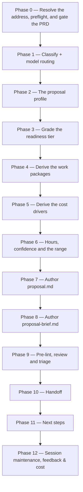

# /prd-proposal

Authors a customer-facing effort proposal for one PRD folder: work packages, hours by package and role, and a range whose width comes from per-package confidence — with every cost driver citing a record on disk.

## Who runs it

`/prd-proposal` runs in the [pm](../roles-and-phases.md#pm--product-management) role, cost-attribution phase [proposal](../roles-and-phases.md#proposal). Being in that phase means a requirement set is being **priced** rather than advanced. It is optional at every readiness tier, on both routes into a PRD folder, and nothing on the build ladder waits on it.

## Synopsis

```
/prd-proposal <ADDRESS> [--no-brief] [--profile] [--baseline <path>] [--redo]
```

`<ADDRESS>` is a key or an `@<path>` naming a `PRD-` folder — an idea-route PRD or a BRD-route slice, since a `PRD-` folder is a `PRD-` folder either way. The four flags:

- `--no-brief` — write `proposal.md` only, and skip the rationale brief that would otherwise render at tier 2 and above.
- `--profile` — re-grill the proposal profile in full before pricing, regardless of what is on disk.
- `--baseline <path>` — reconcile against a prior estimate at that path. It may sit outside `$SPECS_PATH` and is read strictly read-only: nothing is copied, committed or rewritten. An unreadable path stops the run naming that path.
- `--redo` — discard the prior revision as an anchor and re-derive every figure from scratch, for when the previous estimate is known to be wrong.

A `BRD-` container is refused with `PRD_PROPOSAL_BRD_NOT_SLICED`, on the directory prefix and before any file inside the folder is read: an effort proposal for a container is the programme umbrella rather than a slice's own estimate, and the stop names the slices beneath it, one run each.

## How it runs



Two subagents are dispatched: `proposal-reviewer` (Phase 9, Opus-pinned) and `workflows-core:impl-maintenance` (Phase 12, session lessons-learned). Both artifacts are authored inline, on the session's own model, rather than through a delegated writer — the authoring *is* this command's purpose, and a handoff to a writer would only add a place for the resolved data set to be lost between derivation and rendering.

## What it needs

- **A `PRD-` folder holding a `prd.md` on the specs repo's default branch** — gated via `require-on-main`. An unmerged PRD stops the run naming the branch and any open pull request. Row F splits in two: no `prd.md` anywhere is `PRD_PROPOSAL_NEEDS_PRD` and points at [`/create-prd`](create-prd.md); a `prd.md` in the folder and on no ref is `PRD_PROPOSAL_PRD_NOT_HANDED_OFF`, whose fix is to land the file already on disk — re-running `/create-prd` would author a second PRD rather than land this one.
- **A proposal profile** at `$SPECS_PATH/.dev-workflows/proposal-profile.yml` — the vendor and client names, the engagement model, the team's roles, the productivity basis and the calendar. It is grilled into existence on the first run that needs it, **shown back for confirmation on every later run** rather than read silently, and re-grilled under `--profile`. A run that cannot obtain one stops with `PRD_PROPOSAL_NEEDS_PROFILE`. It carries no rates and no money of any kind.
- **`$SPECS_PATH`** (required) — if unset, the run stops naming `SPECS_PATH` and offers to enter a path or cancel.

**Nothing else is required.** In particular there is no ARD gate and no specification gate: what an ARD or a specification changes is the *readiness tier*, which is a grade rather than a gate. A folder holding only a PRD grades at tier 1 · Indicative and estimates fine — the document simply says outright that its cost drivers are not known. Verified grounding from [`/prd-ground`](prd-ground.md) plus a settled decision register raise it to tier 2 · Grounded, an `ard.md` to tier 3 · Architected, and a `specification.md` to tier 4 · Specified. The tier caps how confident any single work package may be; it never sets that confidence, which is computed bottom-up from the evidence each package actually has.

The run opens no code repository at any point. Every commit a grounding finding cites was already pinned by `/prd-ground`, and this command reads the finding rather than the repository.

## What it produces

- **`proposal.md`**, always, written into the resolved folder — so its traceability section is relative links that resolve rather than names a reader has to go and find. It carries the twenty-three-section set fixed by [`proposal-format.md`](../../references/proposal-format.md) §4, opening with a header block that puts the readiness tier beside the date: a reader is never handed a number without being told what grade of evidence stands behind it.
- **`proposal-brief.md`**, at tier 2 and above unless `--no-brief` was given — a short pre-read whose spine is the driver argument, derived from the same resolved data set as the proposal rather than re-authored from it. It does not render below tier 2 irrespective of the flag, because below tier 2 that spine does not exist. The final report says which of the two reasons applied.
- **The archived prior revision**, on a re-run — the previous `proposal.md` moved to `revisions/<KEY>_proposal_<YYYYMMDD>.md`, and the previous brief beside it where this run rendered a new one. The new canonical records `revision_of:` naming the archived snapshot, and its changelog section classifies every moved figure as a **correction** or a **re-estimate**.

Behind Phase 10's consent choice, both artifacts and any archived prior are committed and pushed on a `prd/` branch and a pull request is opened against the specs repo's default branch.

Every figure in both artifacts is **hours of human delivery time**. Neither carries a rate, a currency symbol or a monetary total, at any tier and under any flag. The USD figure the run prints at the end is [session cost](../reference/session-cost.md) — this run's own model spend — and is a different quantity entirely.

## Gates

- **The `prd.md` gate**, described under *What it needs*. It is the only hard refusal on readiness.
- **`proposal-reviewer`** (Phase 9, Opus-pinned by frontmatter, no override) — the review gate, dispatched with both artifact paths, the profile, the resolved tier and the anchor revision where one exists. Its findings are triaged by the orchestrator before anything is edited: each finding is verified at the location it names, every dismissal is recorded with a reason that disposes of that finding's own claim, and only survivors are fixed. Cap: one fix cycle plus one re-review. The agent, its model pin, its tools and what it returns are on the `proposal-reviewer` row of [Agents](../reference/agents.md).
- **A structural pre-lint** runs first, as the cheap pass before the expensive one — the universal checks, identifier integrity over the `[WP#n]` and `[ED#n]` series, and required-section presence against the two section sets. Advisory, never blocking. Its auto-link collision check deliberately does **not** run here: that check is scoped to documents that get pasted into a tracker, and a proposal is sent to a customer instead.

## What it does not do

- **It gates nothing on the build ladder, and nothing there waits on it.** No command of that ladder reads `proposal.md`, requires one to exist, or behaves differently because one does — [`/create-ard`](create-ard.md), [`/specify`](specify.md), [`/epics`](epics.md) and the `dev-workflows` commands below them each resolve the same folder and neither know nor care whether it holds a proposal. No readiness tier withholds permission to begin work. The one command that does read a proposal is the sibling umbrella that rolls a slice's into a programme-level one, which is a second proposal rather than a phase of the build.
- **It prices nothing in money.** No rate card, no currency, no monetary total — those are contractual and belong in a document this pipeline does not produce.
- **It requires no ARD and no specification.** Grading replaces that gate, which is the whole answer to the question of when a requirement set becomes estimable.
- **It does no documentation grounding**, and takes no `--no-docs` flag. Shipped product documentation bears on how a feature is described and not at all on what it costs to build, so there is no flag to turn off and no `docs grounding:` line in the report.
- **It never offers a defect repair as a scope lever.** Where the folder holds an unrepaired code defect, its repair becomes its own work package automatically and appears in neither the scope-lever nor the priced-options table. Asking a customer to authorise deferring a defect the vendor's own work found would return that deferral carrying the customer's authority on a question the vendor's policy has already answered.
- **It writes no code repository, no docs repository and nothing in your current working directory.**

## Example

Price a reconciled BRD slice that has been through grounding and an interview round:

```
/product-workflows:prd-proposal PRODUCT-1234-01
```

The run gates `prd.md` on the default branch, shows the proposal profile back for confirmation, grades the folder — verified grounding plus a settled register, no `ard.md` yet, so **tier 2 · Grounded**, ceiling **Medium** — clusters the requirements into work packages by delivery seam with a discovery package first and a test/UAT/release package last, sweeps three sources for unrepaired code defects and asks you to confirm the two that are not already adjudicated, computes and prints the naive baseline, then writes one `[ED#n]` row per cost driver that resolves to a verified finding, a frozen decision or a confirmed defect — dropping any candidate that cites none of the three, and naming it in the report. It grades each package's confidence, applies the default band for that grade, records a reason for any deviation, and renders the hours grid with its expected, low and high totals. Then the pre-lint, `proposal-reviewer`, triage, and the handoff offer. Its next-step array offers `/product-workflows:create-ard PRODUCT-1234-01` first, because at tier 2 that is the run that actually moves the grade.

Price an idea-route PRD with nothing but a PRD in the folder:

```
/product-workflows:prd-proposal PRODUCT-1234 --no-brief
```

Same run, graded **tier 1 · Indicative**, ceiling **Low**. Every package is graded Low and carries a declared re-estimate gate; the document carries one document-level gate whose trigger is grounding the folder, and its cost-driver section states outright that the drivers are not known. No brief is written — not because of the flag, but because the brief does not render below tier 2 at all, and the report says so.

## See also

- [Roles and phases](../roles-and-phases.md) — what the `pm` role owns, and what the `proposal` phase means on a cost report.
- [`proposal-format.md`](../../references/proposal-format.md) — the canonical shape of both artifacts: the section sets, the `[WP#n]`/`[ED#n]` namespaces, the readiness tiers, the confidence grades and bands, and the closed set of evidence classes a cost driver may cite.
- [`/create-prd`](create-prd.md) — the upstream command that authors the `prd.md` this run gates on.
- [`/prd-ground`](prd-ground.md) — the optional, ungated run, on either route, whose verified findings are what raises a folder from tier 1 to tier 2 and what most cost drivers cite.
- [`/create-ard`](create-ard.md) and [`/specify`](specify.md) — the two commands this run's next-step offer names at tiers 2 and 3, because each one raises the tier and narrows the range on a re-run.
- [`/epics`](epics.md) — where the `EPIC-` folders come from that seed the middle work packages when they exist. They are never required.
- [The BRD-to-PRD route](../brd-workflow.md) — where a slice's decision register, coverage ledger and code-defect log come from, all three of which this run reads.
- [Agents](../reference/agents.md) — the subagent inventory, including the reviewer this command's Phase 9 dispatches.
- [Model routing](../reference/model-routing.md) — the classification and Opus fallback chain, plus the hard model gate this command applies: `SIGNIFICANT` is its floor.
- [Session cost](../reference/session-cost.md), [Session feedback](../reference/session-feedback.md), and [Resume and checkpoints](../reference/resume-and-checkpoints.md) — the terminal Phase 12 bookkeeping every run emits.
