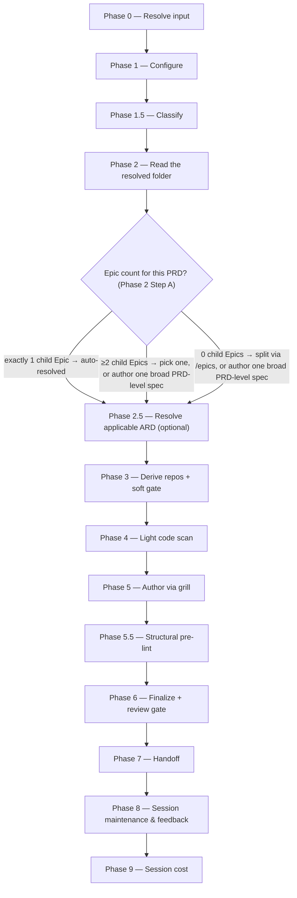

# /specify

Reads the resolved Epic or PRD folder, lightly grounds in code, and authors an org-standard `specification.md` through a relentless grill.

## Who runs it

`/specify` runs in the [pe](../roles-and-phases.md#pe--product-engineering) role, cost-attribution phase [specification](../roles-and-phases.md#specification) — being in this phase means an org-standard `specification.md` is being authored for one item, lightly grounded in code.

## Synopsis

```
/specify <ADDRESS> [--no-docs] [--docs <path>]
```

**The BRD route** — where the resolved folder is a `PRD-` folder carrying a `brd-link.md`, or an `EPIC-` folder inside one, the run authors the specification for a decided BRD slice. It is detected, not declared: there is no flag. A `BRD-` container is refused (`SPECIFY_BRD_NOT_SLICED`). The address is then the slice's key (or an Epic's inside it), validated against `^[A-Z][A-Z0-9_]*(-\d+)+$` for shape only (so a three-segment slice key such as `EPIC-008-01` is as valid as `EPIC-008`) and resolved through `resolve-address`, which searches every level `workflows-core:addressing` §3 bounds — three below `specifications/`, plus its legacy fallback — so an `@<path>` is only for a folder outside the normal layout. It takes **one address**, like every other route: a second positional token stops the run (`SPECIFY_ONE_ADDRESS`), because a key encodes its own ancestry and no command takes a chain (D4). The pickers, Epic counts and folder read described below run on this route too — a slice is a PRD folder, and [`/epics`](epics.md) can mint Epics inside it — and the route adds to them rather than replacing them: it also reads the slice's `spec-seed.md`, `decisions.md` and `brd-link.md`, and writes no `idea.md`.

The folder's prefix sets the altitude — an `EPIC-` folder specifies that Epic, a `PRD-` folder the PRD — never the kind it asserts; a legacy folder with no prefix is placed by what it holds — a carrier asserting `kind: epic` as an Epic folder, one asserting `kind: prd` or a `brd-link.md` naming a `parent:` as a PRD folder.

Key distinction from [`/epics`](epics.md): `/epics` *splits* a PRD into Epic drafts; `/specify` *authors one specification* for a single item. **The PRD-level path is genuinely valid, not a fallback of last resort**: `/specify <PRD>` with no focus Epic stays in the PE lane and produces one broad `specification.md` at the PRD dir. What Phase 2 does with a bare PRD key depends on how many child Epics it has:

- **A PRD with exactly 1 Epic** — no picker; that Epic auto-resolves as the focus, with a one-line notice.
- **A PRD with ≥2 Epics** — Phase 2 renders a progress-aware picker: one row per child Epic (marked ○ not started / ◐ in progress / ● done), plus an explicit **"Author one broad PRD-level spec instead"** choice.
- **A PRD with 0 Epics** — offered `choices: ["Split into Epics first with /product-workflows:epics (Recommended)", "Author one broad PRD-level spec now", "Cancel"]`. `/epics` writes the Epic folders into this PRD folder, where `/specify` sees them immediately.

**There is no fourth case.** An Epic always has a PRD above it — [`/epics`](epics.md) is the only command that creates an `EPIC-` folder, and it writes every one of them under a PRD folder — so a top-level `EPIC-` folder with no PRD above it is no longer a shape `/specify` resolves. A per-Epic feature folder that does not exist is a stop (`SPECIFY_EPIC_NOT_FOUND`) naming `/product-workflows:epics <PRD>`, never a directory this command creates.

Addressing the Epic directly — `/specify <EPIC-KEY>`, or an `@<path>` to its folder — skips the picker entirely: the Epic is already chosen, and its parent PRD is the folder above it. There is no two-key form to skip the picker with; `/specify` takes **one** address and refuses a second positional token (`SPECIFY_ONE_ADDRESS`). `--no-docs` turns off the optional Phase 4 documentation-grounding pass.

## How it runs



Four subagents are dispatched: `workflows-core:docs-grounder` (Phase 4, read-only grounding on the shipped product docs — default ON when `$DOCS_PATH` resolves, advisory, never a gate), `workflows-core:code-scanner` (Phase 4, one instance per mounted candidate repo, up to 4 concurrent per batch — deliberately **light** relative to `/epics`' scan, grounding for feasibility rather than a full reuse audit), `spec-reviewer` (Phase 6, Opus-pinned), and `workflows-core:impl-maintenance` (Phase 8, session lessons-learned). The grill and the `specification.md` authoring itself run inline on `current_model` rather than through a delegated subagent.

## What it needs

- **An Epic or PRD address** — a prompt with no address is rejected outright (`SPECIFY_NEEDS_KEY`); `/specify` has no direct-prompt behaviour.
- **The PRD on the specs repo's default branch** — gated via `require-on-main` against `specifications/<PRD>-<vslug>/`. An unmerged PRD is a hard stop, naming the branch and any open pull request. An **absent** PRD is not a stop: `/specify`'s existing specs-tree behaviour is unaffected, and the run reports that it is specifying from the resolved folder directly — the same fallback `/create-ard` uses.
- **`$SPECS_PATH`** (required) — `/specify` writes under `$SPECS_PATH/specifications/`, the specs repo; unset stops the run naming `SPECS_PATH`, with no fallback.
- **An optional ARD** for this item (Phase 2.5), resolved via `workflows-core:ard-resolution` with the PRD and the resolved focus Epic. `status: none` skips silently; `status: unmerged` stops, naming the branch and any pull request; `status: found` keeps the spec's user stories and scope consistent with its `[AD#N]` invariants during the grill, passed to `spec-reviewer` as `applicable_ard`.
- **Mounted repos under `$REPOS_PATH`** — candidates are auto-derived from the PRD's capability themes and from the `repo:` entries of the `implementation.md` records in the folders the run reads — the focus Epic's, or, for a broad PRD-level spec, the PRD folder's and every Epic's, since a record lives with the unit it implemented; there is no PR list to read. An *unresolved* repo slug (zero or ambiguous matches) hard-escalates before Phase 4 runs at all. A resolved-but-unmounted repo, by contrast, only **soft-gates**: it becomes an open question in `_session.md` and the run proceeds with the remaining mounted repos — the specification just can't cite the ungrounded one until it's mounted and the run is re-invoked.
- **`$DOCS_PATH`** (optional, default `/workspace/docs`) — consumed with grill-rank ranking in Phase 4. Turned off for a run with `--no-docs`, or pointed at another root with `--docs <path>`. Missing, unreadable, or empty is a silent, non-blocking skip. Turned off with `--no-docs`.
- **A prior `_session.md`** (optional) — if one exists in the resolved feature folder, Phase 1 offers resume-vs-fresh; on resume, Phase 5 begins at the first unsettled stage instead of the header.
- **`grounding/`, read wherever the PRD folder holds it, on either route** — the resolved folder on a PRD address, and on an Epic address the PRD folder above the Epic, since grounding is PRD-altitude and an `EPIC-` folder never holds a `grounding/` of its own; the idea-route PRD folder as readily as the BRD-route slice, since [`/prd-ground`](prd-ground.md) now writes `grounding/code-grounding.md` (plus any derivation matrix appended to it) and `grounding/design-grounding.md` from either. Where either file is present, its `[CG#n]`/`[DG#n]` findings **seed Phase 4's capability-theme extraction** before falling back to the PRD-derived themes — a finding whose verdict says a capability is absent is a theme worth scanning, one whose verdict says it is present names the code that already implements it, directing the scan rather than replacing it. A finding with no verifier outcome is never evidence and grounds nothing. Where the folder holds neither file, this run proceeds exactly as it did before this feature — grounding is optional to `/specify` and nothing in this run gates on it.

### The BRD route

On the BRD route the run is seeded by a decided BRD slice, and what it needs changes accordingly:

- **No tracker is consulted.** Nothing is dispatched against a tracker: a BRD key names a folder under `$SPECS_PATH` and was never checked against one. The code this route grounds on is still reached through `$REPOS_PATH`, as on the keyed route. `SPECIFY_NEEDS_KEY` is route-independent — the route is detected from the folder an address resolves to, so a prompt with no address stops there before any route exists to detect.
- **The same PRD gate as the keyed route, and the same folder read.** The route resolves a `PRD-` slice folder in every case, so there is one folder to gate and one `prd.md` to look for in it. An **absent** PRD is reported and the run specifies from the resolved folder — `/create-prd` is not a prerequisite here, and the gate's `absent` branch is what keeps that true. The hard stop is a `prd.md` that exists on an unmerged branch. **The register is gated as well.** Before the run reads `decisions.md` it executes `require-on-main` on it: a register that is not on the default branch as it stands — on a branch with its pull request still open, on no branch because its handoff was declined, or edited in the working tree — stops the run before it reads a line of it, naming the state and what resolves it (`SPECIFY_REGISTER_NOT_HANDED_OFF` for the declined handoff, `SPECIFY_REGISTER_NOT_ON_MAIN` otherwise). The usual writer of an unmerged register is the [`/brd-reconcile`](brd-reconcile.md) run that froze the customer's decisions, or a `/create-prd` that added an assumption to it, so the run never specifies from customer decisions nobody has merged; an **absent** register is reported and the run specifies from what the slice does hold, exactly as it did before the gate existed. `/brd-reconcile`'s offer of this command carries the `<merge-clause>` naming that wait, and the [`/brd-*` route](../brd-workflow.md)'s earlier handoffs are no substitute for the gate: on the path that advances the slice, `/brd-reconcile` hands over to this command — directly, or through [`/create-prd`](create-prd.md) or [`/create-ard`](create-ard.md), each of which writes to the register too — and nothing on that path but this gate and the same gate in `/create-prd` and `/create-ard` refuses to start on a register left unmerged. [`/brd-package`](brd-package.md) gates it as well, but a slice passes through that command again only when it goes back through the route — a question still held for the customer, a reopened decision's new round, or a re-grounded claim — and not on the path that advances it.
- **The BRD folder's seed, register and findings** — `spec-seed.md` (the implementation altitude of the router; `prd-seed.md` and `ard-seed.md` belong to [`/create-prd`](create-prd.md) and [`/create-ard`](create-ard.md) and are not read), `decisions.md`, the `[CG#n]`/`[DG#n]` records in `grounding/`, and **the derivation matrix**, which lives appended to `grounding/code-grounding.md` rather than in a file of its own. Any of them being absent is reported, never a stop. **A seed file is normally absent**, because nothing on the route creates one: the one command that creates one is `/brd-intake --sort-existing`, a migration path (`/brd-reconcile` only corrects an existing one's prose) for a package authored by hand before the route existed. The register, the findings and the matrix are what this route is really seeded from. A finding carrying no verifier outcome is not evidence: it grounds nothing and is never marked consumed.
- **A `PRD-` slice folder, and never a `BRD-` container.** The route is the slice [`/brd-split`](brd-split.md) carved — the folder carrying `brd-link.md`. A `BRD-` folder stops with `SPECIFY_BRD_NOT_SLICED` **on either route**, the moment the address resolves and the specs-repo preflight has settled the specs checkout's branch, so a stale plugin branch cannot hide a slice from the listing — the BRD route is detected from a `brd-link.md` and a root BRD folder need not carry one, so a route-conditioned refusal would let a container fall through. A legacy unprefixed folder has no prefix to test and is answered by positive evidence instead — `coverage-ledger.md` or `brd/brd-inventory.md` present and no `brd-link.md` naming a `parent:` — so a legacy idea-route PRD folder, which carries neither file, proceeds. A BRD is a container, and its requirements are specified in the slices under it, one specification each. The stop names those slices, or — where the BRD holds none — [`/brd-split`](brd-split.md) to carve one, with that command's own two conditions stated in the offer: it gates on verified grounding findings, and it is a no-op on a ledger with no `unallocated` row.
- **No coverage-ledger check.** PRD eligibility and the allocation gate govern authoring a *PRD*; a specification is not that artifact, so nothing this route reads to author with is a ledger row — the container refusal above is decided on the folder's prefix, not on any row. That is a decision, not an omission — [`/create-prd`](create-prd.md) is where the gate lives. Three places do open the ledger, and none gates anything this run does: the zero-Epics choice and the `### Next step` offer each read it only to decide whether [`/create-prd`](create-prd.md) can be *named*, since that command refuses three BRD-route shapes, not one; and, report-only, the final report reads its `disposition` column to leave out of the list of findings still `consumed_by: none` every finding about a requirement now `covered-by` another BRD.
- **Repo candidates come from `grounding/baselines.md`** — the repositories `/prd-ground` already pinned — rather than from PRD themes and an implementation record, which this route has none of. The soft gate for an unmounted repo is unchanged.
- **The ARD is resolved from `brd-link.md`'s `parent:`**, never from counting segments in the key: the route resolves a slice and nothing else, so the pair is always the parent's key with the slice's own as the Epic — the same pair `/create-ard` on the BRD route writes into the ARD's frontmatter.
- **Decisions are frozen.** The grill fills what the seed leaves unstated and may not reopen a `[VD#n]` or `[CD#n]`; open decisions and open `[AS#n]` assumptions reach the spec as `- [ ]` open questions under their own ids, which is also what keeps the header's count honest.

## What it produces

`specification.md` (`Published: no`), `idea.md` (pre-spec brainstorming provenance derived from the scoped item text), `_session.md` and `_glossary.md` — written into the feature folder: the Epic subfolder for a per-Epic spec, or the PRD dir itself for a broad PRD-level spec. `specification.md` is authored against `../../references/specification-format.md` through five ordered stages: Problem statement, Scope, User stories, Acceptance criteria (EARS phrasing), and Test cases — each stage's own numbered-ID scheme is the spec/design namespace `specification-format.md` defines, deliberately separate from a PRD's `[US#N]`-style grammar. Behind Phase 7's consent choice, the whole feature folder is committed, pushed, and a pull request opened against the specs repo's default branch — **merged-to-main is what makes the spec visible to Devs and to `/dev-workflows:design`**, which reads it from `main` only, never from a branch. `Published: yes` is a separate, human-only freeze step outside this command's scope.

**Wherever the PRD folder holds `grounding/`, on either route** — the PRD folder above the Epic, on an Epic address — the run writes `consumed_by: specification` onto every `[CG#n]`/`[DG#n]` finding it actually drew on — never a finding read for context and unused, and never one with no verifier outcome — and stages that folder's `grounding/code-grounding.md` and `grounding/design-grounding.md` alongside the spec.

**On the BRD route** the same files land in the feature folder Phase 2 resolved — flat in the `PRD-` slice folder in the ordinary case, or in an `EPIC-` subfolder under it where the slice already holds Epics and the picker chose one or the Epic was addressed directly — on a branch named from that folder: `spec/<SLICE-KEY>-<slug>` for the flat case, `spec/<EPIC>-<eslug>` for an Epic subfolder — with one omission: **no `idea.md`**, because the folder already holds the committed provenance this spec was built from and a derived restatement of a signed-off document does not belong beside it. That run additionally writes `consumed_by: specification` onto the implementation-altitude decisions in the slice's `decisions.md` the spec drew on — the only other write it makes into any BRD file — and stages `decisions.md` alongside the grounding files. `spec-seed.md` is read but never written, and the derivation matrix is not a record either, so both are reported at file granularity rather than stamped. The next-step offer names `/dev-workflows:design` with a merge clause, since that command gates the specification this run wrote, and [`/epics`](epics.md) **only where the PRD folder — the slice — holds an authored `prd.md`** — `/epics` refuses a folder that holds none. Where there is none the offer becomes [`/create-prd`](create-prd.md) on the same address, but only where that command can itself run: it refuses three BRD-route shapes and this run has cleared only the container one, so on a slice the two data refusals are tested against the ledger first. A row still `unallocated` names [`/brd-split`](brd-split.md) on the slice instead; a slice claiming nothing names `/brd-split` on the parent — with a slicing instruction, `/brd-split <PARENT-KEY> "<how to cut it>"`, where the parent's own ledger still holds an `unallocated` row (a bare run stops there with `BRD_SPLIT_NEEDS_INSTRUCTION`), bare where it holds none, and in neither form where that ledger cannot be read; and a fully-allocated slice with no `covered-here` row names neither `/create-prd` nor `/epics`, because `/create-prd`'s own branch for that state names no command either. `/dev-workflows:design` is unaffected — it takes over the specification this run wrote and needs no PRD.

## Gates

Phase 6 dispatches `spec-reviewer`, Opus-pinned by frontmatter (`model: opus`, no override), checking per-stage quality, cross-stage consistency, coverage, and identifier integrity. `BLOCK` fixes the BLOCKER findings inline — the orchestrator/grill edits `specification.md` directly; there is no delegated writer to re-dispatch — and re-reviews once; an unresolved BLOCKER after that cycle is escalated individually, with "Defer" appending a `## Refinement notes` section to the spec itself. `MAJOR`/`MINOR`/`NIT` under `PASS WITH RECOMMENDATIONS` are deferred to the final report with no mandatory fix cycle. Cap: one fix cycle plus one re-review.

Ahead of the review, Phase 5.5 runs a structural pre-lint (`workflows-core:pre-lint`) — advisory only — checking the Universal checks and the spec block, including that the header's `Open questions` count matches the actual `- [ ]` count.

## Example

Author a specification for a single Epic already selected:

```
/product-workflows:specify EPIC-98761
```

The run resolves the PRD and the named focus Epic (skipping the picker, since it was given explicitly), reads the full Epic subtree, resolves any applicable ARD, derives and lightly scans mounted repos, grills you relentlessly through Problem statement → Scope → User stories → Acceptance criteria → Test cases, runs the structural pre-lint, then `spec-reviewer`. On a passing verdict it offers to branch, commit, push, and open a pull request; if this Epic came from a multi-Epic PRD's picker, it then offers to loop straight into the next sibling Epic.

Author the specification for a decided BRD slice instead:

```
/product-workflows:specify EPIC-008-01
```

The run resolves `EPIC-008-01`'s folder one level under `specifications/`, reads `spec-seed.md`, the register, the verified findings and any derivation matrix, resolves the ARD under the parent's key with this slice as the Epic, scans the repositories `grounding/baselines.md` pinned, and grills **only the gaps** — every `[VD#n]` and `[CD#n]` the register holds as decided is an input the interview never reopens, because the customer signed it. A `NEW-CAPTURE` matrix row is work this spec must deliver and lands in `## Scope` and an EARS acceptance criterion, not in a footnote.

## See also

- [Roles and phases](../roles-and-phases.md) — what the `pe` role owns, including the two "absent falls back, unmerged stops" gates it shares with [`/create-ard`](create-ard.md).
- [`/epics`](epics.md) — the upstream command that splits a PRD into the child Epics `/specify` is typically run once per; a PRD with 0 Epics is offered a link back here.
- [`/create-ard`](create-ard.md) — the optional upstream command whose `[AD#N]` invariants `/specify` inherits when present.
- `/dev-workflows:design` — the downstream command that refuses to start until this command's `specification.md` is merged to the specs repo's default branch.
- [Model routing](../reference/model-routing.md) — the classification rules and the `spec-reviewer` Opus pin.
- [Session cost](../reference/session-cost.md), [Session feedback](../reference/session-feedback.md), and [Resume and checkpoints](../reference/resume-and-checkpoints.md) — the terminal Phase 8–9 bookkeeping every run emits.
- [`specification-format.md`](../../references/specification-format.md) — the canonical structure `specification.md` is authored and reviewed against.
- `workflows-core:ard-resolution` — how the optional ARD is resolved and inherited.
- [`/prd-ground`](prd-ground.md) — the optional, ungated run, on either route, whose `[CG#n]`/`[DG#n]` findings and derivation matrix this command reads and marks `consumed_by: specification` wherever the PRD folder holds them — the folder above the Epic, on an Epic address.
- `workflows-core:grounding-format` — the finding record, the six verdicts, and the derivation matrix classes this command reads.
- [The BRD-to-PRD route](../brd-workflow.md) — the `/brd-*` commands that produce the register, findings and derivation matrix the BRD route reads, and the customer sign-off that makes those decisions unreopenable here. They produce no `spec-seed.md`: the one command that creates a seed file is `/brd-intake --sort-existing`, a migration path (`/brd-reconcile` only corrects an existing one's prose), so a reconciled BRD normally holds none and the implementation altitude arrives through the register, the findings and the matrix.
