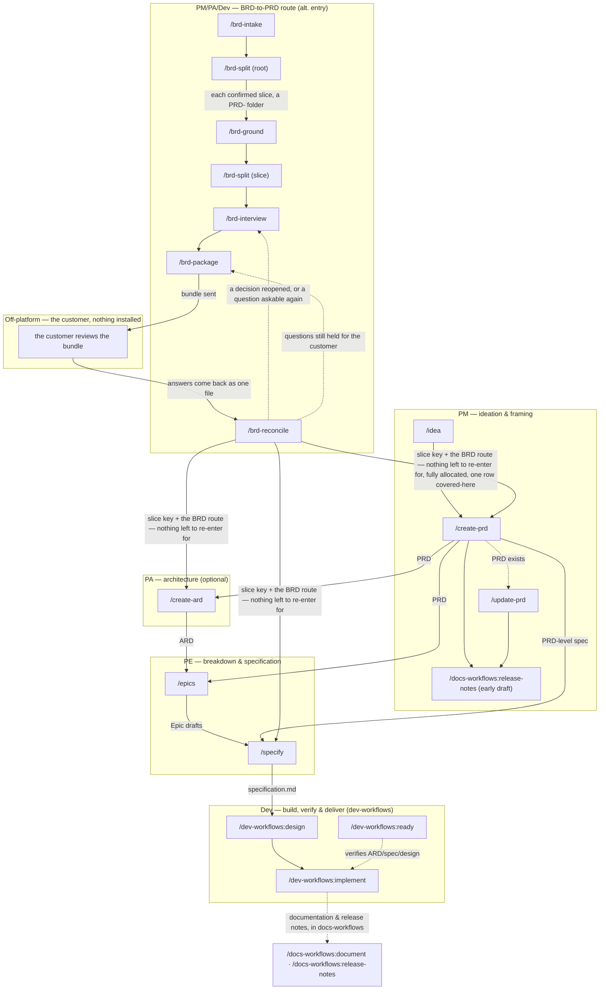

# Workflow overview

This is the `product-workflows` pipeline top to bottom — every command shown here, in the order the roles typically hand work to each other. `/idea → /create-prd` opens a Product Requirements Document; `/specify` is where this plugin's spine ends, handing `specification.md` to the companion `dev-workflows` plugin's `/dev-workflows:design`, which carries the pipeline the rest of the way to shipped code and, through the companion `docs-workflows` plugin, product documentation and release notes. A second route into a PRD exists alongside it: `/brd-intake → /brd-split → /brd-ground → /brd-split → /brd-interview → /brd-package → /brd-reconcile` — the second `/brd-split` running on each slice the first carved — turns a customer-supplied BRD into a grounded, allocated, decided and customer-reviewed requirement inventory instead of a PM-authored idea, then hands over to `/create-prd`, `/create-ard` or `/specify` on the BRD route — see [BRD workflow](brd-workflow.md) for its own diagram and parameter table.

The diagram draws the ARD reaching `/epics`, but that is one of five consumers: `/epics`, `/specify`, and the companion `dev-workflows` plugin's `/dev-workflows:design`, `/dev-workflows:implement`, and `/dev-workflows:ready` all resolve the applicable ARD once it exists. The edge is drawn once to keep the diagram readable, not because the others do not consult it.

The BRD-to-PRD route hands over at `/brd-reconcile`, and the diagram draws that handover as **three** edges rather than one, because the BRD route ships on `/create-prd`, `/create-ard` and `/specify` and `/brd-reconcile`'s next-step phase offers all three against the same **slice** key **on a run that left nothing to re-enter for** — a reopened decision, a customer question still held, a finding left to re-derive, or a dependent it could only sweep on paper each drop all three, because a reopened record may not be consumed downstream and all three consume the register. **A slice key and never a root BRD key**: a BRD is a container, its `prd.md`, `ard.md` and `specification.md` are authored in the `PRD-` slice folders under it, and each of the three refuses a `BRD-` folder in its own Phase 0 — moot in practice, since `/brd-reconcile` itself refuses a resolved root before this next-step phase can ever run (`BRD_RECONCILE_ROOT_LEVEL`), naming `/brd-split` as the way to carve a slice first. On an advancing slice run only the first carries a further condition: `/create-prd <SLICE-KEY>` is offered where the reconciled ledger leaves no row `unallocated` and at least one `covered-here`, which are the two refusals its own Phase 0 raises, both read over the slice's own claimed rows. `/create-ard <SLICE-KEY>` and `/specify <SLICE-KEY>` add none of their own, since neither reads a resolved folder, gates a PRD, or reads the ledger — which is also why neither refuses an unsettled register, and why that judgement sits with `/brd-reconcile` alone. The three are alternatives, not a sequence — neither of the other two waits on the PRD — so `/brd-reconcile` is where the route hands over, not where it ends.

The `Off-platform` box is the one node in this diagram no command runs. It is the customer reviewing the bundle with a vanilla agent and nothing installed, and the route waits there — which is why `/brd-reconcile` takes the returned review as an argument rather than looking for it.

The two dashed edges leaving `/brd-reconcile` go to different commands on purpose, and are drawn separately rather than merged under one label: a decision the review reopened is settled by another interview round, while a question the customer left unanswered goes back out in the next package. They are the same two edges [BRD workflow](brd-workflow.md) draws, with the same labels — as are the three handover edges above them, and every other BRD edge here: all twelve edges that page draws appear in this diagram unchanged, in style and in label, so this diagram summarises that one and never disagrees with it.

Five nodes in the diagram are not this plugin's commands and are drawn for continuity only: `/dev-workflows:design`, `/dev-workflows:implement`, and `/dev-workflows:ready` — where this plugin's spine hands off — plus `/docs-workflows:release-notes` as the PM's early draft and the combined `/docs-workflows:document · /docs-workflows:release-notes` handoff hanging off `/dev-workflows:implement`. `/dev-workflows:design`, `/dev-workflows:implement`, and `/dev-workflows:ready` ship in the companion `dev-workflows` plugin; `/docs-workflows:document` and `/docs-workflows:release-notes` ship in the companion `docs-workflows` plugin. All are documented there, not here.

The diagram above shows where each command sits in the pipeline; [Roles and phases](roles-and-phases.md) says what each role is accountable for and what it hands over at each seam.

**None of this plugin's own twelve commands is known to collide with a Claude Code built-in today**, so every one of them works either way, bare or `product-workflows:`-qualified. The one cross-plugin command this diagram draws for continuity that does collide, `/docs-workflows:release-notes`, is qualified for that reason; it ships in the companion `docs-workflows` plugin.

## Parameters at the BRD-to-PRD handoff

The three edges leaving `/brd-reconcile` into the PRD pipeline, as each command's own argument parsing defines them. [BRD workflow](brd-workflow.md#parameters) carries the same table for the six `/brd-*` commands upstream of them.

| Command | Required | Optional | Offered from `/brd-reconcile` |
|---|---|---|---|
| `/create-prd` | `<SLICE-KEY>` | `--lean`/`--hybrid`/`--full` (defaults to `--full` here), `--no-docs` | Only on a slice, and only where no ledger row is `unallocated` and at least one is `covered-here` |
| `/create-ard` | `<SLICE-KEY>` | `--no-docs` | On a slice, with no further condition — the run gates and reads the slice's `prd.md` exactly as it does on the idea route, proceeding when there is none, and reads no ledger |
| `/specify` | `<SLICE-KEY>` | `--no-docs` | On a slice, on exactly the same terms as `/create-ard` |

**The BRD route is detected, never declared.** There is no flag and no `<dir>` operand on any of the three rows: each takes one positional address, and where that address resolves to a `PRD-` folder carrying `brd-link.md`, the run is on the BRD route and says so before doing anything. A `BRD-` container resolves too, and is then refused — `CREATE_PRD_BRD_NOT_SLICED`, `CREATE_ARD_BRD_NOT_SLICED`, `SPECIFY_BRD_NOT_SLICED` — because a BRD holds no PRD, ARD or specification of its own. A flag that could disagree with the folder it names would be one more disagreement to have. `/create-prd` still takes `--from-prd`, which is not the same thing and is not excluded by the route — it names a *different* PRD to seed from, which no folder can decide on the operator's behalf.

`<SLICE-KEY>` is `^[A-Z][A-Z0-9_]*(-\d+)+$` — **two segments or three**, so the slice `EPIC-008-01` is as valid a key as `EPIC-008`, and all three commands resolve a folder at either level before refusing the container level. It is checked for shape only and never against a tracker: a BRD is a markdown file under `$SPECS_PATH`, not a ticket. Each of the three takes exactly **one** address; `/create-ard` and `/specify` stop on a second positional token (`CREATE_ARD_ONE_ADDRESS` / `SPECIFY_ONE_ADDRESS`) on every route, because a key encodes its own ancestry and no command takes a chain (D4).

## Roles

| Role | Runs | Produces → lands at |
|---|---|---|
| **PM** | `/idea`, `/create-prd`, `/update-prd` (and an early `/docs-workflows:release-notes`); also `/brd-intake`, `/brd-split`, `/brd-interview`, `/brd-package`, `/brd-reconcile` | `idea.md`, then the PRD, in `$SPECS_PATH/specifications/PRD-<KEY>-<slug>/`; on the BRD route, the inventory, ledger, decision register, customer package and reconciliation record |
| **PA** | `/create-ard` (optional); also `/brd-ground` (PM-initiated, PA/Dev-executed) | the ARD, in the same specs feature folder as the PRD; `[CG#n]`/`[DG#n]` grounding findings in the BRD's own folder |
| **PE** | `/epics`, `/specify` | `epic.md` per `EPIC-` folder under the PRD folder; `specification.md` on the specs repo's default branch |

See [Roles and phases](roles-and-phases.md) for what each role owns, consumes, and hands off — this table only shows where the commands sit. The Dev role, downstream of this plugin's spine, is documented on the companion `dev-workflows` plugin's own Roles and phases page.

## Artifact homes

- **`$SPECS_PATH/specifications/PRD-<KEY>-<slug>/`** — the shared, team-visible home for the PRD and the ARD, with `specification.md` in the `EPIC-` folders below it (a BRD route puts the same PRD folder one level down, inside `BRD-<KEY>-<slug>/`). Each authoring command lands its file here, then hands it onto the specs repo's default branch for the next command to find.
- **`$REPOS_PATH`** — the mounted code and design clones this plugin grounds against, read-only. Nothing in this plugin writes into a code repository; that starts downstream, in the companion `dev-workflows` plugin.
- **Plugin bookkeeping** — feedback, session-cost, and resume-pointer files — lives under `<PRD-dir>/dev-workflows/` inside `$SPECS_PATH`, committed and pushed alongside the specs artifacts it describes. That folder name is a fixed, family-wide constant shared by every plugin's own bookkeeping, not a `product-workflows`-specific path.

## Sources of truth

- **The artifacts** are the source of truth for workflow *status*. The companion `dev-workflows` plugin's `/dev-workflows:ready` derives the phase from what is on disk, reading the ARD and specification this plugin's PA and PE roles produce.
- **The specs repo's default branch** is the source of truth for whether a phase's deliverable is actually *done*. A producing command lands its artifact there; the next command in the chain refuses to start expensive work until it finds the artifact on that branch, not merely written to disk. See [Roles and phases](roles-and-phases.md) for what happens when the artifact is on an unmerged branch instead, or missing entirely.

## Cross-cutting commands

These ship in companion plugins and run against the same specs tree, outside this plugin's own role pipeline:

- **In `workflows-core`.** The status line, the specs-tree frame-set indexer, and the plugin-feedback commands: `/workflows-core:statusline`, `/workflows-core:frames`, `/workflows-core:feedback`, `/workflows-core:prompt`, `/workflows-core:prompt-brainstorm` and `/workflows-core:prompt-grill-me`.
- **In `docs-workflows`.** Documentation, the docs-repo profile, and the release note: `/docs-workflows:document`, `/docs-workflows:docs-profile` and `/docs-workflows:release-notes`.
- **In `dev-workflows`.** Standalone maintenance outside the PRD pipeline — `/dev-workflows:vuln` (CVE remediation) and `/dev-workflows:upgrade` (dependency / runtime upgrades) — alongside the Dev-role commands this plugin's spine hands off to.
