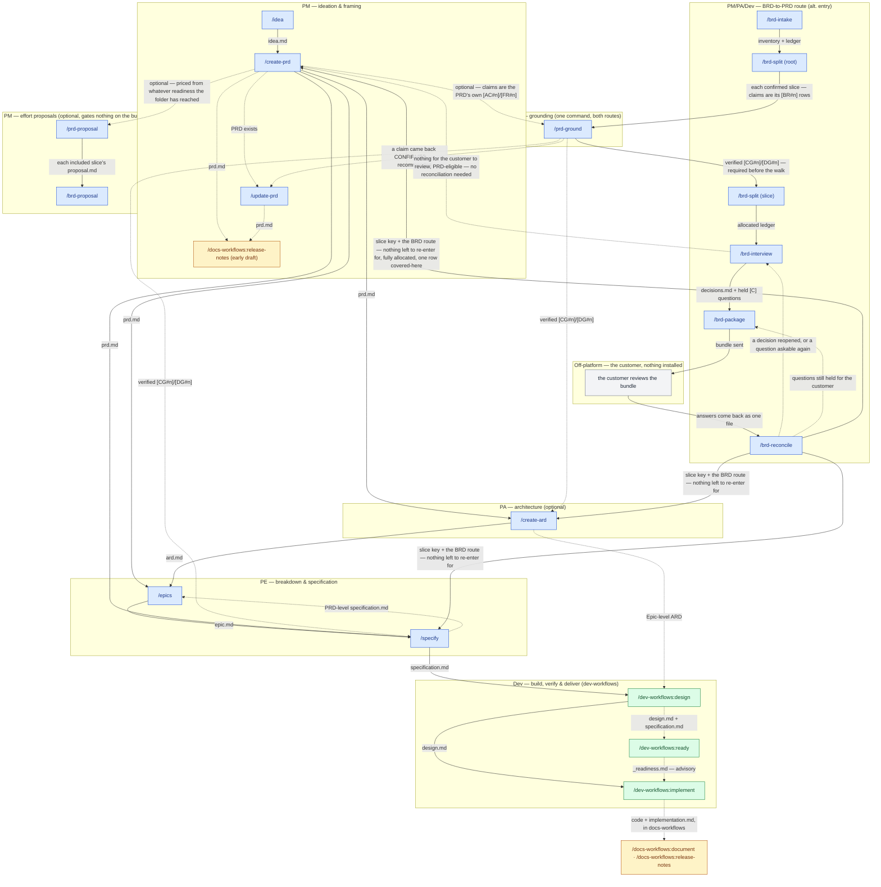

# Workflow overview

This is the `product-workflows` pipeline top to bottom — every command shown here, in the order the roles typically hand work to each other. `/idea → /create-prd` opens a Product Requirements Document; `/specify` is where this plugin's spine ends, handing `specification.md` to the companion `dev-workflows` plugin's `/dev-workflows:design`, which carries the pipeline the rest of the way to shipped code and, through the companion `docs-workflows` plugin, product documentation and release notes. A second route into a PRD exists alongside it: `/brd-intake → /brd-split → /prd-ground → /brd-split → /brd-interview → /brd-package → /brd-reconcile` — the second `/brd-split` running on each slice the first carved — turns a customer-supplied BRD into a grounded, allocated and decided requirement inventory — customer-reviewed wherever a decision is the customer's to make — instead of a PM-authored idea, then hands over to `/create-prd`, `/create-ard` or `/specify` on the BRD route — see [BRD workflow](brd-workflow.md) for its own diagram and parameter table. `/prd-ground` is one command serving both routes, its own subgraph reached with a solid edge from `/brd-split (root)` — grounding is required there before the allocation walk — and a dashed edge from `/create-prd`, where it is optional: run against a PRD's own `[AC#n]`/`[FR#n]` rows, it seeds `/create-ard` and `/specify` with verified findings the same way it seeds `/brd-split`'s slice with them on the other route.

The diagram draws the ARD reaching `/epics`, and an Epic-level ARD reaching `/dev-workflows:design`, but those are two of five consumers: `/epics`, `/specify`, and the companion `dev-workflows` plugin's `/dev-workflows:design`, `/dev-workflows:implement`, and `/dev-workflows:ready` all resolve the applicable ARD once it exists. The edges are drawn sparingly to keep the diagram readable, not because the others do not consult it.

The BRD-to-PRD route hands over at `/brd-reconcile`, and the diagram draws that handover as **three** edges rather than one, because the BRD route ships on `/create-prd`, `/create-ard` and `/specify` and `/brd-reconcile`'s next-step phase offers all three against the same **slice** key **on a run that left nothing to re-enter for** — a reopened decision, a customer question still held, a finding left to re-derive, or a dependent it could only sweep on paper each drop all three, because a reopened record may not be consumed downstream and all three consume the register. **A slice key and never a root BRD key**: a BRD is a container, its `prd.md`, `ard.md` and `specification.md` are authored in the `PRD-` slice folders under it, and each of the three refuses a `BRD-` folder in its own Phase 0 — moot in practice, since `/brd-reconcile` itself refuses a resolved root before this next-step phase can ever run (`BRD_RECONCILE_ROOT_LEVEL`), naming `/brd-split` as the way to carve a slice first. On an advancing slice run only the first carries a further condition: `/create-prd <SLICE-KEY>` is offered where the reconciled ledger leaves no row `unallocated` and at least one `covered-here`, which are the two refusals its own Phase 0 raises, both read over the slice's own claimed rows. `/create-ard <SLICE-KEY>` and `/specify <SLICE-KEY>` add none of their own, since neither reads the ledger as an authoring input, and the PRD gate both run reports an absent PRD rather than stopping on it. All three do gate the register — `require-on-main` on `decisions.md`, which stops on one `/brd-reconcile` handed off and nobody merged, and is why each of the three offers carries a merge clause — but that gate tests which ref the register is on and never what it holds, so none of them refuses a merged register carrying a reopened decision, and that judgement sits with the command that offers them — `/brd-reconcile` here, and `/brd-interview` on a slice that needs no customer review. The three are alternatives, not a sequence — neither of the other two waits on the PRD — so `/brd-reconcile` is where the route hands over, not where it ends.

**The route also hands over one step earlier, on a slice that needs no customer review.** Where every question was settled from the findings and no reopened decision waits, `/brd-interview` offers the same three commands on the same conditions `/brd-reconcile` applies — `/create-ard` and `/specify` on the slice level alone, `/create-prd` only where the slice is PRD-eligible — because all three gate the slice's `decisions.md` and none reads a reconciliation record. The diagram draws that as one dashed edge, to `/create-prd`.

The `Off-platform` box is the one node in this diagram no command runs. It is the customer reviewing the bundle with a vanilla agent and nothing installed, and the route waits there — which is why `/brd-reconcile` takes the returned review as an argument rather than looking for it.

The two dashed edges leaving `/brd-reconcile` go to different commands on purpose, and are drawn separately rather than merged under one label: a decision the review reopened is settled by another interview round, while a question the customer left unanswered goes back out in the next package. They are the same two edges [BRD workflow](brd-workflow.md) draws, with the same labels — as are the three handover edges above them, and every other BRD edge here: all thirteen edges that page draws appear in this diagram in the same style, and all but one with the same label. The one is the edge into `/prd-ground`, which this diagram labels with what crosses it — the slice's claimed `[BR#n]` rows — where that page names the slice's folder kind; neither label contradicts the other, so this diagram summarises that one and never disagrees with it.

Five nodes in the diagram are not this plugin's commands and are drawn for continuity only: `/dev-workflows:design`, `/dev-workflows:implement`, and `/dev-workflows:ready` — where this plugin's spine hands off — plus `/docs-workflows:release-notes` as the PM's early draft and the combined `/docs-workflows:document · /docs-workflows:release-notes` handoff hanging off `/dev-workflows:implement`. `/dev-workflows:design`, `/dev-workflows:implement`, and `/dev-workflows:ready` ship in the companion `dev-workflows` plugin; `/docs-workflows:document` and `/docs-workflows:release-notes` ship in the companion `docs-workflows` plugin. All are documented there, not here.

The diagram above shows where each command sits in the pipeline; [Roles and phases](roles-and-phases.md) says what each role is accountable for and what it hands over at each seam.

**None of this plugin's own fourteen commands is known to collide with a Claude Code built-in today**, so every one of them works either way, bare or `product-workflows:`-qualified. The one cross-plugin command this diagram draws for continuity that does collide, `/docs-workflows:release-notes`, is qualified for that reason; it ships in the companion `docs-workflows` plugin.

## Parameters at the BRD-to-PRD handoff

The three edges leaving `/brd-reconcile` into the PRD pipeline, as each command's own argument parsing defines them. [BRD workflow](brd-workflow.md#parameters) carries the same table for the six BRD-to-PRD route commands upstream of them.

| Command | Required | Optional | Offered from `/brd-reconcile` |
|---|---|---|---|
| `/create-prd` | `<SLICE-KEY>` | `--lean`/`--hybrid`/`--full` (defaults to `--full` here), `--no-docs`, `--docs <path>` | Only on a slice, and only where no ledger row is `unallocated` and at least one is `covered-here` |
| `/create-ard` | `<SLICE-KEY>` | `--no-docs`, `--docs <path>` | On a slice, with no further condition — gates and reads `prd.md` as on the idea route, proceeding when there is none, and never authors from the ledger |
| `/specify` | `<SLICE-KEY>` | `--no-docs`, `--docs <path>` | On a slice, on exactly the same terms as `/create-ard` |

**The BRD route is detected, never declared.** There is no flag and no `<dir>` operand on any of the three rows: each takes one positional address, and where that address resolves to a `PRD-` folder carrying `brd-link.md`, the run is on the BRD route and says so before doing anything. A `BRD-` container resolves too, and is then refused — `CREATE_PRD_BRD_NOT_SLICED`, `CREATE_ARD_BRD_NOT_SLICED`, `SPECIFY_BRD_NOT_SLICED` — because a BRD holds no PRD, ARD or specification of its own. A flag that could disagree with the folder it names would be one more disagreement to have. `/create-prd` still takes `--from-prd`, which is not the same thing and is not excluded by the route — it names a *different* PRD to seed from, which no folder can decide on the operator's behalf.

`<SLICE-KEY>` is `^[A-Z][A-Z0-9_]*(-\d+)+$` — **two segments or three**, so the slice `EPIC-008-01` is as valid a key as `EPIC-008`, and all three commands resolve a folder at any of the three levels `resolve-address` searches before refusing a `BRD-` container. It is checked for shape only and never against a tracker: a BRD is a markdown file under `$SPECS_PATH`, not a ticket. Each of the three takes exactly **one** address; `/create-ard` and `/specify` stop on a second positional token (`CREATE_ARD_ONE_ADDRESS` / `SPECIFY_ONE_ADDRESS`) on every route, because a key encodes its own ancestry and no command takes a chain (D4).

## Roles

| Role | Runs | Produces → lands at |
|---|---|---|
| **PM** | `/idea`, `/create-prd`, `/update-prd` (and an early `/docs-workflows:release-notes`); also `/brd-intake`, `/brd-split`, `/brd-interview`, `/brd-package`, `/brd-reconcile` | `idea.md`, then the PRD, in `$SPECS_PATH/specifications/PRD-<KEY>-<slug>/`; on the BRD route, the inventory, ledger, decision register, customer package and reconciliation record |
| **PM** *(effort proposals — optional, gates nothing on the build ladder)* | `/prd-proposal`, `/brd-proposal` | `proposal.md` and its rationale brief: in the `PRD-` slice folder for one slice, and in the `BRD-` container above a set of priced slices for the programme umbrella |
| **PA** | `/create-ard` (optional); also `/prd-ground` (PM-initiated, PA/Dev-executed, either route) | the ARD, in the same specs feature folder as the PRD; `[CG#n]`/`[DG#n]` grounding findings in the resolved folder — a BRD slice's on the BRD route, a PRD's on the idea route |
| **PE** | `/epics`, `/specify` | `epic.md` per `EPIC-` folder under the PRD folder; `specification.md` on the specs repo's default branch |

See [Roles and phases](roles-and-phases.md) for what each role owns, consumes, and hands off — this table only shows where the commands sit. The Dev role, downstream of this plugin's spine, is documented on the companion `dev-workflows` plugin's own Roles and phases page.

## Artifact homes

- **`$SPECS_PATH/specifications/PRD-<KEY>-<slug>/`** — the shared, team-visible home for the PRD and the ARD, with `specification.md` in the `EPIC-` folders below it (a BRD route puts the same PRD folder one level down, inside `BRD-<KEY>-<slug>/`). Each authoring command lands its file here, then hands it onto the specs repo's default branch for the next command to find.
- **`$REPOS_PATH`** — the mounted code and design clones this plugin grounds against, read-only. Nothing in this plugin writes into a code repository; that starts downstream, in the companion `dev-workflows` plugin.
- **Plugin bookkeeping** — feedback, session-cost, and resume-pointer files — lives under `<PRD-dir>/dev-workflows/` inside `$SPECS_PATH`, committed and pushed alongside the specs artifacts it describes. That folder name is a fixed, family-wide constant shared by every plugin's own bookkeeping, not a `product-workflows`-specific path.

## Sources of truth

- **The artifacts** are the source of truth for workflow *status*. The companion `dev-workflows` plugin's `/dev-workflows:ready` derives the phase from what is on disk, reading the ARD and specification this plugin's PA and PE roles produce.
- **The specs repo's default branch** is the source of truth for whether a phase's deliverable is actually *done*. A producing command lands its artifact there; the next command in the chain refuses to start expensive work until it finds the artifact on that branch, not merely written to disk. See [Roles and phases](roles-and-phases.md) for what happens when the artifact is on an unmerged branch instead, or missing entirely.

## Cross-cutting commands

These ship in companion plugins and run against the same specs tree, outside this plugin's own role pipeline:

- **In `workflows-core`.** The specs-tree frame-set indexer and the plugin-feedback commands: `/workflows-core:frames`, `/workflows-core:feedback`, `/workflows-core:prompt`, `/workflows-core:prompt-brainstorm` and `/workflows-core:prompt-grill-me`. `/workflows-core:statusline` ships there too but meets no part of the criterion above — it configures your terminal status line and never touches the specs tree.
- **In `docs-workflows`.** What happens downstream of the `specification.md` this plugin's spine ends at — the documentation, the release note, and the cold-start scaffold that creates the repository both land in: `/docs-workflows:document`, `/docs-workflows:release-notes`, `/docs-workflows:docs-init`, and a standalone `/docs-workflows:docs-brand`, each emitting its own session bookkeeping here. That plugin's remaining two, `/docs-workflows:docs-profile` and `/docs-workflows:docs-serve`, act on a documentation repository alone and write nothing into the specs tree.
- **In `dev-workflows`.** Standalone maintenance outside the PRD pipeline — `/dev-workflows:vuln` (CVE remediation) and `/dev-workflows:upgrade` (dependency / runtime upgrades) — alongside the Dev-role commands this plugin's spine hands off to.
