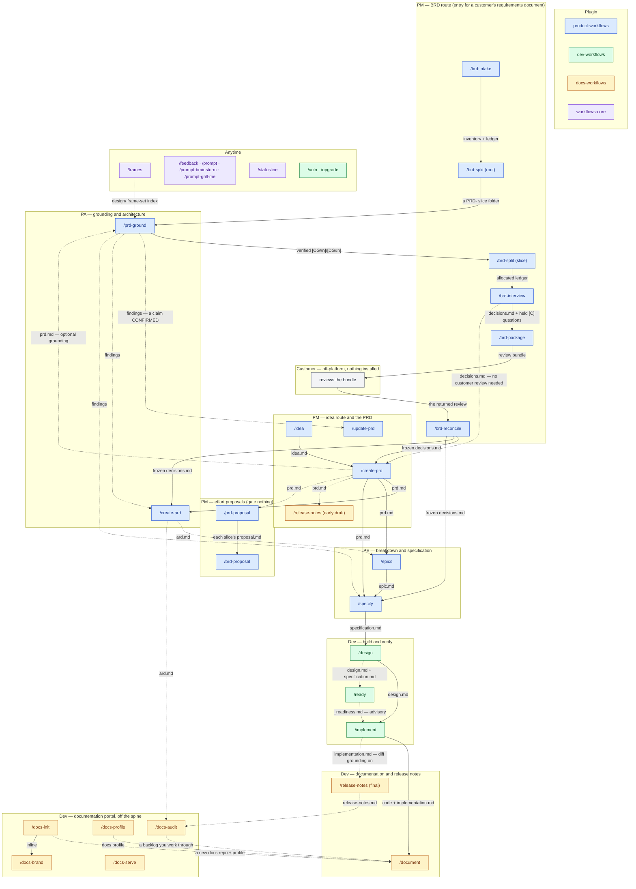

# Family map

This page shows the whole plugin family on one diagram: every slash command of `product-workflows`, `dev-workflows`, `docs-workflows` and `workflows-core`, from the two ways work enters — `/idea` and `/brd-intake` — to shipped code, its documentation and its release notes. Each lane is a **role**. Each command is **coloured by the plugin that ships it**. Each labelled arrow is the **deliverable** one command hands to the next: the file the next command reads, not merely the step it tends to follow.

## Reading it

- **Solid arrows are the main line**: the deliverable the next command is built to consume. **Dashed arrows** are the rest — an input the next command reads where it exists, an optional branch you may skip (grounding an idea-route PRD, pricing it, drafting early release notes), advice (`/ready`'s verdict), or a list a person works through (`/docs-audit`'s backlog, which `/document` never reads). Whether a command also waits for its input to be merged is a per-command gate, described on its own page.
- **The BRD route joins the PRD ladder at the slice folder**, not at an `idea.md`. The three authoring commands are alternatives, not a sequence, and each gates the slice's `decisions.md`. `/brd-reconcile` offers them once the customer's answers are frozen. `/brd-interview` offers them directly when every question was settled from the findings, so the slice needs no customer review — `/create-prd` there, as after a reconciliation, only where a row the slice claims is `covered-here`.
- **`/release-notes` is drawn twice** because it runs at two moments: early, from `prd.md`, and again after implementation. The final run reads nothing `/document` writes, so the two documentation commands are independent.
- **`/ready` sits beside the spine, not on it.** Its verdict is advice `/implement` reads; it blocks nothing.
- **The Anytime lane hands no deliverable to the pipeline** except `/frames`' frame-set index, which `/prd-ground`'s design grounding needs. The portal lane prepares the documentation repository `/document` writes into, and `/docs-serve` only previews it.

## The detail, per plugin

Each plugin's own workflow page draws its commands in full, with the loops and conditions this map leaves out:

- `product-workflows` — its Workflow overview page, and its BRD workflow page for the six-command route with its re-entry loops.
- `dev-workflows` — its Workflow overview page.
- `docs-workflows` — its Workflow overview page, and its docs workflow page for the portal procedure.
- `workflows-core` — [Workflow](workflow.md), for what this plugin gives the other three.

The roles are described on each plugin's Roles and phases page; this plugin's own is [Roles and phases](roles-and-phases.md).
