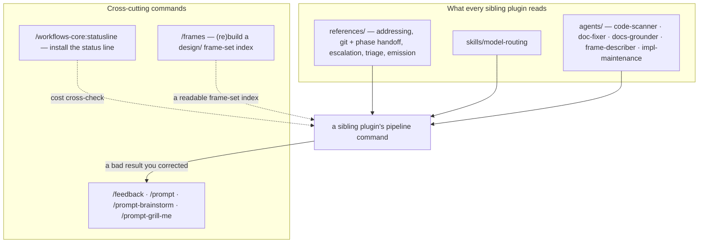

# Workflow

`workflows-core` runs no pipeline of its own. It is the shared foundation the `dev-workflows` plugin family draws on — the reference corpus, the `model-routing` skill, and five agents — plus six commands that sit beside a pipeline rather than inside one.

The three dashed and solid edges into `a sibling plugin's pipeline command` are the whole point of this plugin: a command in `dev-workflows` reads a reference here, loads the routing skill here, and dispatches an agent here, so the same rules bind every plugin in the family rather than being copied into each.

## Cross-cutting commands

These run outside any role pipeline, at any time:

- **Plugin improvement.** `/feedback` logs a note about the plugin itself; `/prompt`, `/prompt-brainstorm`, and `/prompt-grill-me` turn a correction you just made into logged feedback plus a fix — applied directly, redesigned with `superpowers:brainstorming`, or grilled inline.
- **Setup.** `/statusline` installs the family's multi-line status line. It collides with a Claude Code built-in of the same name, so type the qualified `/workflows-core:statusline`.
- **Specs-tree repair.** [`/frames`](commands/frames.md) (re)builds the frame-set index of any folder holding exported design frames — a BRD, PRD, or Epic folder alike — so a set somebody dropped in by hand becomes readable. It advances no phase and grounds nothing.

None of the six advances a pipeline phase. What they do share with the pipeline is the cost ledger: each is charged to the phase of the command it is correcting or the folder it is acting on — see [Roles and phases](roles-and-phases.md).

See the [documentation index](README.md) for everything else.
