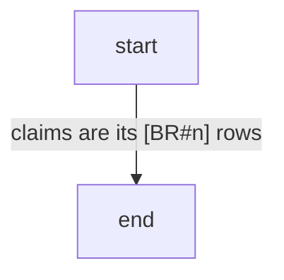

# Green: the same edge label, quoted

Quoting the label makes the brackets literal text. This is the fix, and it must parse.

```mermaid
flowchart TD
    a["start"]
    b["end"]
    a -->|"claims are its [BR#n] rows"| b
```
