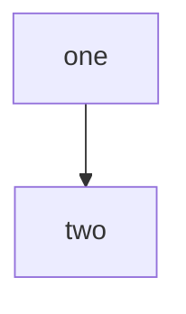

# Green: a four-space-indented block is code, not a diagram

A paragraph, then a block indented four spaces, which CommonMark makes an indented code block that GitHub shows as text:

    ```mermaid
    flowchart TD
        a -->|this [is] shown as text, never drawn| b
    ```

And one real diagram, which must be found and must parse:


