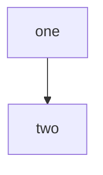

# Green: a mermaid fence shown as an example is not a diagram

How to write one, as a literal example:

````markdown
```mermaid
flowchart TD
    a -->|this [is] literal text, never parsed| b
```
````

And one real diagram, which must be found and must parse:


