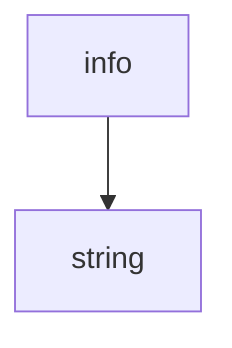

# Green: a tilde fence, and an info string with trailing words

~~~mermaid
flowchart TD
    a["tilde"] --> b["fence"]
~~~

```mermaid title="trailing words"
flowchart TD
    c["info"] --> d["string"]
```
